# FloodGuard Full Repository Architecture and Cleanup Audit

> ## ⚠ v3 errata — read before acting on anything below
>
> v1 and v2 were **static** audits: nothing in them had been executed. Between
> 2026-07-29 and 2026-07-30 the Phase 1 and Phase 2 work was implemented on
> branch `system-fix` and the pipeline was actually run. That falsified four
> claims in this document and surfaced five findings it could not have seen.
>
> The original text is left intact below so the reasoning is auditable. **Where
> it conflicts with this block, this block wins.**
>
> ### Falsified by implementation
>
> | § | The audit said | What execution showed |
> |---|---|---|
> | §15 D-02, §22 T4.1, §24 ADR-D | Route `run_real` through `trusted_zonal_adapter` | **Not implementable.** `create_signed_zonal_receipt` raises unless `dataset_mode == "official_input"` *and* `can_feed_decision_layer` is true, and `contract.py` enforces the mirror ("Candidate GeoAI runs cannot feed the decision layer"). The trusted adapter is the **operational** lane; the candidate lane had no bridge at all. Fixed by building one: `src/floodguard/candidate_zonal_receipt.py` |
> | §8A.6, §15 D-37, §22 T2.4 | ★'s IoU 0.07 is published as a suspect model metric — "backwards" | **Unfair to the project.** The field is named `iou_vs_unet_labels` and its `assumptions` already read *"a sanity check, not an accuracy claim."* The framing was correct; the audit summary I worked from had lost that nuance |
> | §22 T2.4 hypothesis 1 | Wrong `band_order` is the leading cause | Dead. `water_baseline.py` already passes `[3, 2, 1, 4]` and documents the mapping |
> | §22 T2.4 hypothesis 2 (as revised) | OWM is fed 0–1 where it expects 0–10000 | Dead. Running OWM on **both** scalings of identical pixels agreed to three decimals — it normalises internally |
>
> ### The actual cause of the ★ result
>
> On a dry-season, cloud-free scene (2024-02-18, 0.004 % cloud), against JRC
> Global Surface Water as an independent reference:
>
> | source | water fraction |
> |---|---|
> | OmniWaterMask | 0.33 % |
> | **JRC occurrence > 50 %** | **0.37 %** |
> | MNDWI > 0 — the reference the IoU was measured against | **3.24 %** |
>
> OWM is within 12 % of JRC. **MNDWI over-detects ~10x while still recovering
> only half the reference** (recall 0.502). The 0.07 measures disagreement
> between two water *definitions*, not model accuracy. No threshold fixes it —
> best case is IoU 0.079 at 0.10, precision 0.100.
>
> That label is also **Component B's training and evaluation target**, which is
> the more consequential half of the finding.
>
> ### Five findings this audit could not have seen
>
> | New | Finding |
> |---|---|
> | **D-41** | `core.autocrlf=true` rewrote **762 of 859 files** to CRLF, breaking the byte-exact SHA-256 provenance the project rests on. Caused 21 of the 37 test failures. Then **recurred through the writers** — `write_text`/`to_csv` default to `os.linesep`, so artifacts differed from their own committed blobs |
> | **CI was red** | The GeoAI runner job had failed since 2026-07-24 at `uv sync` (the D-10 conflict), *before* reaching its tests or lint — which is why 89 ruff violations had accumulated unseen |
> | **The published evidence was never one run** | `outputs/geoai/` was assembled from three executions across `b07bebd`, `095c39e`, `debe413`. Not merely unreproducible — **incoherent**. Two consecutive governed runs now give `FPPS max|delta| = 0.000000` |
> | **Correctness vs evaluability** | Only the *wrong* MNDWI label is dense enough to permit a leakage check, because over-detecting 8.7x is what makes it dense. OWM gives 352 training positives against a 2,000 floor; training longer collapsed the model to the majority class (IoU 0.0023, recall 0.0024) |
> | **Component D was broken and is now swapped** | Overpass serves an **expired certificate** and the cached fallback is gitignored, so Component D had no working path. Now Overture: 118,050 footprints and 232 exposed, against 463 and **0** |
>
> ### Also resolved
>
> - **Open question 2** — `_configured_cors_origins()` reads `FLOODGUARD_CORS_ORIGINS`
> - **Open question 6** — the Thai NGIS chain is **valid** (TLSv1.3, RapidSSL, expires 2026-09-04). `CERT_NONE` was convenience, not a workaround
> - **D-04 must not be done before judging** — the offline smoke *throws* if `outputs/dashboard.html` is missing and the submission instructions tell judges to serve it
> - **GPU** — `torch 2.13.0+cu126` on an RTX 3060 gives a **28x** speedup (Component B: 64 min → 2.3 min). It does *not* violate the frozen pin: `environment.py` never checks torch, and PEP 440 accepts `2.13.0+cu126` for `==2.13.0`
>
> **Live status:** `docs/run_plan_governed_rerun_v1.md` §12 · `research/MANIFEST.md`
> · baseline `docs/baseline/2026-07-30-run1/`

**Document version:** v3 (errata added 2026-07-30 after implementation)
**Original audit date:** 2026-07-28 · **v2 revision:** 2026-07-29
**Commit audited:** `debe413c083140dcaeadec5daf1baede9273eb21`
**Branch audited:** `codex/mae-sai-milestones-1-5`
**Mode:** Read-only inspection. No repository files were modified by this audit.

### What changed in v2

v1 was a static architecture audit. v2 adds an **executable toolchain layer** and turns the
roadmap into something a developer can work from directly:

| Addition | Where | Why |
|---|---|---|
| **§8A — GeoAI toolchain and the `geoai-skills` plugin** | new section | The repo binds every AI component to a chapter of *Introduction to GeoAI* (Wu, 2026) but never installs the library that book teaches. §8A closes that loop. |
| **Verified environment probe** | §8A.3 | v1 inferred dependency problems. v2 **executed** the resolver and probed all three virtualenvs. Two v1 findings are now proven, not suspected. |
| **Research/Evidence promotion gate** | §8A.5 | Skills produce ungoverned files. Without an explicit sandbox they would silently become "evidence". |
| **8 new debt items (D-33 … D-40)** | §15 | All GeoAI-toolchain related. |
| **Fully rewritten roadmap** | §22 | Task cards with exact commands, acceptance checks, rollback commands, effort, and skill invocations — replacing v1's summary tables. |
| **16 new Mermaid diagrams** (18 → 34) | header, §8A, §15, §20, §22, §23, §28 | Reading guide, toolchain layering, skill→component mapping, environment reality, research/evidence promotion gate, annotated pipeline, debt-by-priority, phase graph, Gantt, two before/after diagrams for the highest-risk PRs, PR dependency graph, and two onboarding flows. |
| **ADR-I and ADR-J** | §24 | Adopting the skills as the research-tier entry point; calibrating against open benchmarks. |
| **§28 Developer onboarding** | new section | First hour, the five surprises, the full path for adding a component, a command cheat sheet, and a symptom→cause table. |

### How to read this document

```mermaid
flowchart LR
    subgraph understand["Understand the system"]
        s1["§1 Executive summary"]
        s2["§3-§8 What exists today"]
        s3["§8A GeoAI toolchain"]
        s4["§9 Current diagrams"]
    end

    subgraph judge["Judge the system"]
        s5["§11-§14 Coupling, config,<br/>testing, security"]
        s6["§15 Debt register D-01…D-40"]
        s7["§16 Keep / refactor / archive"]
    end

    subgraph change["Change the system"]
        s8["§17-§21 Target architecture"]
        s9["§22 Roadmap — task cards"]
        s10["§23 PR sequence"]
        s11["§24 ADRs"]
        s12["§28 Developer onboarding"]
    end

    s1 --> s2 --> s3 --> s4
    s4 --> s5 --> s6 --> s7
    s7 --> s8 --> s9 --> s10 --> s11 --> s12

    reader["Reviewer or judge<br/>START HERE"] --> s1
    dev["Developer picking up work<br/>START HERE"] --> s12
    dev --> s9
```

**Reviewers and judges** should read §1, §8A, §9, and §25.
**Developers** should read §28 (onboarding), then §22 (task cards), then §23 (PR order).

---

## 1. Executive Summary

### What the system currently is

FloodGuard is a **three-project polyglot monorepo** with **no database**. It is best described as *a governed evidence-publishing system with a map front-end*, not a conventional web application.

- **859 tracked files**, ~100,600 lines of Python in `src/floodguard/` alone, ~13,000 lines of TypeScript in `apps/web/`.
- **One Next.js 16 static-export PWA** (`apps/web`) with three role routes: `/public`, `/command`, `/studio`.
- **One FastAPI service** (`services/api`, 30 endpoints) that reads **committed CSV/GeoJSON artifacts from `outputs/` and `tests/fixtures/`** — there is no database, ORM, migration, or persistent store anywhere in the repository.
- **One isolated GeoAI runner** (`services/geoai-runner`) holding all heavy ML/geospatial dependencies.
- **A very large Python decision/governance layer** (`src/floodguard/`) that is the actual centre of gravity of this project.

The deployed artifact is a **static export to Vercel** (`vercel.json` → `apps/web/out`). **The FastAPI service is not deployed by any configuration in this repository.** In the shipped build, the front-end falls back to committed JSON bundles in `apps/web/public/offline-demo/`.

### Main architectural strengths

1. **Genuinely rigorous evidence governance.** Contract schemas (`packages/contracts/schemas`, 20 JSON Schemas), fail-closed validation, HMAC-signed receipts, and a consistently enforced `official_warning=false` boundary. This is unusually disciplined for a hackathon-stage project.
2. **Correct dependency isolation.** `geoai-py`/PyTorch/rasterio live only in `services/geoai-runner`; CI actively asserts the light environment *cannot* import them (`.github/workflows/ci.yml`, job `geoai-normal`).
3. **Real test mass.** 1,649 root tests, 274 runner tests, plus web vitest and Playwright offline smokes — with contract-level and adversarial rejection tests, not just happy paths.
4. **Crisis-safety UX is actually implemented,** not just documented: stale/degraded states, bilingual TH/EN status copy, abstention surfacing, explicit non-warning language in the UI.
5. **Deployment-profile separation** that physically removes staff routes from the public build (`apps/web/scripts/build-profile.mjs`).

### Main weaknesses

1. **`outputs/` is a 36 MB committed data lake doing three incompatible jobs at once** — API data source, generated evidence, and demo assets. 21 of 124 files are referenced nowhere in code. Two generated HTML files total 11.3 MB.
2. **Two parallel, unreconciled UIs.** `apps/web` (Next.js) and `src/floodguard/dashboard.py` (4,545-line static HTML generator with vendored Leaflet). Both render maps and priority tables.
3. **Two parallel, unreconciled GeoAI stacks** inside one service: `geoai_runner/{contract,prepare,train,infer,manifest}.py` (governed, receipt-bound) and `geoai_runner/realpipeline/` (executable, real-data). They do not share a contract.
4. **The governance layer blocks development rather than claims.** Gates that should protect *published assertions* currently block *experimentation* — this is the single biggest productivity drag on the project.
5. **`src/floodguard/` is a flat 60-module package** mixing decision engine, label factory, provenance, dashboards, and one-off study-area scripts.
6. **104 scripts in `scripts/`,** 19 of which are referenced in no doc, workflow, or manifest.
7. **Tests are not hermetic.** Subprocess-spawning tests resolve `floodguard` through the editable install rather than the checkout — 16 fail in a git worktree for this reason alone.
8. **The GeoAI library the project is built around is not installed anywhere.** `geoai-py==0.41.1` is declared in two extras of `services/geoai-runner/pyproject.toml`, imported by six modules, and cited chapter-by-chapter in `realpipeline/registry.py` — but **`import geoai` fails in all three virtualenvs** (§8A.3). Every `geoai.*` code path is therefore unexercised here — and in CI too, since the only job that would exercise it (`geoai-smoke`) is `workflow_dispatch`-only while `geoai-normal` actively asserts the library is *absent*. See D-33.
9. **The `realpipeline` extra provably cannot be installed.** v1 inferred this; v2 executed the resolver and captured the failure (§8A.3). `omniwatermask` requires `numpy>=2.0,<2.4`; the project pins `numpy==2.4.2`. See D-10.

### New in v2 — the toolchain gap

The single most actionable finding added in this revision: **FloodGuard describes itself in terms of a
GeoAI library it never runs.** `registry.py` maps components A–G to chapters of *Introduction to GeoAI*
(Wu, 2026); `susceptibility.py`, `water_unet.py`, `water_baseline.py`, `infer.py`, and `prepare.py` all
call `geoai.*` or `samgeo.*`. None of it can execute in this environment. The `geoai-skills` plugin
(8 skills wrapping the same library) is the shortest path to closing that gap, and §8A specifies how to
adopt it *without* letting ungoverned skill output leak into the evidence tree.

### Most important cleanup priorities

| Rank | Action | Debt ID | Why |
|---|---|---|---|
| 1 | Split `outputs/` into `fixtures/`, `evidence/`, `research/`, `web-assets/` | D-03 | Ambiguity here causes the API to read demo data, and makes evidence indistinguishable from samples. v2 adds a fourth tree, `research/`, as the landing zone for ungoverned skill output |
| 2 | Re-scope governance gates from *blocking work* to *blocking claims* | ADR-E | Currently the primary development blocker |
| 3 | **Install and exercise the GeoAI toolchain** (`uv sync --extra geoai`, then the `geoai-skills` plugin) | D-33, D-10 | Six modules import a library that is not installed, and the entire component registry describes it. Until this is fixed, no GeoAI change can be verified locally |
| 4 | Route real GeoAI output through `trusted_zonal_adapter` | D-02 | Governance that can be bypassed is documentation, not architecture |
| 5 | Retire `src/floodguard/dashboard.py` as a UI | D-13 | 4,545 lines + vendored Leaflet duplicating `apps/web` |
| 6 | Reconcile the two GeoAI stacks in `services/geoai-runner` | D-09 | Two answers to "how does a model run get recorded" |
| 7 | Group `src/floodguard/` into sub-packages | D-14 | 60 flat modules is past the navigable limit |

### Recommended target architecture

**A modular monolith with clearer internal seams — not a rewrite, and not microservices.** The current three-project split (`web` / `api` / `geoai-runner`) is correct and should be preserved. The work is *internal* reorganisation plus artifact-lifecycle discipline. Cleanup should be **incremental**; no phase requires stopping feature work, and the demo must remain runnable throughout.

---

## 2. Scope, Method, and Limitations

### What was inspected

Every tracked directory: `apps/`, `packages/`, `services/`, `src/`, `scripts/`, `tests/`, `docs/`, `outputs/`, `notebooks/`, `tasks/`, `packaging/`, `resources/`, `.github/`, and all root files.

### Methods used

| Method | Command class |
|---|---|
| File inventory | `git ls-files`, extension/directory aggregation |
| Structure mapping | directory-depth aggregation of tracked paths |
| Route extraction | `grep` on FastAPI decorators and Next.js `app/` layout |
| Import tracing | reverse-reference counting per module |
| Orphan detection | per-module reverse grep across all file types |
| Secret scanning | pattern grep for key/secret/token/password assignments |
| Dependency review | `package.json`, `pyproject.toml` × 3, `pnpm-workspace.yaml` |
| Test execution | root `pytest` (1,649 passed / 16 failed), runner `pytest` (274 passed) |
| Git metadata | `rev-parse`, `status --porcelain`, `worktree list` |
| **Dependency resolution (v2)** | `uv pip compile` against the declared `realpipeline` extra — resolver failure captured verbatim |
| **Virtualenv probe (v2)** | `import` probe of 11 packages across `.venv`, `services/api/.venv`, `services/geoai-runner/.venv` |
| **Reference cross-check (v2)** | `registry.py` `book_ref` fields checked against the table of contents and API listings of *Introduction to GeoAI* (Wu, 2026), 423 pp. |
| **Skill inventory (v2)** | All 8 `geoai-skills` `SKILL.md` files read in full; every `geoai.*` function they invoke recorded |

### Limitations and uncertainty

- **The Next.js production build was not run** (`node_modules` is not installed in this environment). Build-time behaviour, bundle size, and TypeScript compilation across the whole app are **unverified**.
- **The FastAPI service was not started.** Endpoint behaviour is inferred from route decorators and repository code, not observed.
- **Binary assets** (49 PNG, 1 PDF, 1 DOCX, 1 parquet) were classified by path and extension, not decoded.
- **4 Jupyter notebooks** were inventoried but their cell contents were not fully executed or traced.
- **The 16 root test failures are environment-specific** (see §13) and would not reproduce in CI.
- **No live third-party API was contacted,** per the read-only constraint. All external-service behaviour is inferred from client code.

---

## 3. Repository Coverage

### File inventory

| Extension | Count | Notes |
|---|---:|---|
| `.py` | 396 | src, services, scripts, tests |
| `.md` | 107 | docs-heavy project |
| `.json` | 79 | contracts, bundles, fixtures |
| `.csv` | 78 | outputs + fixtures |
| `.ts` | 49 | web lib + tests |
| `.png` | 49 | visual QA, GeoAI previews, THEOS-2 thumbnails |
| `.tsx` | 29 | React components/pages |
| `.geojson` | 16 | map layers |
| `.mjs` | 14 | web build/smoke scripts |
| `.css` | 8 | globals + CSS modules |
| `.ipynb` | 4 | exploratory notebooks |
| `.yml`/`.yaml` | 5 | CI, workspace, conda env |
| `.toml` | 3 | three Python projects |
| `.lock` | 3 | uv × 2 + pnpm |
| other | ~19 | svg, html, xml, pdf, docx, parquet, ps1, webmanifest |
| **Total** | **859** | |

### Inspection coverage

| Path | Files | Types | Status | Architectural role | Notes |
|---|---:|---|---|---|---|
| `apps/web/src/app` | 7 | tsx, css | Full | Next.js routes | 4 routes; 3 are 12-line shells |
| `apps/web/src/components` | 33 | tsx, ts, css | Full | UI layer | `geo-map.tsx` 981 lines |
| `apps/web/src/lib` | 43 | ts | Full | Client data/domain | `data-provider.ts` 1,565 lines |
| `apps/web/src/data` | 3 | json | Full | Static GeoJSON | Imported at build time |
| `apps/web/public` | 34 | json, png, svg, js | Full | Offline bundles + PWA | `roads.json` 2.3 MB |
| `apps/web/scripts` | 12 | mjs, py | Full | Build/smoke tooling | Mixed Node + Python |
| `packages/contracts` | 42 | json, ts | Full | Shared schemas | 20 schemas, 18 examples |
| `services/api/src` | 12 | py | Full | HTTP boundary | 9,498 lines |
| `services/api/tests` | 6 | py | Full | API contract tests | |
| `services/geoai-runner/geoai_runner` | 34 | py | Full | ML/geo execution | Two parallel stacks |
| `services/geoai-runner/tests` | 18 | py | Full | Runner tests | 274 pass |
| `src/floodguard` | ~60 | py | Full | Decision engine | 44,861 lines |
| `src/floodguard/label_factory` | ~50 | py | Full | Annotation governance | 55,742 lines |
| `scripts` | 104 | py, mjs | Listed + sampled | One-off pipelines | 19 unreferenced |
| `tests` | 127 | py, csv, json | Full | Root suite | 14 fixtures |
| `docs` | 106 | md, png, pdf, docx | Listed + sampled | Documentation | 17 visual-QA PNGs |
| `outputs` | 124 | csv, png, md, geojson, json, html | Full listing | **Mixed-purpose artifacts** | 36 MB |
| `notebooks` | 4 | ipynb | Listed only | Exploration | 2.9 MB largest |
| `tasks` | 7 | md | Full | Historical backlog | Superseded by PLANS.md |
| `packaging/offline-demo` | 3 | md, ps1, py | Full | Demo server | |
| `resources` | 1 | xml | Full | SNAP graph | Sentinel-1 RTC processing |
| `.github/workflows` | 2 | yml | Full | CI | 4 jobs + opt-in smoke |

### Files not meaningfully inspected

| File | Reason |
|---|---|
| `docs/submission/.../FloodGuard_GeoHackathon_2026_Proposal.pdf` (726 KB) | Binary; not decoded per constraint |
| `docs/submission/.../*.docx` (587 KB) | Binary |
| 49 `.png` files | Binary; classified by path |
| `outputs/flood_classifier_embeddings.parquet` | Binary columnar |
| 4 `.ipynb` files | Inventoried; cell-level tracing not performed |
| `pnpm-lock.yaml`, `uv.lock` × 2 | Machine-generated; inspected for tool identity only |

### Generated / binary / vendored files committed

| Item | Size | Should it be version-controlled? |
|---|---:|---|
| `outputs/dashboard.html` | 5.9 MB | **No** — fully generated by `dashboard.py` |
| `outputs/geoai/geoai.html` | 5.4 MB | **No** — generated by `geoai_page.py` |
| `outputs/mae_sai_road_risk.geojson` | 4.5 MB | Borderline — regenerable, but is API input |
| `outputs/geoai/rivers.geojson` | 3.7 MB | **No** — a cached DWR fetch |
| `apps/web/public/offline-demo/mae-sai/roads.json` | 2.3 MB | **Yes** — required for offline demo |
| `notebooks/03_*.ipynb` | 2.9 MB | Strip outputs before committing |
| `src/floodguard/static/leaflet/` | ~150 KB | **Vendored third-party.** Justifiable only for offline dashboard |
| `docs/visual-qa/**/*.png` | ~5 MB total | Consider Git LFS or external storage |
| `outputs/theos2_thumbnails/*.png` | ~2 MB | Evidence artifacts; acceptable but should move to `evidence/` |

**No `node_modules`, `.venv`, or build output is committed.** `.gitignore` is comprehensive for remote-sensing assets (`*.tif`, `*.SAFE`, `*.pth`, `*.onnx`).

---

## 4. Technology Stack

### Confirmed from code

| Layer | Technology | Evidence |
|---|---|---|
| Frontend framework | Next.js 16.2.6 (App Router, static export) | `apps/web/package.json`, `apps/web/src/app/` |
| UI runtime | React 19.2.4 | `apps/web/package.json` |
| Mapping | Leaflet 1.9.4 (dynamic import) | `apps/web/src/components/geo-map.tsx:25` |
| Styling | CSS Modules + `globals.css` | `*.module.css` × 6 |
| Fonts | Fontsource (Plus Jakarta Sans, Noto Sans Thai) | `apps/web/package.json` |
| Web tests | Vitest 3.2.4 | `apps/web/vitest.config.ts` |
| Browser tests | Playwright 1.61.1 | `apps/web/scripts/browser-*.mjs` |
| Web lint | ESLint 9.39.2 + `eslint-config-next` | `apps/web/eslint.config.mjs` |
| Types | TypeScript 5.7.3, `strict: true` | `apps/web/tsconfig.json` |
| Package manager (JS) | pnpm 10.34.5, workspace | `pnpm-workspace.yaml` |
| Backend framework | FastAPI 0.116.1 + Uvicorn 0.35.0 | `services/api/pyproject.toml` |
| Validation | Pydantic 2.11.7 | `services/api/pyproject.toml` |
| Package manager (Py) | uv (3 lockfiles) | `uv.lock` × 3 |
| Python | 3.12 (`>=3.12,<3.13` for services) | `pyproject.toml` × 3 |
| Data | pandas ≥ 2.0 | root `pyproject.toml` |
| Raster | rasterio 1.4.4 | `services/geoai-runner/pyproject.toml` |
| ML (optional extra) | torch 2.13.0, `geoai-py` 0.41.1, `segmentation-models-pytorch` 0.5.0 | runner `[project.optional-dependencies]` |
| Python lint | Ruff 0.12.4 | all three `pyproject.toml` |
| Python tests | pytest (8.4.1 API, 9.0.2 runner) | manifests |
| CI | GitHub Actions, 4 jobs + opt-in | `.github/workflows/ci.yml` |
| Deployment | Vercel static export | `vercel.json` |
| Contracts | JSON Schema (20 files) | `packages/contracts/schemas/` |
| Auth | HMAC-SHA256 bearer tokens | `services/api/src/floodguard_api/pilot.py:1033` |
| SAR preprocessing | ESA SNAP graph XML | `resources/snap/sentinel1_grd_rtc_v1.xml` |

### Installed but apparently unused / not exercised in the shipped build

| Item | Evidence | Assessment |
|---|---|---|
| FastAPI service | No deployment config references it; `vercel.json` builds only `apps/web` | **Confirmed not deployed.** Runs locally and in CI only |
| **`geoai-py == 0.41.1`** | Declared in the `geoai` **and** `realpipeline` extras; imported by 5 modules — `infer.py`, `prepare.py`, `susceptibility.py`, `water_baseline.py`, `water_unet.py` | **Confirmed not installed in any virtualenv** (§8A.3). The library the architecture is named after has never run here |
| `omniwatermask ≥ 0.5` | Declared in `realpipeline` extra | **Unresolvable — proven by resolver output** (§8A.3): requires `numpy>=2.0,<2.4`; project pins `numpy==2.4.2`. The extra cannot install as declared |
| `torchange ≥ 0.0.2` (ChangeStar) | Declared in extra | Superseded by GHSL path in commit `debe413`. Note: `geoai` ships its own `geoai.change_detection.ChangeStarDetection` wrapper, so the direct `torchange` pin is redundant either way |
| `moondream ≥ 0.0.6` | Declared in extra | Superseded by deterministic narrative in `debe413` |
| `samgeo` (SAM 3) | Imported by `infrastructure.extract_buildings_sam` | **Not declared in any extra and not installed.** The import is guarded and raises `SAMUnavailableError`, so the failure is graceful — but the dependency is invisible to `uv` |
| `environment.yml` (conda) | Root file | No workflow or doc references it; uv is the actual toolchain. Note: the GeoAI book's own install path is conda-based, which may explain its origin |

### GeoAI toolchain — declared vs. installed

Full detail, including the raw resolver failure and the per-virtualenv probe, is in **§8A.3**. Summary:

| Package | Declared in | Installed in `.venv` | Installed in `geoai-runner/.venv` |
|---|---|---|---|
| `geoai-py` | `geoai`, `realpipeline` extras | **No** | **No** |
| `torch` / `torchvision` | both extras | **No** | **No** |
| `rasterio` | runner base deps | Yes (1.4.4) | Yes (1.4.4) |
| `geopandas` | (transitively via `geoai-py`) | Yes (1.1.4) | **No** |
| `pystac-client`, `planetary-computer` | `realpipeline` extra | **No** | **No** |
| `omniwatermask` | `realpipeline` extra | **No** — cannot resolve | **No** — cannot resolve |
| `samgeo` | **nowhere** | **No** | **No** |

### Planned or documented but not implemented

| Item | Where documented | Status |
|---|---|---|
| Rainfall / hydrology forecast branch | `PLANS.md` step 9 | **Not implemented** — no rainfall module exists |
| SAM 3 building extraction | `registry.py`, `infrastructure.extract_buildings_sam` | Implemented but raises `SAMUnavailableError`; OSM fallback used |
| Google Earth Engine | Mentioned in embeddings docstrings | **No GEE code, credentials, or client anywhere** |
| Spatial database (PostGIS etc.) | — | **Never mentioned; none exists** |
| THEOS-2 sub-metre imagery | `docs/theos2_inventory.md` | Metadata/thumbnails only; no imagery processing |
| Real Clay / AlphaEarth / TESSERA embeddings | `embeddings.py` docstring | Local features used as stand-in |

---

## 5. Current Product and User Experiences

### Route and experience matrix

| Experience | Route | User type | Main components | Data source | Backend dependency | Completion |
|---|---|---|---|---|---|---|
| Role chooser / Public entry | `/` | Anyone | `page.tsx`, `PublicExperience` | Profile-dependent | Optional | **Complete** |
| Public Preparedness | `/public` | Resident | `public-experience.tsx` (427 ln), `household-plan-builder.tsx` | `public-data-provider.ts` → API, falls back to `public-bundle.json` | Optional | **Complete** |
| Planning Command Center | `/command` | Government planner | `command-workspace.tsx` (571 ln), `geo-map.tsx`, `geoai-real-panel.tsx` | `data-provider.ts` → API, falls back to `bundle.json` | Optional | **Complete** |
| Research & Validation Studio | `/studio` | Researcher | `studio-workspace.tsx` (395 ln), `model-registry-panel.tsx`, `studio-proof-panel.tsx`, `qualified-evidence-foundation-panel.tsx` | Same provider + contract evidence | Optional | **Complete** |
| Household preparedness plan | within `/public` | Resident | `household-plan-builder.tsx`, `use-household-plan.ts` | `localStorage` | None | **Complete** |
| Static dashboard (parallel UI) | `outputs/dashboard.html` | Judge/offline | `src/floodguard/dashboard.py` | `outputs/*.csv` | None | **Complete but redundant** |

### Hypothesised experiences that do NOT exist

| Hypothesis | Verdict | Evidence |
|---|---|---|
| Flood reporting workflow | **Does not exist** | No POST endpoint accepts a community report; no report schema |
| SOS / emergency function | **Does not exist** | Only static hotline numbers in bundles |
| Shelter discovery/routing | **Partial only** | Shelters appear in bundles + access-loss analysis, but no user-facing routing UI |
| Admin/analyst CRUD | **Does not exist** | All POSTs are pilot session/receipt operations, not content management |
| Authentication for end users | **Does not exist** | HMAC pilot credentials are for *staff API routes*; no login UI exists |

**This matters:** the absence of community reporting and SOS removes an entire class of security risk (user-generated content, abuse, PII). The system is **read-only from the public's perspective**, which is a significant safety advantage worth preserving deliberately.

### User roles

| Role | Enforcement point | Evidence |
|---|---|---|
| `public` | Layer visibility filter + build-time route removal | `layer-visibility.ts`, `build-profile.mjs` |
| `command` | Default data-provider role; API `require_official_command_data` | `data-provider.ts:DEFAULT_DATA_OPTIONS`, `app.py:405` |
| `studio` | Evidence-scope filter | `studio-evidence-scope.ts` |

---

## 6. Current Repository Structure

```
/
├── apps/web/                 Next.js 16 PWA (3 role routes) — pnpm workspace member
├── packages/contracts/       JSON Schemas + TS types — pnpm workspace member
├── services/
│   ├── api/                  FastAPI (uv project) — reads committed artifacts
│   └── geoai-runner/         Isolated ML/geo (uv project) — TWO parallel stacks
├── src/floodguard/           Decision engine + label factory (root uv project)
├── scripts/                  104 one-off CLI pipelines
├── tests/                    1,649-test root suite + fixtures
├── docs/                     107 markdown + submission binaries + visual QA
├── outputs/                  36 MB mixed artifacts (API input + evidence + demo)
├── notebooks/                4 exploratory notebooks
├── tasks/                    7 historical task files
├── packaging/offline-demo/   Demo HTTP server
└── resources/snap/           ESA SNAP processing graph
```

### Package/application boundaries

There are **two independent dependency universes** that meet only through the filesystem:

- **JS universe:** `pnpm-workspace.yaml` → `apps/*` + `packages/*`. `@floodguard/contracts` is consumed via `workspace:*`.
- **Python universe:** three separate `pyproject.toml` files with three `uv.lock` files. `services/api` and `services/geoai-runner` both declare `floodguard-thailand = { path = "../..", editable = true }`.

**They share no build tool.** `pnpm verify:frontend` invokes `python scripts/run_check_with_junit.py` — the only cross-universe seam, and it is in CI only.

### Structural issues

| Issue | Evidence | Severity |
|---|---|---|
| `outputs/` serves three roles simultaneously | `repository.py:198-212` reads it as API input; `run_real.py` writes evidence to it; `dashboard.html` is a demo asset | **High** |
| `src/floodguard/` is 60 flat modules | `ls src/floodguard/*.py` | **Medium** |
| Two GeoAI stacks in one package | `geoai_runner/cli.py` chain vs `geoai_runner/realpipeline/` | **Medium** |
| Two UI generators | `apps/web` and `src/floodguard/dashboard.py` (4,545 ln) | **Medium** |
| `scripts/` is undifferentiated | 104 files, no subdirectories | **Medium** |
| `tasks/` superseded but retained | `PLANS.md` is the live roadmap | **Low** |

---

## 7. Current Runtime Architecture

### Startup flow (web)

1. `apps/web/src/app/layout.tsx` — root layout, font loading, `PwaRegister`.
2. Route page renders a workspace component.
3. Workspace calls `use-floodguard-data.ts` → `data-provider.ts`.
4. `data-provider.ts` reads `process.env.NEXT_PUBLIC_FLOODGUARD_API_URL`.
   - **If set:** parallel `fetch` of `/api/v1/status`, `/evidence-context`, `/areas`, `/public-areas`, `/layers`, `/evidence-records/{id}`.
   - **If unset or fetch fails:** falls back to build-time-imported JSON bundles.
5. Evidence assertions run (`assertEvidenceContextMatches`, `assertArtifactsMatchEvidenceContext`).
6. `localStorage` snapshot written under `floodguard:last-known-api-snapshot:v2`.
7. Map mounts via dynamic `import("leaflet")`.

**Critical property (Confirmed from code):** the front-end is **fully functional with no backend**. Static import of `bundle.json` at module scope means the bundles are in the JS chunk, not fetched.

### API flow

`app.py` `create_app()` → CORS (default `localhost:3000`) + GZip → 30 routes → `repository.py` → filesystem reads from `outputs/` and `tests/fixtures/`.

Staff routes gate on `Depends(require_official_command_data | require_official_scenario | require_study_area_model)`, which parse an HMAC bearer token (`pilot.py:1033`). **No token-issuing endpoint exists** (`pilot.py:197` states this explicitly) — tokens must be minted externally.

### State management

**No state library.** React hooks only: `use-floodguard-data.ts`, `use-public-floodguard-data.ts`, `use-household-plan.ts`, `use-language.ts`, `use-proposal-evidence.ts`. Persistence is `localStorage`. This is appropriate for the current scale.

### External dependencies at runtime

| Dependency | Where | Criticality |
|---|---|---|
| OpenStreetMap tiles | `geo-map.tsx:71` | **High** — map is blank without it |
| Esri World Imagery | `geo-map.tsx:77` | Optional basemap |
| OpenTopoMap | `geo-map.tsx:83` | Optional basemap |
| Microsoft Planetary Computer | `real_data.py` | Offline pipeline only |
| Thai NGIS ArcGIS | `real_data.py:459` | Offline pipeline only |
| OSM Overpass API | `real_data.py:344` | Offline pipeline only |

---

## 8. Current Data and GeoAI Architecture

### Data lineage

| Dataset | Origin | Processing module | Transformation | Output | Consumer | Status |
|---|---|---|---|---|---|---|
| Sentinel-1 RTC pre/post | Planetary Computer STAC | `real_data.fetch_sentinel1_rtc_pair` | dB, boxcar, drop→prob, morphology | `real_flood_extent.tif`, `flood_probability` | `aggregate.py` | **Real pipeline** |
| Sentinel-1 series (~180) | Planetary Computer | `real_data.fetch_sentinel1_rtc_series` | Single-orbit filter, disk cache | `S1Series` | `sar_temporal.py` | **Implemented, never executed** |
| Sentinel-2 L2A | Planetary Computer | `fetch_sentinel2_composite` | 6-band, same-date mosaic | `s2.tif` | Components B, F | **Real pipeline** |
| MNDWI labels | Derived from S2 | `run_real.py` | `(green−swir1)/(…) > 0` | `water_label.tif` | Component B target | **Real (weak supervision)** |
| Copernicus DEM GLO-30 | Planetary Computer | `fetch_copernicus_dem` | HAND/slope/dist/TWI | terrain rasters | Component C | **Real pipeline** |
| JRC Global Surface Water | Planetary Computer | `fetch_jrc_surface_water` | occurrence > 50 | permanent water | Component C validation | **Real pipeline** |
| DOPA sub-districts | Thai NGIS ArcGIS | `fetch_mae_sai_subdistricts` | Filter code 5709 | `subdistricts.geojson` | Zonal aggregation | **Real pipeline** |
| DWR rivers (1,925) | Thai NGIS ArcGIS | `fetch_arcgis_featurelayer` | Rasterise | river mask | HAND | **Real pipeline** |
| OSM buildings (463) | Overpass API | `fetch_osm_buildings` | `out center` → centroids | footprints GeoJSON | Component D | **Real, coverage-flagged** |
| WorldPop 2020 | Pre-ingested | `outputs/mae_sai_population_context.csv` | — | population/tambon | `aggregate.compute_exposure` | **Real, committed** |
| GHSL built-up | Planetary Computer | `encroachment.fetch_builtup_surface` | Epoch differencing | growth raster | Component E | **Implemented, collection ID unverified** |
| Fixture priority scores | Synthetic | `scripts/generate_sample_decision_outputs.py` | — | `outputs/sample_*.csv` | **FastAPI** | **Synthetic fixture** |
| Mae Sai offline bundles | Built | `apps/web/scripts/build-mae-sai-offline-bundle.py` | — | `public/offline-demo/` | Web fallback | **Static** |

### The critical distinction

| Path | Data | Where it surfaces |
|---|---|---|
| **FastAPI `/api/v1/areas`** | **Synthetic fixtures** (`sample_priority_scores.csv`) | `/command` when API is connected |
| **`outputs/geoai/`** | **Real Mae Sai analysis** | `/command`, `/studio` via `geoai-real-panel.tsx` reading `/geoai/mae-sai-real.json` |

These are **two disconnected data paths in the same screen.** The GeoAI panel bypasses the API entirely. This is deliberate (documented in `geoai_methodology.md` §6.4) but architecturally significant: the real evidence never passes through the contract boundary or the trusted zonal adapter.

### GeoAI component status (post-`debe413`)

| Component | Method | Status | Metric |
|---|---|---|---|
| A | SAR pre/post change detection | Executed | 0.21% district |
| A2 | Temporal seasonal baseline | **Implemented, never run** | — |
| B | U-Net segmentation | Executed; **metric withdrawn as leaky** | pending re-run |
| C | HAND/slope/TWI susceptibility | Executed | AUC 0.74 |
| D | OSM buildings (SAM path stubbed) | Executed | 463, coverage-flagged |
| ★ | OmniWaterMask | Executed | IoU 0.07 (flagged suspect) |
| E | GHSL built-up change | Implemented (ChangeStar null retained) | — |
| F | Few-shot RF | Executed; tautology-flagged | — |
| G | Deterministic narrative | Executed | 8 tambons × 2 languages |

---

## 8A. The GeoAI Toolchain and the `geoai-skills` Plugin

*New in v2.* This section covers the layer the v1 audit treated as an implementation detail and which
turns out to be a first-order architectural concern: **which GeoAI library actually runs, where, and
under what governance.**

### 8A.1 The three layers, and where FloodGuard sits

FloodGuard's component registry is not loosely inspired by *Introduction to GeoAI* (Wu, 2026) — it is
bound to it field by field. `services/geoai-runner/geoai_runner/realpipeline/registry.py` defines a
frozen `GeoAIComponent` dataclass with an explicit `book_ref` attribute, and every one of components
A, A2, B, C, D, ★, E, F, G carries a chapter and section citation. The book teaches the `geoai` Python
package; the `geoai-skills` plugin wraps that same package as eight callable skills.

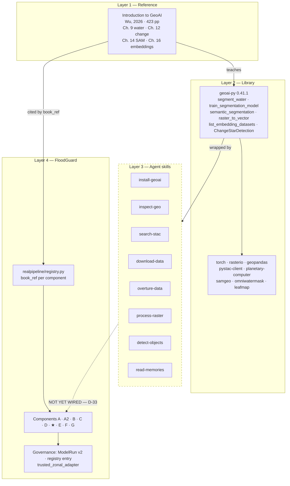

**The dashed edge is the gap.** The skills exist and the citations exist; the executable connection
between them does not.

### 8A.2 The eight skills, and what each is for in FloodGuard

Each skill is a thin, auditable wrapper: it resolves a file path, calls one or two `geoai` functions,
prints a summary, and optionally records state. Nothing is hidden.

| Skill | `geoai` functions it calls | FloodGuard use | Replaces / duplicates | Governance tier |
|---|---|---|---|---|
| `install-geoai` | `import geoai` probe; optional `torch`/CUDA check | **Run this first.** Diagnoses D-33 in one command | `geoai_runner/environment.py` (partly) | Infrastructure |
| `inspect-geo` | `get_raster_info`, `get_raster_stats`, `get_vector_info`, `analyze_vector_attributes`, GDAL/OGR fallbacks | Verify every artifact in `outputs/geoai/`: CRS, bounds, dtype, band stats. Feeds evidence receipts | Ad-hoc `rasterio` snippets in `raster_io.py` | Research + Evidence |
| `search-stac` | `pc_collection_list`, `pc_stac_search`, `pc_item_asset_list`, `pc_stac_download` | Sentinel-1 RTC / Sentinel-2 L2A / Copernicus DEM / JRC GSW discovery over Mae Sai | `real_data._pc_client`, `_find_rtc_scene` (hand-rolled `pystac_client`) | Research |
| `download-data` | `download_naip` | **Not applicable to Thailand** — NAIP is US-only. Useful only for reproducing book exercises | — | Research |
| `overture-data` | `download_overture_buildings`, `get_overture_data` | Second, independent building/road source to cross-check the 463 OSM buildings flagged for coverage | `real_data.fetch_osm_buildings` (Overpass) | Research |
| `process-raster` | `clip_raster_by_bbox`, `stack_bands`, `mosaic_geotiffs`, `raster_to_vector`, `vector_to_raster` | Clip to the Mae Sai bbox, stack S2 bands, vectorise flood masks | `raster_io.py`, inline rasterisation in `susceptibility.py` | Research |
| `detect-objects` | `BuildingFootprintExtractor`, `CarDetector`, `ShipDetector`, `SolarPanelDetector`, `ParkingSplotDetector`, `AgricultureFieldDelineator`, `GroundedSAM` | **Unblocks Component D.** `BuildingFootprintExtractor` is pre-trained and needs no SAM 3 checkpoint, unlike `infrastructure.extract_buildings_sam` | The `SAMUnavailableError` path | Research |
| `read-memories` | (session-log search; no `geoai` call) | Recover prior CRS decisions, data paths, and model configs across the many one-off `scripts/` runs | — | Meta |

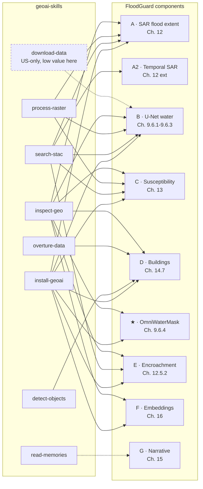

**Read this diagram as coverage, not as a plan.** Five of the eight skills touch the flood-mapping
path directly. `download-data` is near-useless here (NAIP does not cover Thailand) and should be
documented as such so nobody wastes a day on it.

### 8A.3 Verified environment state — the toolchain does not run

This is the finding that changes the roadmap. Two checks were executed on 2026-07-29.

**Check 1 — dependency resolution of the declared `realpipeline` extra.** Run with `uv pip compile`
against Python 3.12, resolution only, nothing installed:

```
× No solution found when resolving dependencies:
╰─▶ Because omniwatermask==0.5.0 depends on numpy>=2.0,<2.4 and
    only omniwatermask<=0.5.0 is available, we can conclude that
    omniwatermask>=0.5.0 depends on numpy>=2.0,<2.4.
    And because you require omniwatermask>=0.5 and numpy==2.4.2, we can
    conclude that your requirements are unsatisfiable.
```

D-10 is now **proven, not inferred**. `uv sync --extra realpipeline` cannot succeed as the manifest
stands, which means Component ★ (OmniWaterMask, the sensor-agnostic water baseline) is uninstallable
by the project's own declaration.

**Check 2 — import probe across all three virtualenvs.**

| Package | root `.venv` (py 3.11.8) | `services/api/.venv` (3.12.13) | `services/geoai-runner/.venv` (3.12.13) |
|---|---|---|---|
| `geoai` | MISSING | MISSING | **MISSING** |
| `torch` | MISSING | MISSING | **MISSING** |
| `rasterio` | 1.4.4 | MISSING | 1.4.4 |
| `geopandas` | 1.1.4 | MISSING | MISSING |
| `numpy` | 2.4.6 | 2.5.1 | 2.4.2 |
| `pystac_client` | MISSING | MISSING | MISSING |
| `planetary_computer` | MISSING | MISSING | MISSING |
| `leafmap` | MISSING | MISSING | MISSING |
| `samgeo` | MISSING | MISSING | MISSING |
| `omniwatermask` | MISSING | MISSING | MISSING |
| `overturemaps` | MISSING | MISSING | MISSING |

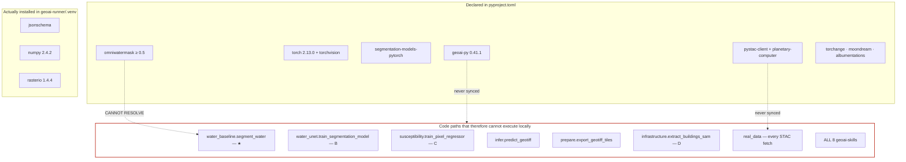

**Consequences that matter for the audit's conclusions:**

1. The 274 runner tests pass **with the library absent**, which means none of them exercise a `geoai` path. `test_geoai_smoke.py` is gated behind `RUN_GEOAI_SMOKE=1`, and CI job `geoai-normal` *asserts the library is absent*. The suite proves the isolation boundary works; it proves nothing about the GeoAI code itself.
2. The v1 statuses in §8 — "Executed" for B, ★, C, D, F — describe runs performed on a **previously configured machine that no longer exists in this checkout**. They are not currently reproducible. This does not make them false; it makes them unverifiable, which for a project whose central claim is provenance is a material gap.
3. Any developer picking up this repo today cannot run a single GeoAI component without an install step that is not documented in any README.

### 8A.4 Duplication between hand-rolled code and library functions

`realpipeline` reimplements a number of things `geoai` already provides. This is not automatically
wrong — the hand-rolled versions are windowed, memory-bounded, and dependency-light, which was a
deliberate choice — but the duplication should be a recorded decision rather than an accident.

| FloodGuard code | Lines | `geoai` equivalent | Recommendation |
|---|---|---|---|
| `real_data._pc_client` + `_find_rtc_scene` | ~30 | `geoai.pc_stac_search` | **Keep FloodGuard's.** It does windowed COG reads via `rasterio.windows.from_bounds`; the library helper downloads whole assets. Record the reason in a docstring |
| `real_data.fetch_osm_buildings` (Overpass) | ~60 | `geoai.download_overture_buildings` | **Add Overture as a second source**, do not replace. Two independent building sources let the coverage flag become a measured agreement rate instead of a caveat |
| `raster_io.py` read/write helpers | ~200 | `geoai.clip_raster_by_bbox`, `stack_bands`, `mosaic_geotiffs` | **Keep.** They carry FloodGuard's CRS and nodata conventions. Use the skills for exploration only |
| vectorisation in `sar_flood.py` | inline | `geoai.raster_to_vector(min_area=…, simplify_tolerance=…)` + `add_geometric_properties` | **Adopt the library's.** It also yields an `elongation` column, which the book uses to strip road-edge and shadow false positives (Ch. 9.6.3.7) — directly applicable to speckle artifacts in the SAR mask |
| `infrastructure.extract_buildings_sam` | ~90, raises | `geoai.BuildingFootprintExtractor` (pre-trained, no checkpoint) or `geoai.GroundedSAM` (text-prompted) | **Add a third path.** `SAMUnavailableError` becomes avoidable rather than merely well-handled |
| `embeddings._local_embedding` | ~40 | `geoai.list_embedding_datasets`, `get_embedding_info` | **Replace the stand-in.** The registry exposes `tessera` (pixel, global, 10 m, 128-d, 2017-2024) and `google_satellite` / AlphaEarth (pixel, global, 10 m, 64-d) — the exact datasets `embeddings.py` names in its docstring as "must be downloaded" |

### 8A.5 The governance problem the skills introduce, and how to contain it

**This is the part that must not be skipped.** The skills write plain files — `buildings_detections.gpkg`,
`clipped_x.tif`, `s2_owm_water_mask.tif` — with no checksum, no `ModelRun`, no registry entry, and no
`official_warning=false` marker. They also write `.geoai-skills/state.json`, an untracked session cache.

Dropping those outputs into `outputs/` would collapse the exact distinction ADR-C exists to create.
The containment is a fourth artifact tree and one mandatory promotion step:

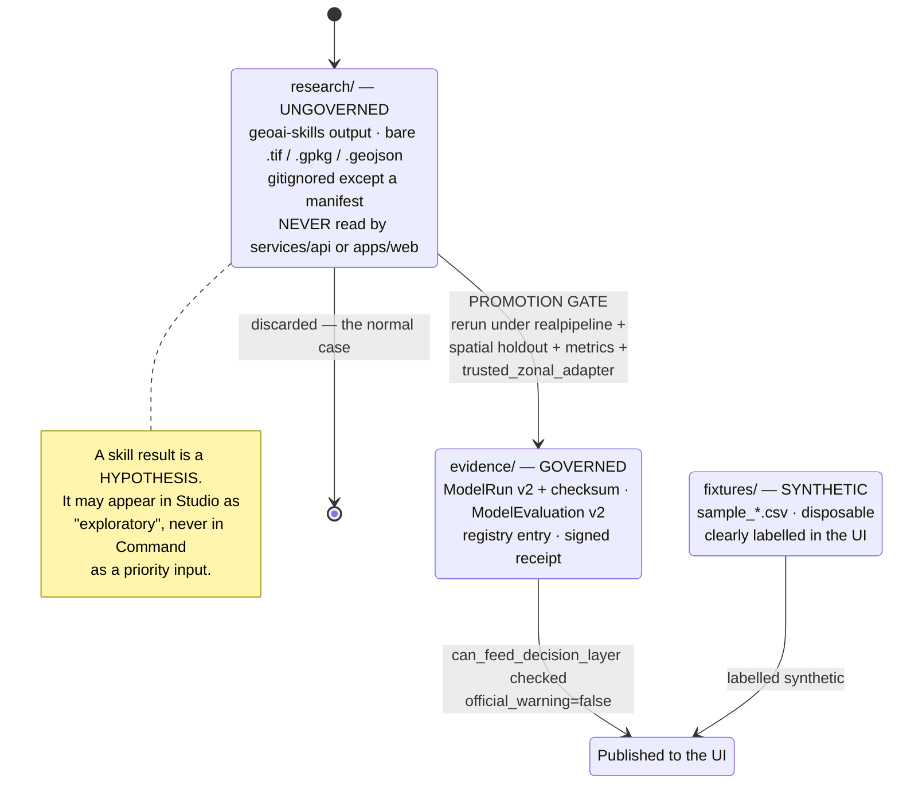

**Three rules, stated so they can be enforced in CI:**

1. `services/api/src/floodguard_api/repository.py` must never resolve a path under `research/`. Add a test that asserts this.
2. `apps/web` must never import or fetch from `research/`. Add a lint rule or a grep-based CI check.
3. Every file promoted from `research/` to `evidence/` must gain a `ModelRun v2` document and pass `trusted_zonal_adapter`. This is D-02 and the promotion gate solved by the same change.

### 8A.6 What the skills unblock that nothing else does

Two blockers in the v1 audit dissolve once the library is installed.

**Blocker 1 — "calibration is BLOCKED, no reference" (§9 diagram E, `calibration.py`).**
The reasoning was: no licensed in-area reference mask exists, therefore no calibration. But the book
ships two open, redistributable water-segmentation datasets, both fetched with one call:

| Dataset | Content | Book reference | Fetch |
|---|---|---|---|
| `waterbody-dataset.zip` | 2,841 RGB image/mask pairs, global, multi-season | Ch. 9.6.1 | `geoai.download_file(url)` |
| `dset-s2.zip` (Earth Surface Water, Luo et al. 2021) | Sentinel-2 L2A, 6 bands, expert masks, separate train/val splits | Ch. 9.6.2 | `geoai.download_file(url)` |

Neither is Mae Sai, so neither supports an *in-area accuracy claim* — but both fully support a
**research-tier claim** that the model is calibrated and non-degenerate. That is precisely the
three-tier split ADR-E proposes, and it means the gate can be re-scoped without weakening any
published assertion.

**Blocker 2 — no external metric reference.** §8 records Component B's metric as "withdrawn as leaky"
and Component ★'s IoU as 0.07, "flagged suspect". Neither number means anything without a reference
point. The book reports, on the same architecture and the same task:

| Configuration | Best validation IoU | Best F1 | Source |
|---|---|---|---|
| U-Net + ResNet34, 3-band RGB | 0.708 | 0.804 | Ch. 9.6.1.3 |
| U-Net + ResNet34, 6-band Sentinel-2 | **0.899** | — | Ch. 9.6.2.4 |

An IoU of 0.07 against a ~0.90 reference on the same task is roughly an order of magnitude below a
well-configured baseline. That is not a marginal result to caveat — it is strong evidence of a
band-order, scaling, or label-alignment defect. The book's own note that `segment_water()` takes a
`band_order` parameter mapping input bands to the R/G/B/NIR the model expects is the first thing to
check. ~~**This converts a vague "flagged suspect" into a specific, testable hypothesis.**~~ **v3: the hypothesis was tested and rejected.** The artifact already said "a sanity check, not an accuracy claim", and the cause is that MNDWI over-detects ~10x — not a model defect. See the v3 errata. (D-37, closed.)

### 8A.7 Where skills fit in the developer's day

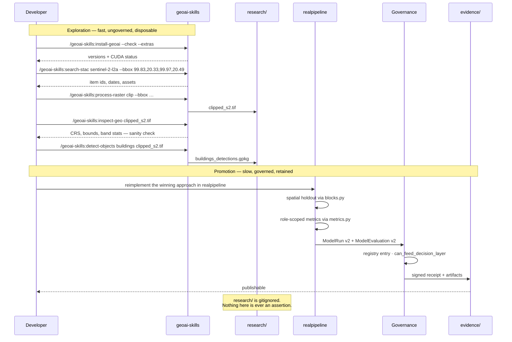

**The rule in one line:** *skills are how you find out; `realpipeline` is how you claim.*

---

## 9. Current-State Architecture Diagrams

### A. Current System Context

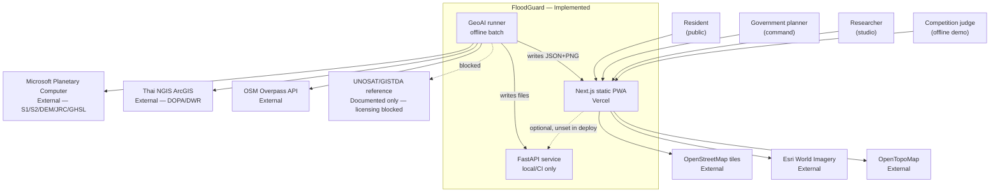

**Represents:** system boundary and external actors.
**Files:** `vercel.json`, `apps/web/src/lib/data-provider.ts:289`, `geo-map.tsx:71-86`, `real_data.py`, `docs/reference_mask_licensing_log.md`.
**Limitations:** the `runner → api` and `runner → web` edges are **filesystem writes committed to Git**, not runtime calls.
**Unverified:** whether any Vercel deployment sets `NEXT_PUBLIC_FLOODGUARD_API_URL`. No repository evidence that it does.

### B. Current Container Diagram

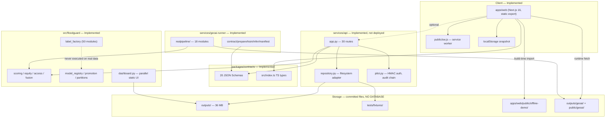

**Represents:** deployable/runnable units.
**Files:** all three `pyproject.toml`, `apps/web/package.json`, `repository.py:198-212`.
**Key limitation:** `outputs/` is a shared mutable filesystem acting as the integration bus between four otherwise-isolated components.

### C. Current Internal Component Diagram (web)

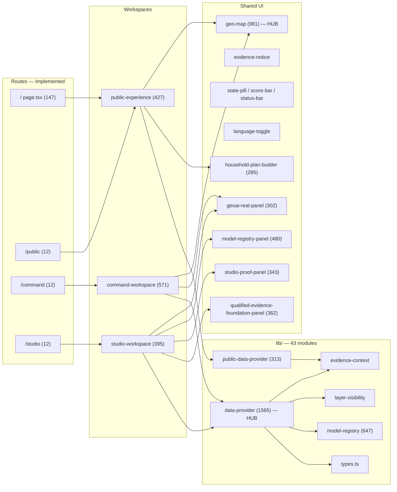

**Two dependency hubs are visible:** `data-provider.ts` (1,565 lines) and `geo-map.tsx` (981 lines). Both are imported by every workspace and both mix concerns — `data-provider` performs fetching, fallback, schema assertion, snapshot persistence, and scenario submission in one module.

### D. Current Request and Data-Flow

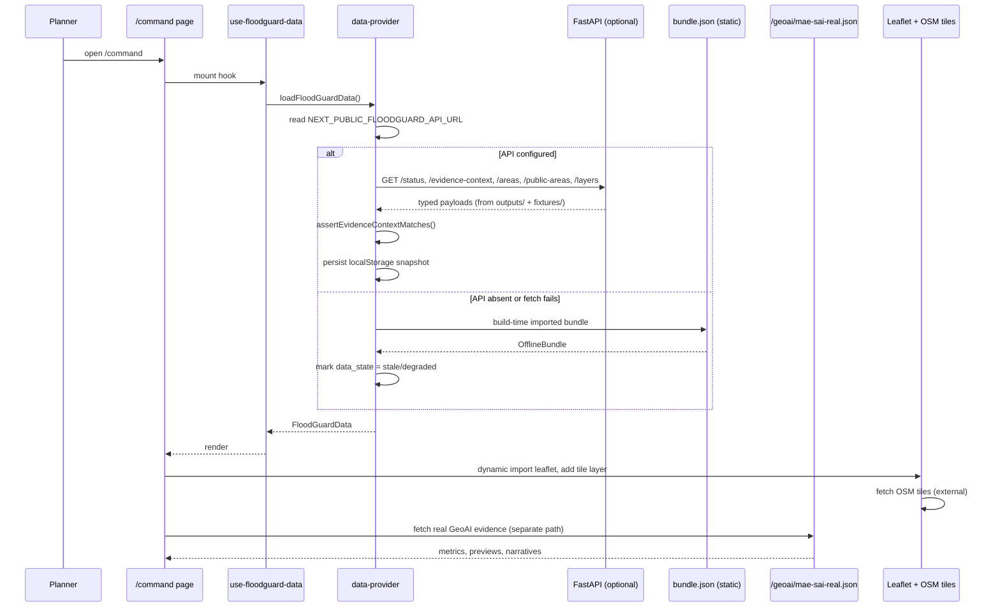

**Note the two independent data paths.** The GeoAI panel does not go through `data-provider`, the API, or the contract layer.

### E. Current GeoAI Pipeline

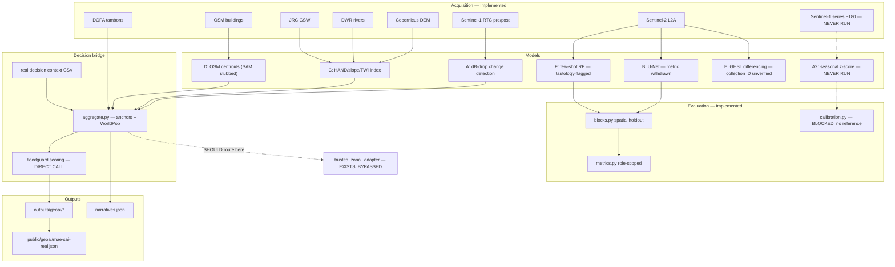

**The dashed `aggregate → trusted_zonal_adapter` edge is the single most important architectural gap.** `src/floodguard/trusted_zonal_adapter.py` (1,354 lines) exists and is documented as the *only* permitted model→reporting bridge (`docs/geoai-system-design-v1.md:80`), but `run_real.py` calls `score_subdistricts` directly.

### F. Current Deployment

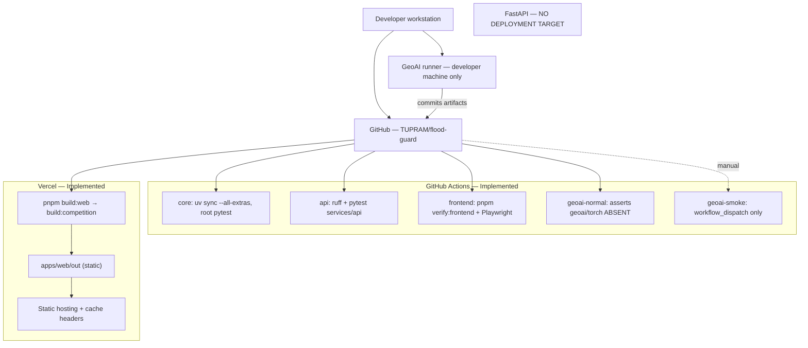

**Confirmed:** no Dockerfile, no container config, no IaC, no staging environment, no secrets configuration in the repository. Deployment is static-only.

### G. Current User-Experience Flow

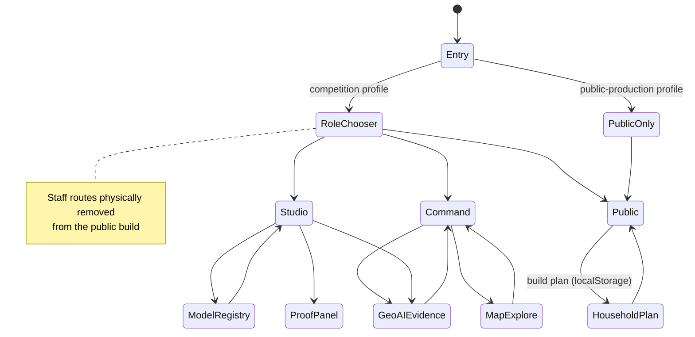

**No login, no session, no cross-role navigation guard.** Role separation is build-time and link-based only.

---

## 10. Current Domain and Data Model

**There is no database.** Entities exist as JSON Schema contracts, Pydantic models, TypeScript types, and CSV columns.

| Entity | Current representation | Source files | Issues |
|---|---|---|---|
| Study area | `study_area_id` string | `data-provider.ts`, `app.py` query param | Not a first-class entity |
| Administrative area (tambon) | `AreaRecord` / `AreaDecision` | `contracts/schemas/area-decision.schema.json`, `types.ts` | **3 representations**: contract, CSV row, GeoJSON properties |
| Public preparedness area | `PublicPreparednessArea` | `public-preparedness-area.schema.json` | Parallel to `AreaDecision` |
| Evidence context | `EvidenceContext` | `evidence-context.schema.json` | Well-defined |
| Evidence record | `EvidenceRecord` | `evidence-record.schema.json` | Well-defined |
| Model run | `ModelRun` (v1) + `ModelRunV2` | `model-run.schema.json`, `model-run-v2.schema.json` | **Two versions coexist** |
| Model evaluation | `ModelEvaluationV2` | `model-evaluation-v2.schema.json` | v1 absent |
| Model registry entry | `ModelRegistryEntryV1` | `model-registry-entry-v1.schema.json` | |
| Flood observation product | `FloodObservationProductV2` | `flood-observation-product-v2.schema.json` | Descriptor-only in fixtures |
| Layer | `LayerCatalogItem` | `layer.schema.json` | |
| Road segment | CSV rows + GeoJSON | `outputs/mae_sai_road_risk.csv/.geojson` | **No contract schema** |
| Facility / shelter | GeoJSON + bundle JSON | `outputs/mae_sai_facilities.geojson` | **No contract schema** |
| Population node | CSV | `outputs/mae_sai_population_nodes.csv` | **No contract schema** |
| Access-loss result | CSV | `outputs/mae_sai_access_loss.csv` | **No contract schema** |
| Equity gap | CSV | `outputs/mae_sai_equity_gap.csv` | **No contract schema** |
| Priority score (FPPS) | CSV + GeoJSON + contract | multiple | **3 representations** |
| Household plan | TS type + localStorage | `household-plan.ts` | Client-only |
| Pilot credential/receipt | Pydantic | `pilot_models.py` | |
| Qualified label release | Python dataclasses | `label_factory/` | **No JSON Schema** |
| Spatial partition | Python dataclass | `multi_event_partitions.py`, `blocks.py` | **Two unrelated implementations** |

### Current confirmed model

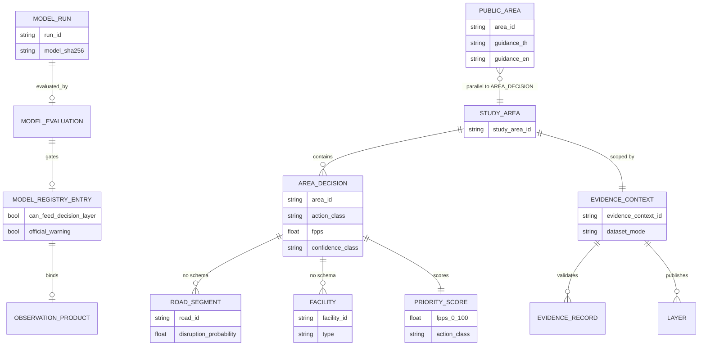

### Duplicated / conflicting models

| Conflict | Evidence | Impact |
|---|---|---|
| `AreaDecision` vs `PublicPreparednessArea` | two schemas, two providers | Same tambon, two shapes, two fetch paths |
| `ModelRun` v1 vs v2 | both schemas live; `geoai-system-design-v1.md:186` says v1 is frozen | Consumers must handle both |
| FPPS in CSV, GeoJSON properties, and contract | `outputs/*.csv`, `*.geojson`, schema | Silent divergence risk |
| Spatial partition: `multi_event_partitions.py` vs `blocks.py` | two dataclasses, no shared type | Intentional (sealed vs runner-local) but undocumented as a pair |
| Road/facility/population/access/equity have **no schema at all** | `packages/contracts/schemas/` lacks them | These flow to the UI unvalidated |

---

## 11. Dependency and Coupling Analysis

### Dependency hubs

| Module | Lines | Imported by | Concerns mixed |
|---|---:|---|---|
| `apps/web/src/lib/data-provider.ts` | 1,565 | all command/studio components | fetch, fallback, assertion, persistence, scenario POST |
| `apps/web/src/components/geo-map.tsx` | 981 | public + command | basemaps, layers, popups, a11y, i18n |
| `services/api/src/floodguard_api/pilot.py` | 1,932 | app.py | auth, audit chain, receipts, retention |
| `services/api/src/floodguard_api/dataset_registry.py` | 1,727 | app.py | dataset gating |
| `src/floodguard/controlled_experiment.py` | 7,476 | scripts, tests | acquisition gates, holdouts, reviewer receipts, reference cells |
| `src/floodguard/dashboard.py` | 4,545 | 4 files | HTML generation + Leaflet embedding |

### Circular dependencies

**None found in Python.** The `src/floodguard` ↔ `services/*` relationship is strictly one-directional (services import core; core never imports services), enforced by ADR-0001 and CI job `geoai-normal`.

### Orphaned modules

| Scope | Result |
|---|---|
| `src/floodguard/*.py` | **No orphans** (all 60 modules referenced) |
| `services/geoai-runner/realpipeline/*.py` | **No orphans** (only `__init__`/`__main__`) |
| `scripts/*` | **19 files referenced in no doc/CI/manifest** — see §16 |
| `outputs/*` | **21 of 124 files referenced nowhere in code** |

### Cross-layer violations

| Violation | Evidence | Severity |
|---|---|---|
| GeoAI runner calls decision engine directly, bypassing `trusted_zonal_adapter` | `run_real.py:45` `from floodguard.scoring import score_subdistricts` | **High** — contradicts `geoai-system-design-v1.md:80` |
| `run_real.py` mutates `sys.path` at import time | `run_real.py:33-36` | Medium — masks packaging problems |
| API reads repo-relative paths via `parents[4]` | `config.py` `RepositoryPaths.discover` | Medium — API cannot be containerised without the repo |
| Web imports 2.3 MB JSON at module scope | `data-provider.ts:1-7` | Medium — bundle size |
| `dashboard.py` embeds vendored Leaflet | `src/floodguard/static/leaflet/` | Low |

### Duplicate logic

| Duplication | Locations |
|---|---|
| Data fetching + fallback | `data-provider.ts` and `public-data-provider.ts` (313 ln, similar shape) |
| Map rendering | `geo-map.tsx` and `dashboard.py` inline JS |
| Binary mask metrics | Previously 3 copies; **consolidated into `metrics.py` in `debe413`** |
| Sub-district ID normalisation | `aggregate.normalise_subdistrict_id` + implicit handling elsewhere |
| Priority-table rendering | `command-workspace.tsx`, `geoai-real-panel.tsx`, `dashboard.py`, `geoai_page.py` |

---

## 12. Configuration and Environment Review

| Variable | Used by | Purpose | Required | Exposure | Risk |
|---|---|---|---|---|---|
| `NEXT_PUBLIC_FLOODGUARD_API_URL` | `data-provider.ts:289`, `public-data-provider.ts` | API base | Optional | **Client** | If unset → silent static fallback. **Not documented in any `.env.example`** |
| `NEXT_PUBLIC_FLOODGUARD_APP_PROFILE` | `deployment-profile.ts`, `build-profile.mjs` | competition \| public-production | Optional (defaults competition) | **Client** | Wrong value → staff routes in public build. Mitigated by build-time route removal |
| `FLOODGUARD_APP_PROFILE` | `build-profile.mjs` | Build-time profile | Build only | Server | — |
| `FLOODGUARD_API_URL` | `live-api-smoke.mjs` | Smoke target | Optional | Test | — |
| `FLOODGUARD_WEB_URL` | browser smokes | Smoke target | Optional | Test | — |
| `FLOODGUARD_SMOKE_TIMEOUT_MS` | smokes | Timeout | Optional | Test | — |
| `FLOODGUARD_BROWSER_EXECUTABLE` | `browser-launch.mjs` | Playwright path | Optional | Test | Machine-specific |
| `FLOODGUARD_*_PROFILE_OUT` (×3) | profile scripts | Output dir | Optional | Test | — |
| `FLOODGUARD_TEST_PROMOTION_KEY` | `tests/test_model_promotion.py` | HMAC test key | Test only | Test | **Test fixture only — not a production secret** |
| `RUN_GEOAI_SMOKE` | `test_geoai_smoke.py` | Opt-in gate | Optional | CI | — |
| `FLOODGUARD_PROOF_COMMIT`, `GEOAI_PROOF_OUTPUT_DIR` | geoai-smoke workflow | Proof metadata | CI | CI | — |
| `NODE_ENV` | Next.js | Standard | Auto | Both | — |
| `GDAL_DISABLE_READDIR_ON_OPEN` | `real_data.py:90` | COG read perf | Set in code | Server | — |
| *(CORS origins)* | `app.py:78` | `DEFAULT_CORS_ORIGINS` | Hard-coded | Server | **localhost-only default**; `_configured_cors_origins()` exists but its source is not an env var visible in `config.py` — **requires verification** |

### Findings

| Finding | Severity |
|---|---|
| **No secrets committed.** Pattern scan across `.py/.ts/.tsx/.json/.yml/.mjs` found zero credential-shaped literals | ✅ Good |
| **No `.env` file tracked**; `.gitignore` covers `.env*.local` | ✅ Good |
| **No `.env.example` anywhere** — 13 variables are undocumented | **Medium** |
| Machine-specific paths appear **only in test fixtures asserting rejection** (`data-provider.test.ts:124`, `test_api.py:386`) — this is a *path-leak defence*, a positive finding | ✅ Good |
| `RepositoryPaths.discover()` uses `parents[4]` | Medium — brittle, blocks containerisation |
| TLS verification disabled for Thai NGIS: `ssl.CERT_NONE`, `check_hostname=False` | **High** — see §14 |
| Hard-coded tile URLs (3 providers) | Low — acceptable for basemaps |
| `environment.yml` (conda) unreferenced while uv is the real toolchain | Low — misleading |

---

## 13. Testing, Reliability, and Observability Review

### Executed results

| Suite | Command | Result |
|---|---|---|
| Root | `pytest tests/` | **1,649 passed, 16 failed, 1 skipped** (256 s) |
| GeoAI runner | `pytest services/geoai-runner/tests` | **274 passed, 1 skipped** |
| Web | not run | `node_modules` absent |
| API | not run | env not provisioned |

### The 16 root failures — diagnosis

**Confirmed root cause: worktree / editable-install mismatch, not a code defect.**

`floodguard-thailand` is installed editable via `__editable__.floodguard_thailand-0.1.0.pth`, which resolves to the **main checkout** (`C:/Users/iputu/Documents/Flood Guard/src`), currently on `master`. In-process tests work because `pyproject.toml` sets `pythonpath = ["src"]` relative to the worktree. **Subprocess-spawned CLI tests do not inherit that**, so they import `floodguard` from the main checkout, which lacks `model_promotion.py`.

Failing tests are all subprocess-based CLI tests: `test_model_promotion.py` (×2), `test_controlled_experiment_cli.py`, `test_label_factory_qualified_reference_release.py`, `test_sign_controlled_model_run_cli.py`, and others.

**This is nonetheless a real finding:** the test suite is **not hermetic**. It would also break for anyone with two checkouts or a stale editable install. In CI (fresh clone) it passes.

### Testing matrix

| System area | Existing tests | Coverage quality | Missing | Priority |
|---|---|---|---|---|
| FPPS scoring | `tests/test_scoring*.py` | **Strong** | — | — |
| Equity / access | `tests/test_equity.py`, `test_access.py` | **Strong** | — | — |
| Contract schemas | `test_contract_schemas.py`, `contracts.test.ts` | **Strong** | Road/facility/access schemas absent | P2 |
| Label factory | ~30 test files | **Strong (unit)** | Never executed on real data | P2 |
| Model governance | `test_model_promotion.py`, `test_model_registry.py` | **Strong (adversarial)** | — | — |
| API routes | `services/api/tests` (6 files) | **Good** | No auth-bypass fuzzing; no rate-limit tests | P1 |
| GeoAI realpipeline | 274 tests | **Good** | Network fetchers untested; `--temporal` never executed | P1 |
| Spatial holdout | `test_blocks.py` (25) | **Strong** | — | — |
| Calibration | `test_calibration.py` (30) | **Strong** | Never fitted against a real reference | P2 |
| Web components | vitest across ~12 files | **Moderate** | `geo-map.tsx` (981 ln) has only `geo-map.test.ts` unit-level | P1 |
| Offline/PWA | `browser-offline-smoke.mjs`, `offline-smoke.mjs` | **Good** | — | — |
| Deployment profiles | `verify-deployment-profiles.mjs` | **Good** | — | — |
| E2E user journeys | **None** | **Missing** | No Playwright journey covering role→map→evidence | P1 |
| Accessibility | **None** | **Missing** | No axe/a11y assertions | P2 |
| Performance | **None** | **Missing** | No bundle-size budget despite 2.3 MB JSON import | P1 |

### Observability

| Capability | Status |
|---|---|
| Structured logging | **Absent** — `print()` in pipelines, none in API |
| Error tracking (Sentry etc.) | **Absent** |
| Metrics/APM | **Absent** |
| Health check | **Present** — `/api/v1/health` |
| Audit logging | **Present and strong** — `pilot.py` hash-chained append-only ledger |
| Model version tracking | **Present** — `model_sha256`, registry entries |
| Dataset version tracking | **Present** — `source_bundle_sha256`, checksums |
| Data-quality checks | **Partial** — validation modules exist; not run on a schedule |

---

## 14. Security, Privacy, and Crisis-Safety Review

### Findings by severity

#### HIGH

**H-1. TLS certificate verification disabled for Thai government data source**
`services/geoai-runner/geoai_runner/realpipeline/real_data.py:43-44`
```
_SSL.check_hostname = False
_SSL.verify_mode = ssl.CERT_NONE
```
All Thai NGIS ArcGIS fetches (DOPA boundaries, DWR rivers) run over an unauthenticated channel. A MITM could substitute administrative geometry or river networks, silently corrupting HAND, susceptibility, and every zonal aggregate. **This directly contradicts the project's provenance claims** — authoritative sourcing cannot be asserted over an unverified channel.
*Remediation:* enable verification; if NGIS has a certificate-chain problem, pin its CA explicitly and record why.

**H-2. GeoAI evidence bypasses the contract boundary**
`run_real.py:45` imports `floodguard.scoring.score_subdistricts` directly, while `docs/geoai-system-design-v1.md:80` states `trusted_zonal_adapter.py` is the *only* permitted model→reporting bridge. Real model output reaches an action class (A–E) with no signed receipt, no registry entry, and no `can_feed_decision_layer` check. The published claim of report-only governance is **asserted in prose, not enforced in code** for this path.

**H-3. No rate limiting on any endpoint**
No limiter in `app.py`. Mitigated in practice because the API is not deployed — but it becomes exploitable the moment it is. `/api/v1/layer-data/{layer_id}` serves multi-MB GeoJSON.

#### MEDIUM

**M-1. CORS default is permissive-by-omission.** `DEFAULT_CORS_ORIGINS` is localhost-only, but `_configured_cors_origins()` sourcing is not visible in `config.py`. **Requires verification** before deployment.

**M-2. No `.env.example`.** 13 environment variables; a deployer cannot know `NEXT_PUBLIC_FLOODGUARD_API_URL` exists. Silent fallback to static data means a misconfiguration produces a **plausible-looking but stale** UI rather than an error.

**M-3. Unversioned API contract in the URL only.** All routes are `/api/v1/...` but `ModelRun` v1 and v2 coexist *within* v1 routes.

**M-4. `RepositoryPaths.discover()` uses `parents[4]`.** The API cannot run outside the repository layout — blocks containerisation and any least-privilege deployment.

**M-5. Large GeoJSON rendered without a feature cap.** `roads.json` is 2.3 MB. No evidence of clustering/simplification limits in `geo-map.tsx`. DoS-by-payload risk if layer data ever becomes user-influenced.

#### LOW

**L-1.** No security headers (CSP, HSTS, X-Frame-Options) in `vercel.json` — only cache-control.
**L-2.** No dependency vulnerability scanning in CI (no Dependabot config, no `pip-audit`/`pnpm audit` step).
**L-3.** Vendored Leaflet in `src/floodguard/static/leaflet/` receives no update path.
**L-4.** `notebooks/*.ipynb` may contain outputs with embedded data; not stripped.

#### INFORMATIONAL

**I-1.** No user authentication exists — correct for a read-only public tool, but should be a *documented decision*, not an omission.
**I-2.** No PII is collected. Household plans are `localStorage`-only and never transmitted. **This is a strong privacy posture worth preserving explicitly.**
**I-3.** No file upload anywhere → entire upload attack class absent.
**I-4.** No community reporting → no UGC moderation/abuse surface.

### Crisis-safety assessment

| Question | Finding | Evidence |
|---|---|---|
| Could emergency information be stale? | **Yes, and it is handled.** `data_state` = ready/stale; UI shows TH/EN "Confirm current conditions" | `status-bar.tsx:13`, `public-experience.tsx:30` |
| Is uncertainty communicated? | **Yes.** `confidence_class` surfaced; `signal_agreement_gap` published; narratives carry mandatory caveats | `narrative.py`, `geoai-real-panel.tsx:150` |
| Could shelter availability be misrepresented? | **Partial risk.** Shelters are static bundle entries with no capacity/status freshness field | `bundle.json` |
| Could routing be read as guaranteed-safe? | **Low risk** — no routing UI exists. Access-loss is described as threshold analysis, and `model_contract.md:131` explicitly forbids calling it 2SFCA | `model_contract.md` |
| Are predictions presented as observations? | **Well handled.** Evidence kinds are typed (`satellite_observed_extent` vs `susceptibility_forecast`); `official_warning=false` enforced | `geoai-system-design-v1.md:107` |
| Is degraded/offline considered? | **Yes, thoroughly.** Service worker, offline bundles, `stale_offline` messaging, Playwright offline smokes | `sw.js`, `browser-offline-smoke.mjs` |
| Single-provider dependency? | **Yes — OSM tiles.** Map is blank if `tile.openstreetmap.org` is unreachable. No tile fallback chain or cached-tile strategy | `geo-map.tsx:71` |
| Can users distinguish official from community data? | **N/A** — no community data exists |

**Overall crisis-safety posture is unusually strong for this project stage.** The main gaps are H-1 (channel integrity) and the OSM tile single point of failure.

---

## 15. Technical Debt and Cleanup Findings

| ID | Area | Current issue | Evidence | Impact | Risk | Recommended cleanup | Effort | Priority | Depends on |
|---|---|---|---|---|---|---|---|---|---|
| D-01 | Security | TLS verification disabled | `real_data.py:43-44` | Provenance claims unsound | High | Enable verification; pin CA if needed | XS | **P0** | — |
| D-02 | Governance | GeoAI bypasses trusted adapter | `run_real.py:45` | Contract claim unenforced | High | ~~Route through `trusted_zonal_adapter`~~ **SUPERSEDED — see v3 errata.** The adapter refuses candidate input by design; a report-only lane was built instead (`candidate_zonal_receipt.py`) | S | **DONE** | — |
| D-03 | Data arch | `outputs/` mixes API input, evidence, demo assets | `repository.py:198-212`; 124 files, 36 MB | Cannot tell sample from evidence | High | Split into `fixtures/`, `evidence/`, `web-assets/` | M | **P0** | D-04 |
| D-04 | Git hygiene | 11.3 MB generated HTML committed | `outputs/dashboard.html` 5.9 MB, `geoai/geoai.html` 5.4 MB | Repo bloat; diff noise | Low | Gitignore; publish as CI artifacts | XS | **P1** | — |
| D-05 | Config | No `.env.example` | 13 vars, none documented | Misconfig → silent stale data | Medium | Add `.env.example` + startup validation | XS | **P1** | — |
| D-06 | Testing | Suite not hermetic | 16 subprocess failures in worktree | False failures; hides real ones | Medium | Pass `PYTHONPATH` explicitly in subprocess tests | S | **P1** | — |
| D-07 | Frontend | `data-provider.ts` 1,565 lines, 5 concerns | file | Hard to test/change | Medium | Split: `api-client` / `fallback` / `assertions` / `snapshot` | M | **P1** | — |
| D-08 | Frontend | `geo-map.tsx` 981 lines | file | Map changes are risky | Medium | Extract `basemaps`, `layer-builders`, `popups` | M | **P1** | — |
| D-09 | GeoAI | Two parallel stacks in one package | `cli.py` chain vs `realpipeline/` | Two answers to "record a run" | High | Decide: realpipeline emits governed ModelRun v2 | M | **P1** | D-02 |
| D-10 | Deps | `realpipeline` extra cannot resolve | `omniwatermask` needs `numpy<2.4`; pinned `2.4.2` | `--all-methods` uninstallable | High | Pin `numpy<2.4` in the extra, or drop OmniWaterMask | XS | **P1** | — |
| D-11 | Frontend | 2.3 MB JSON imported at module scope | `data-provider.ts:1-7` | Bundle size | Medium | Lazy-load bundles via `fetch` | S | **P1** | D-07 |
| D-12 | Reliability | OSM tiles single point of failure | `geo-map.tsx:71` | Blank map on outage | Medium | Fallback chain + offline tile note | S | **P1** | — |
| D-13 | UI dup | Two UI generators | `dashboard.py` 4,545 ln vs `apps/web` | Double maintenance | Medium | Freeze `dashboard.py`; archive after judging | S | **P2** | — |
| D-14 | Structure | `src/floodguard/` 60 flat modules | `ls` | Navigation cost | Medium | Group: `decision/`, `evidence/`, `provenance/`, `studies/` | L | **P2** | — |
| D-15 | Scripts | 19 unreferenced scripts | reverse grep | Unclear what is live | Low | Move to `scripts/archive/` with README | S | **P2** | — |
| D-16 | Contracts | Road/facility/population/access/equity have no schema | `packages/contracts/schemas/` | Unvalidated data reaches UI | Medium | Add 5 schemas | M | **P2** | — |
| D-17 | Domain | `AreaDecision` vs `PublicPreparednessArea` | two schemas | Divergence risk | Medium | Derive public view from canonical | M | **P2** | D-16 |
| D-18 | Domain | ModelRun v1 + v2 coexist | both schemas | Consumer complexity | Low | Mark v1 deprecated in schema | XS | **P2** | — |
| D-19 | Outputs | 21 output files referenced nowhere | reverse grep | Dead weight | Low | Verify then archive | S | **P2** | D-03 |
| D-20 | Testing | No E2E user journey | no Playwright journey spec | Regressions reach demo | Medium | 3 journeys (public/command/studio) | M | **P2** | — |
| D-21 | Observability | No structured logging in API | `app.py` | Undiagnosable in deployment | Medium | Add structured logger + request IDs | S | **P2** | — |
| D-22 | Security | No security headers | `vercel.json` | Weak defence-in-depth | Low | Add CSP/HSTS/X-Frame-Options | XS | **P2** | — |
| D-23 | Security | No dependency scanning | no config | Unknown CVE exposure | Medium | Dependabot + `pip-audit` in CI | XS | **P2** | — |
| D-24 | Docs | README mixes intent with status | `README.md` | Readers overestimate maturity | Medium | Status column per capability | S | **P2** | — |
| D-25 | Git | Notebook outputs committed (2.9 MB) | `notebooks/03_*.ipynb` | Bloat; possible data leak | Low | `nbstripout` pre-commit | XS | **P3** | — |
| D-26 | Config | `environment.yml` unreferenced | root | Misleads contributors | Low | Remove or document | XS | **P3** | — |
| D-27 | Structure | `tasks/` superseded by `PLANS.md` | both | Two roadmaps | Low | Archive `tasks/` | XS | **P3** | — |
| D-28 | Assets | ~5 MB visual-QA PNGs | `docs/visual-qa/` | Clone size | Low | Git LFS or external | S | **P3** | — |
| D-29 | A11y | No a11y tests | none | Unknown compliance | Medium | axe in Playwright | S | **P3** | D-20 |
| D-30 | Perf | No bundle budget | no config | Silent bloat | Low | `next build` size assertion in CI | XS | **P3** | D-11 |
| D-31 | i18n | Bilingual strings inline in components | `public-experience.tsx:30` | Hard to add a language | Low | Extract to message catalogue | M | **P4** | — |
| D-32 | Vendoring | Leaflet vendored | `src/floodguard/static/leaflet/` | No update path | Low | Remove with `dashboard.py` | XS | **P4** | D-13 |

### GeoAI toolchain debt — added in v2

| ID | Area | Current issue | Evidence | Impact | Risk | Recommended cleanup | Effort | Priority | Depends on |
|---|---|---|---|---|---|---|---|---|---|
| D-33 | GeoAI env | **`geoai-py` is not installed in any virtualenv**, yet 6 modules import the stack (`infer.py`, `prepare.py`, `susceptibility.py`, `water_baseline.py`, `water_unet.py`, and `infrastructure.py` via `samgeo`) | §8A.3 probe across 3 venvs | No GeoAI component is locally runnable or reproducible | **High** | `uv sync --extra geoai` in the runner; document in README; add a `make geoai-env` target; add an opt-in CI job that actually imports it | S | **P0** | D-10 |
| D-34 | GeoAI arch | Hand-rolled fetch/IO duplicates `geoai` helpers with no recorded rationale | §8A.4 table | Reviewers cannot tell deliberate choice from ignorance | Low | Add a `# why not geoai.X` docstring note to each of the 6 sites; adopt `raster_to_vector` where it is strictly better | S | **P2** | D-33 |
| D-35 | Governance | Skill output has no provenance envelope and no quarantine directory | Skills write bare `.gpkg`/`.tif`; `.geoai-skills/state.json` untracked | Ungoverned files could be mistaken for evidence | **Medium** | Create `research/`; gitignore its contents except `research/MANIFEST.md`; add CI assertions that `repository.py` and `apps/web` never read it | S | **P1** | D-03 |
| D-36 | Calibration | Calibration declared BLOCKED on an in-area reference while two open benchmarks are one function call away | `calibration.py`; book Ch. 9.6.1–9.6.2 datasets | The project's headline measurement gap is self-imposed | **High** | Fit and report calibration on `dset-s2` (Earth Surface Water) at **research tier**; keep the in-area gate for operational claims | M | **P1** | D-33, ADR-E |
| D-37 | Metrics | Component B (withdrawn) and ★ (IoU 0.07) have no external reference point | §8A.6 | ~~probably a defect~~ **CORRECTED:** the artifact was already honestly labelled `iou_vs_unet_labels`; the reference (MNDWI) is what is wrong | **Medium** | ~~investigate `band_order`, input scaling~~ **both excluded by measurement.** Diagnosed: definition mismatch. See v3 errata | S | **DONE** | D-33 |
| D-38 | Hygiene | `.geoai-skills/state.json` is untracked, ungoverned mutable session state | skill Steps 4–5 | Silent cross-session coupling; could leak absolute paths | Low | Add `.geoai-skills/` to `.gitignore`; document that it is a cache, never an input to a governed run | XS | **P2** | — |
| D-39 | Deps | One monolithic `realpipeline` extra mixes runnable, superseded, and unresolvable pins | runner `pyproject.toml`; §8A.3 resolver output | The whole extra fails because of one package | **High** | Split into three extras: `geoai` (core, must resolve), `realpipeline` (fetchers + sklearn), `research` (omniwatermask, torchange, moondream — explicitly best-effort). Drop `omniwatermask` or relax `numpy` | S | **P0** | — |
| D-40 | Docs | `registry.py` `book_ref` citations are never surfaced to a reader | grep: `book_ref` is written, never rendered | The strongest methodological asset is invisible to judges | Low | Render `book_ref` in the Studio methodology panel and in `geoai.html` | S | **P3** | — |

### Debt by priority, after v2

```mermaid
flowchart LR
    subgraph P0["P0 — blocks the submission story"]
        p0a["D-01 TLS verification"]
        p0b["D-02 Trusted adapter bypass"]
        p0c["D-03 outputs/ split"]
        p0d["D-33 geoai not installed"]
        p0e["D-39 extras cannot resolve"]
    end

    subgraph P1["P1 — before the next demo"]
        p1a["D-04 · D-05 · D-06 · D-07<br/>D-08 · D-09 · D-10 · D-11 · D-12"]
        p1b["D-35 research/ quarantine"]
        p1c["D-36 benchmark calibration"]
        p1d["D-37 metric reference point"]
    end

    subgraph P2["P2 — before a pilot"]
        p2a["D-13 … D-24"]
        p2b["D-34 · D-38"]
    end

    subgraph P3P4["P3-P4 — post-submission"]
        p3a["D-25 … D-32 · D-40"]
    end

    P0 --> P1 --> P2 --> P3P4
```

---

## 16. Keep, Consolidate, Refactor, Replace, Archive, or Delete

| File/module | Responsibility | Classification | Reason | Dependencies | Proposed action |
|---|---|---|---|---|---|
| `apps/web/src/app/**` | Routes | **Keep as-is** | Thin, correct | components | — |
| `apps/web/src/lib/data-provider.ts` | Data access | **Refactor** | 1,565 ln, 5 concerns | all workspaces | Split into 4 modules |
| `apps/web/src/lib/public-data-provider.ts` | Public data | **Consolidate** | Duplicates fetch/fallback | — | Share transport with above |
| `apps/web/src/components/geo-map.tsx` | Map | **Refactor** | 981 ln | public, command | Extract basemaps/layers/popups |
| `apps/web/src/components/*-panel.tsx` | Evidence panels | **Keep with minor cleanup** | Well-scoped | providers | — |
| `packages/contracts/**` | Schemas + types | **Keep as-is** | Best-structured part of repo | everything | Extend with 5 missing schemas |
| `services/api/src/floodguard_api/app.py` | HTTP boundary | **Keep with minor cleanup** | 888 ln, 30 routes, thin | repository, pilot | Consider routers per domain |
| `services/api/.../repository.py` | Filesystem adapter | **Refactor** | Hard-codes `outputs/` paths | app.py | Point at `fixtures/` after D-03 |
| `services/api/.../pilot.py` | Auth + audit | **Keep as-is** | 1,932 ln but cohesive and well-tested | app.py | — |
| `services/geoai-runner/realpipeline/**` | Real GeoAI | **Keep with minor cleanup** | Newly reworked, tested | floodguard.scoring | Route via trusted adapter |
| `services/geoai-runner/{contract,prepare,train,infer,manifest}.py` | Governed run path | **Requires investigation** | Overlaps realpipeline; unclear if superseded | cli.py, tests | Decide before further work |
| `src/floodguard/scoring.py`, `equity.py`, `access.py`, `fusion.py` | Decision engine | **Keep as-is** | Core value, well tested | everything | — |
| `src/floodguard/trusted_zonal_adapter.py` | Model→area bridge | **Keep — and START USING** | Built, tested, bypassed | — | Wire into `run_real.py` |
| `src/floodguard/dashboard.py` (4,545 ln) | Static HTML UI | **Archive after judging** | Duplicates `apps/web` | 4 files | Freeze; do not extend |
| `src/floodguard/static/leaflet/` | Vendored JS | **Candidate for deletion** | Only used by `dashboard.py` | dashboard.py | Delete with D-13 |
| `src/floodguard/label_factory/**` (55,742 ln) | Annotation governance | **Keep as-is** | Complete, tested, never executed | scripts | Feed via weak-signal fusion |
| `src/floodguard/controlled_experiment.py` (7,476 ln) | Experiment gates | **Refactor (later)** | Largest single module | scripts, tests | Split by gate type |
| `src/floodguard/hat_yai_readiness.py`, `theos2_*.py` | Study-area one-offs | **Consolidate** | Study-specific in core namespace | dashboard | Move to `studies/` |
| `scripts/` (104 files) | CLI pipelines | **Consolidate** | 19 unreferenced | varies | `scripts/{pipelines,evidence,archive}/` |
| `outputs/dashboard.html`, `outputs/geoai/geoai.html` | Generated HTML | **Candidate for deletion** | 11.3 MB generated | none | Gitignore; CI artifact |
| `outputs/geoai/rivers.geojson` (3.7 MB) | Cached fetch | **Candidate for deletion** | Regenerable | none | Gitignore |
| `notebooks/**` | Exploration | **Keep with minor cleanup** | Legitimate research record | — | Strip outputs |
| `tasks/**` | Historical backlog | **Archive** | Superseded by `PLANS.md` | none | Move to `docs/history/` |
| `environment.yml` | Conda env | **Candidate for deletion** | Unreferenced; uv is real toolchain | none | Verify then remove |
| `packaging/offline-demo/` | Demo server | **Keep as-is** | Judging path | bundles | — |
| `resources/snap/*.xml` | SNAP graph | **Keep as-is** | Documents SAR preprocessing | docs | — |

### Deletion candidates — required verification before removal

| Candidate | Evidence of disuse | Checks required before deleting |
|---|---|---|
| `outputs/dashboard.html` | Generated by `dashboard.py`; no code reads it | Confirm no judge/demo doc links to it; confirm CI can regenerate |
| `outputs/geoai/geoai.html` | Generated by `geoai_page.py` | Same |
| `outputs/geoai/rivers.geojson` | Cached DWR fetch | Confirm `run_real.py` re-fetches; confirm offline demo does not read it |
| `src/floodguard/static/leaflet/` | Only `dashboard.py` references | Confirm `dashboard.py` archived first |
| `environment.yml` | Zero references found | Confirm no contributor workflow depends on conda |
| 19 unreferenced `scripts/*.py` | No doc/CI/manifest reference | **Check git log for recent use**; check `docs/` prose; check notebooks; check other scripts |
| 21 unreferenced `outputs/*` | No code reference | Check docs/submission references; check whether they are evidence receipts that must persist |

**No deletion was performed. All of the above require the listed checks first.**

---

## 17. Proposed Architecture Principles

| Principle | Why here | Essential? |
|---|---|---|
| **Preserve the three-project split** | `web` / `api` / `geoai-runner` already have correct dependency isolation enforced by CI. Changing it buys nothing | Essential |
| **Modular monolith, not microservices** | 859 files, one developer, no traffic. Microservices would add deployment surface with zero benefit | Essential |
| **Artifacts get a lifecycle, not a folder** | The `outputs/` ambiguity is the single largest structural problem. Fixtures, evidence, and web assets have different retention, review, and Git policies | Essential |
| **Gates block claims, not work** | Current gates block experimentation, which is why development stalls. Re-scope to three tiers: research / in-area claim / operational | Essential |
| **One bridge from model to decision** | `trusted_zonal_adapter` exists and is bypassed. Enforcing it makes the governance claim true rather than asserted | Essential |
| **Contracts cover every payload that reaches the UI** | Roads, facilities, access, equity currently flow unvalidated | Essential |
| **Separate observed / modelled / reported data** | Already partly done via evidence kinds; extend to all layers | Essential |
| **Static-first, API-optional** | The offline fallback is a genuine strength for a crisis tool. Keep it as the primary path | Essential |
| **No database until there is write traffic** | Nothing writes persistent state. Adding PostGIS now would be premature | Essential |
| **Skills explore; the pipeline claims** *(v2)* | `geoai-skills` output is fast and ungoverned. It belongs in `research/` and may never reach `evidence/` without a rerun under `realpipeline` with a spatial holdout and a signed receipt | Essential |
| **Every declared dependency must resolve** *(v2)* | An extra that cannot install is a false capability claim. Split extras so one unresolvable package cannot take down a runnable component | Essential |
| **Measure against something** *(v2)* | A metric with no reference point is not a result. Every model metric carries either an in-area reference or a named open benchmark | Essential |
| **Keep crisis messaging centralised** | Stale/degraded/abstain states are already consistent; formalise as a shared component | Optional but cheap |
| **Localisation via catalogue** | Only when a third language is actually planned | Optional |

### Technologies explicitly NOT recommended

| Technology | Why not |
|---|---|
| PostGIS / spatial DB | No write path, no query complexity that GeoJSON cannot serve. Adds ops burden. **Revisit when** multi-event, multi-district data exceeds ~100 MB or ad-hoc spatial queries are needed |
| Redux / Zustand | Current hook-based state is adequate for 3 routes. **Revisit when** cross-route shared mutable state appears |
| tRPC / GraphQL | REST + JSON Schema already gives typed contracts. **Revisit when** clients need field-level selection |
| Kubernetes / containers-per-service | No traffic, no scaling need. A single container for the API would suffice **when** it is deployed |
| Model serving framework (TorchServe etc.) | GeoAI is batch, offline, and label-blocked. **Revisit when** event-time inference is required |

---

## 18. Proposed Future Directory Structure

```
/
├── apps/
│   └── web/                          UNCHANGED — Next.js PWA, 3 role routes
│       └── src/lib/
│           ├── api/                  NEW — transport only (from data-provider)
│           ├── fallback/             NEW — offline bundle resolution
│           ├── evidence/             NEW — assertions (existing files moved)
│           └── map/                  NEW — basemaps, layer builders, popups
├── packages/
│   └── contracts/                    UNCHANGED + 5 new schemas
│                                     (road-segment, facility, population-node,
│                                      access-result, equity-result)
├── services/
│   ├── api/                          UNCHANGED structure; repository points at fixtures/
│   └── geoai-runner/
│       ├── geoai_runner/
│       │   ├── governance/           MOVED — contract, manifest, prepare, environment
│       │   └── realpipeline/         UNCHANGED
├── src/floodguard/
│   ├── decision/                     MOVED — scoring, equity, access, fusion, briefs
│   ├── evidence/                     MOVED — model_registry, promotion, trusted_zonal_adapter
│   ├── provenance/                   MOVED — ingestion, cdse, sentinel1_provenance, checksums
│   ├── label_factory/                UNCHANGED
│   └── studies/                      MOVED — mae_sai_*, hat_yai_*, theos2_*, ait_*
├── fixtures/                         NEW — synthetic API inputs (from outputs/sample_*)
├── evidence/                         NEW — real analysis receipts (from outputs/geoai/, validation)
├── research/                         NEW (v2) — ungoverned exploration sandbox
│   ├── MANIFEST.md                   the ONLY tracked file; records what was tried and why
│   ├── skills/                       geoai-skills output (gitignored)
│   ├── benchmarks/                   dset-s2, waterbody-dataset (gitignored)
│   └── .geoai-skills/                skill session state (gitignored)
├── scripts/
│   ├── pipelines/                    MOVED — active data pipelines
│   ├── evidence/                     MOVED — receipt builders
│   └── archive/                      NEW — 19 unreferenced scripts, with README
├── tests/                            UNCHANGED
├── docs/
│   └── history/                      NEW — tasks/, superseded docs
├── notebooks/                        UNCHANGED (outputs stripped)
├── packaging/                        UNCHANGED
└── resources/                        UNCHANGED
```

### Directory rationale

| Directory | Responsibility | Files moved in | Boundary established | When |
|---|---|---|---|---|
| `fixtures/` | Synthetic data the API serves for demos | `outputs/sample_*.csv`, `priority_subdistricts.geojson`, `road_risk.geojson` | **Sample ≠ evidence** — the most important new boundary | **Now** |
| `evidence/` | Real analysis receipts with provenance | `outputs/geoai/*`, `outputs/*validation*`, `outputs/*manifest*` | Evidence is reviewed and retained; fixtures are disposable | **Now** |
| `research/` **(v2)** | Ungoverned exploration: skill output, downloaded benchmarks, scratch rasters | nothing existing — new landing zone | **Hypothesis ≠ evidence.** Contents gitignored; unreadable by `services/api` and `apps/web`, enforced in CI | **Now** |
| `src/floodguard/decision/` | Pure decision logic | scoring, equity, access, fusion, briefs, exports | Depends on nothing but pandas | Later |
| `src/floodguard/evidence/` | Governance and receipts | model_registry, model_promotion, trusted_zonal_adapter, multi_event_partitions | May import `decision/`, never the reverse | Later |
| `src/floodguard/provenance/` | Source acquisition and integrity | ingestion, cdse*, sentinel1_provenance, local_data_library | Leaf layer | Later |
| `src/floodguard/studies/` | Study-area specifics | mae_sai_*, hat_yai_*, theos2_*, ait_* | Removes location coupling from core | Later |
| `apps/web/src/lib/{api,fallback,evidence,map}/` | Split the two hubs | from `data-provider.ts`, `geo-map.tsx` | Transport ≠ policy ≠ presentation | Later |
| `scripts/archive/` | Historical CLIs | 19 unreferenced scripts | Live vs historical | **Now** |
| `docs/history/` | Superseded planning | `tasks/` | One live roadmap | **Now** |

**Files that stay put:** all of `apps/web/src/app/`, `packages/contracts/`, `services/api/src/`, `services/geoai-runner/geoai_runner/realpipeline/`, `tests/`, `notebooks/`, `packaging/`, `resources/`.

---

## 19. Future Domain and Data Model

### Recommended canonical entities

| Entity | Canonical home | Change from today |
|---|---|---|
| `StudyArea` | New schema | Promote from string to entity |
| `ReportingArea` (tambon) | `area-decision.schema.json` | **Single** canonical; public view derived |
| `PublicAreaView` | Derived projection | No longer a parallel entity |
| `RoadSegment` | **New schema** | Currently unvalidated CSV/GeoJSON |
| `Facility` | **New schema** | Currently unvalidated |
| `PopulationNode` | **New schema** | Currently unvalidated |
| `AccessResult` | **New schema** | Currently unvalidated |
| `EquityResult` | **New schema** | Currently unvalidated |
| `PriorityScore` | Embedded in `ReportingArea` | Removes 3-way duplication |
| `EvidenceContext` / `EvidenceRecord` | Unchanged | Already canonical |
| `ModelRun` | v2 only | v1 deprecated |
| `ModelEvaluation` | Unchanged | |
| `ModelRegistryEntry` | Unchanged | |
| `ObservationProduct` | Unchanged | |
| `InundationHistory` | **New** | From `sar_temporal.inundation_history` |
| `SpatialPartition` | **New schema** | Unifies `blocks.py` + `multi_event_partitions.py` shapes |
| `HouseholdPlan` | Client-only | Explicitly documented as never transmitted |

### Future canonical model

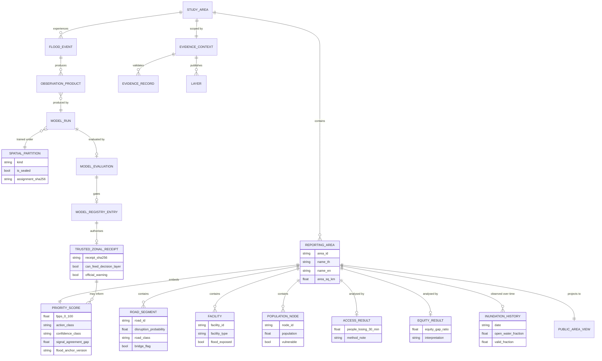

### Schema governance recommendations

1. **Every payload the UI renders must have a schema in `packages/contracts/schemas/`.** Today 5 do not.
2. **One canonical entity per concept; views are derived,** not parallel.
3. **Version at the entity level** (`model-run-v2`) rather than only the URL, and mark superseded versions `deprecated: true` in the schema.
4. **Contract tests must assert schema↔TS↔Pydantic agreement** — `contracts.test.ts` covers TS; extend to Pydantic.

---

## 20. Future-State Architecture Diagrams

### A. Future System Context

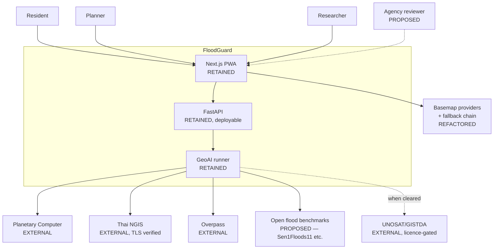

**Change from today:** basemaps gain a fallback chain; NGIS is TLS-verified; open benchmarks become a first-class input, unblocking measurement without in-area licensing.

### B. Future Container Diagram

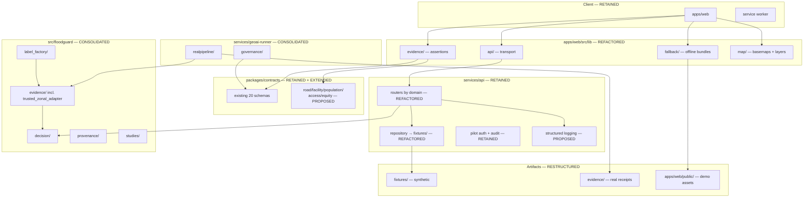

**Key change:** `realpipeline → evidence/ (trusted_zonal_adapter) → decision/`. The direct `realpipeline → scoring` edge is removed.

### C. Future Internal Module Diagram

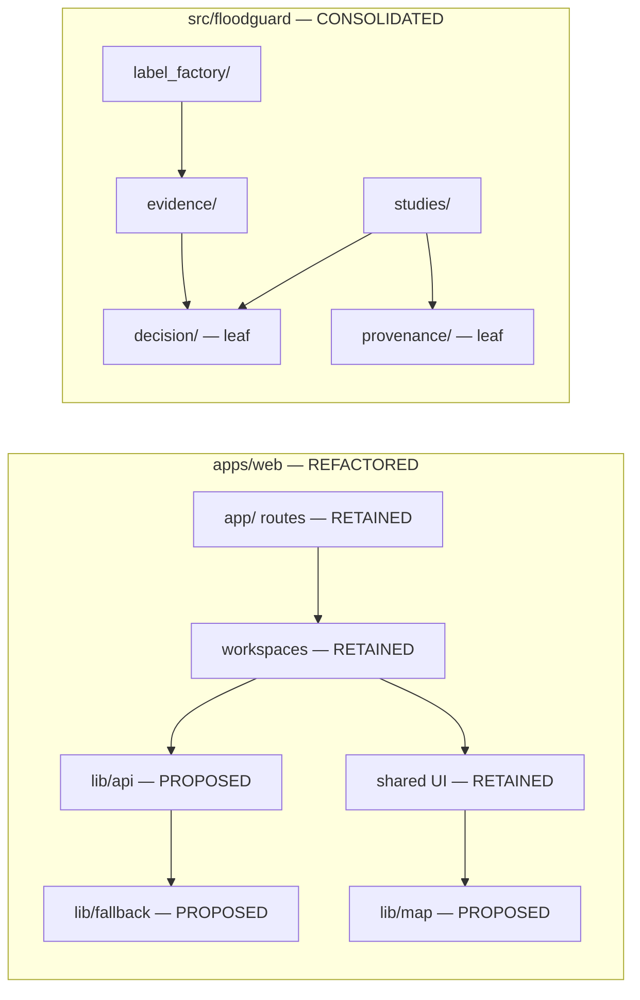

**Enforced rule:** `decision/` and `provenance/` are leaves — they import nothing else from `floodguard`. This makes the decision engine independently testable and portable.

### D. Future Request and Data-Flow

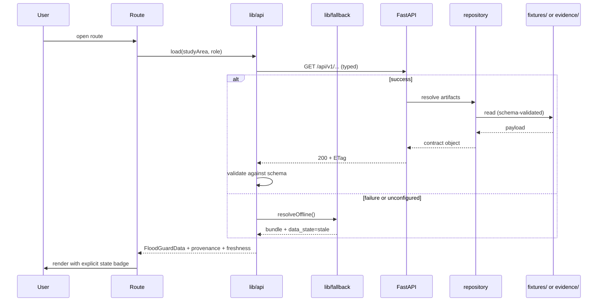

**Change:** validation happens at the boundary in both branches; freshness is always explicit.

### E. Future GeoAI Pipeline

```mermaid
flowchart TB
    subgraph ingest["Ingestion — RETAINED"]
        s1t["Sentinel-1 series — ACTIVATED"]
        s2i["Sentinel-2"]
        demi["Copernicus DEM"]
        auth["NGIS / OSM / WorldPop"]
        benchi["Open benchmarks — PROPOSED"]
    end

    subgraph prov["Provenance — RETAINED"]
        chk["checksums + source bundle hash"]
    end

    subgraph feat["Features — RETAINED"]
        base["seasonal baseline — ACTIVATED"]
        terr["terrain features"]
    end

    subgraph model["Models — RETAINED"]
        det["deterministic SAR"]
        temp["temporal deviation — ACTIVATED"]
        seg["U-Net — REPAIRED"]
    end

    subgraph evalb["Evaluation — RETAINED + EXTENDED"]
        part["spatial partition"]
        met["role-scoped metrics"]
        cal["calibration — ACTIVATED via benchmark"]
        bench2["benchmark comparison — PROPOSED"]
    end

    subgraph gate["Governance — ENFORCED"]
        run["ModelRun v2"]
        ev2["ModelEvaluation v2"]
        reg["Registry entry"]
        tza2["trusted_zonal_adapter"]
    end

    subgraph pub["Publication"]
        prod["Observation product"]
        ui["Web evidence panel"]
    end

    s1t --> chk --> base --> temp
    s2i --> chk --> seg
    demi --> terr
    auth --> chk
    benchi --> bench2

    det & temp & seg --> part --> met --> cal --> ev2
    bench2 --> ev2
    ev2 --> run --> reg --> tza2 --> prod --> ui
```

**Two changes matter:** calibration becomes fittable via open benchmarks, and **every** path to publication passes through `trusted_zonal_adapter`.

### E2. Future GeoAI Pipeline — annotated with the actual library calls *(new in v2)*

The diagram above is the governance view. This one is the **implementation view**: the same pipeline,
labelled with the exact `geoai` function or FloodGuard module that performs each step, and with the
`research/` sandbox shown as a first-class parallel track. A developer should be able to work from
this diagram alone.

```mermaid
flowchart TB
    subgraph research["research/ — SKILLS TRACK, ungoverned, gitignored"]
        direction LR
        rs1["/geoai-skills:search-stac<br/>geoai.pc_stac_search"]
        rs2["/geoai-skills:process-raster clip<br/>geoai.clip_raster_by_bbox"]
        rs3["/geoai-skills:detect-objects buildings<br/>geoai.BuildingFootprintExtractor"]
        rs4["/geoai-skills:overture-data building<br/>geoai.download_overture_buildings"]
        rs5["/geoai-skills:inspect-geo<br/>geoai.get_raster_info + get_raster_stats"]
        rs6["benchmark fetch<br/>geoai.download_file dset-s2"]
    end

    subgraph acq["Acquisition — realpipeline/real_data.py"]
        a1["fetch_sentinel1_rtc_pair<br/>windowed COG read, TLS VERIFIED"]
        a2["fetch_sentinel1_rtc_series<br/>ACTIVATE — A2"]
        a3["fetch_sentinel2_composite"]
        a4["fetch_copernicus_dem · fetch_jrc_surface_water"]
        a5["fetch_mae_sai_subdistricts · fetch_arcgis_featurelayer"]
        a6["fetch_osm_buildings + Overture cross-check"]
    end

    subgraph models["Models — one module per component"]
        m1["sar_flood.py — A<br/>dB drop, morphology"]
        m2["sar_temporal.py — A2<br/>seasonal median + MAD"]
        m3["water_unet.py — B<br/>geoai.train_segmentation_model<br/>+ geoai.semantic_segmentation"]
        m4["water_baseline.py — ★<br/>geoai.segment_water<br/>band_order OK; label is the problem"]
        m5["susceptibility.py — C<br/>HAND/slope/TWI<br/>opt. geoai.train_pixel_regressor"]
        m6["infrastructure.py — D<br/>OSM · Overture · BuildingFootprintExtractor"]
        m7["encroachment.py — E<br/>GHSL differencing"]
        m8["embeddings.py — F<br/>geoai.list_embedding_datasets<br/>tessera / google_satellite"]
    end

    subgraph evalb["Evaluation"]
        e1["blocks.py — spatial holdout, role codes"]
        e2["metrics.py — role-scoped IoU/F1"]
        e3["calibration.py — fit on dset-s2<br/>RESEARCH TIER"]
        e4["benchmark table vs book<br/>RGB IoU 0.71 · S2 IoU 0.90"]
    end

    subgraph gate["Governance — MANDATORY"]
        g1["ModelRun v2"]
        g2["ModelEvaluation v2"]
        g3["Model registry entry<br/>can_feed_decision_layer"]
        g4["trusted_zonal_adapter<br/>THE ONLY BRIDGE"]
    end

    subgraph pub["Publication"]
        p1["aggregate.py — tambon zonal stats"]
        p2["floodguard.scoring — FPPS"]
        p3["evidence/ receipts"]
        p4["apps/web geoai-real-panel"]
    end

    research -.->|"informs design only<br/>NEVER an artifact"| models
    rs6 --> e3

    a1 --> m1
    a2 --> m2
    a3 --> m3
    a3 --> m4
    a3 --> m7
    a4 --> m5
    a5 --> p1
    a6 --> m6
    a3 --> m8

    m1 & m2 & m3 & m4 & m5 & m6 & m7 & m8 --> e1 --> e2
    e2 --> e4
    e3 --> e4
    e4 --> g2

    g2 --> g1 --> g3 --> g4 --> p1 --> p2 --> p3 --> p4
```

**Three things to notice.**

1. The `research/` box has exactly one outbound edge, and it is dashed and labelled *informs design only*. No skill output crosses into `models` as data.
2. `trusted_zonal_adapter` sits between the registry and `aggregate.py`. Today `run_real.py:45` imports `floodguard.scoring.score_subdistricts` directly and skips both. That single edge is D-02.
3. Evaluation now has two inputs to the benchmark table: in-area metrics (`metrics.py`) and open-benchmark metrics (`calibration.py` on `dset-s2`). Neither alone is sufficient; together they support tiered claims.

### F. Future Data Architecture

```mermaid
flowchart LR
    subgraph git["Version-controlled — RESTRUCTURED"]
        fxg["fixtures/ — synthetic, disposable"]
        evg["evidence/ — receipts, retained"]
        schg["packages/contracts/schemas/"]
        wag["apps/web/public/ — demo bundles"]
    end

    subgraph ext["Outside Git — RETAINED"]
        rast["rasters, weights, tiles<br/>(gitignored)"]
        cache["s1_series cache"]
    end

    subgraph ci["CI artifacts — PROPOSED"]
        html["generated dashboards"]
        junit["test receipts"]
    end

    reg2["Model registry<br/>(JSON, content-addressed)<br/>RETAINED"]
    dsm["Dataset metadata<br/>RETAINED"]

    fxg --> schg
    evg --> schg
    evg --> reg2
    evg --> dsm
    rast --> evg
    cache --> rast
    html -.-> ci
```

**No database is introduced.** The change is lifecycle separation, not storage technology.

### G. Future Deployment

```mermaid
flowchart TB
    dev["Developer"]
    gh["GitHub"]

    subgraph cif["CI — EXTENDED"]
        c1["core / api / frontend / geoai — RETAINED"]
        c2["dependency audit — PROPOSED"]
        c3["bundle-size budget — PROPOSED"]
        c4["E2E journeys + a11y — PROPOSED"]
        c5["generated HTML as artifact — PROPOSED"]
    end

    subgraph envs["Environments"]
        prod["Vercel static — RETAINED"]
        stage["Preview deploys — PROPOSED"]
        apihost["API container — PROPOSED, only if needed"]
    end

    obs2["Structured logs + error tracking<br/>PROPOSED"]

    dev --> gh --> c1 & c2 & c3 & c4 & c5
    c1 --> prod
    c1 -.-> stage
    apihost -.-> obs2
```

**Deliberately unchanged:** static-first hosting. The API only needs a host if and when a live data path is required.

### H. Future User-Experience Architecture

```mermaid
flowchart TB
    entry["/ — profile-aware entry<br/>RETAINED"]

    subgraph pubx2["Public — RETAINED"]
        p1["preparedness view"]
        p2["household plan (local only)"]
    end

    subgraph cmdx2["Command — RETAINED"]
        c6["map + priority table"]
        c7["GeoAI evidence"]
        c8["scenario compare"]
    end

    subgraph stdx2["Studio — RETAINED"]
        s3["model registry"]
        s4["evaluation + calibration"]
        s5["methodology"]
    end

    shared2["Shared: evidence notice,<br/>freshness badge, map<br/>CONSOLIDATED"]

    entry --> pubx2 & cmdx2 & stdx2
    pubx2 --> shared2
    cmdx2 --> shared2
    stdx2 --> shared2
    c7 -->|"drill into method"| s5
```

**One new connection:** a link from Command's evidence panel into Studio's methodology, so the three experiences form one product rather than three disconnected surfaces.

### I. Current-to-Future Transition

```mermaid
flowchart LR
    subgraph retained["RETAINED unchanged"]
        r1["apps/web routes"]
        r2["packages/contracts"]
        r3["services/api structure"]
        r4["label_factory"]
        r5["decision engine"]
        r6["realpipeline"]
        r7["CI jobs"]
    end

    subgraph refactored["REFACTORED"]
        f1["data-provider → api/fallback/evidence"]
        f2["geo-map → map/*"]
        f3["repository → fixtures/"]
        f4["src/floodguard → 4 sub-packages"]
    end

    subgraph consolidated["CONSOLIDATED"]
        n1["outputs/ → fixtures/ + evidence/"]
        n2["two GeoAI stacks → one contract"]
        n3["scripts/ → pipelines/evidence/archive"]
    end

    subgraph added["PROPOSED NEW"]
        a1["5 missing schemas"]
        a2[".env.example + validation"]
        a3["E2E + a11y tests"]
        a4["structured logging"]
        a5["benchmark evaluation"]
    end

    subgraph removed["ARCHIVED / REMOVED"]
        d1["dashboard.py + vendored Leaflet"]
        d2["generated HTML from Git"]
        d3["tasks/ → docs/history"]
        d4["19 unreferenced scripts → archive"]
    end
```

---

## 21. Current vs Future Comparison

| Area | Current | Main problem | Future | Benefit |
|---|---|---|---|---|
| User applications | 1 PWA, 3 routes + parallel static dashboard | Two UIs to maintain | 1 PWA; dashboard archived | Halved UI surface |
| Routing | Next.js App Router, build-time profile removal | Sound | Unchanged | — |
| UI components | 33 components, 2 hubs > 950 lines | Change risk concentrated | Hubs split by concern | Testable, safer edits |
| State management | React hooks + localStorage | Adequate | Unchanged | Avoids premature complexity |
| API layer | 30 routes in one 888-line module | Acceptable but growing | Routers per domain | Navigable |
| Domain logic | 60 flat modules, 100k lines | Navigation cost | 4 sub-packages, enforced leaves | Independently testable core |
| Data access | Repo-relative paths into `outputs/` | Sample ≠ evidence ambiguity | `fixtures/` vs `evidence/` | Provenance becomes legible |
| GeoAI pipeline | Two stacks; bypasses trusted adapter | Governance claim unenforced | One contract; adapter mandatory | Claim becomes true |
| Dataset management | Checksums + manifests, mixed folders | Lifecycle unclear | Explicit fixture/evidence lifecycle | Retention policy possible |
| Model management | Registry + receipts, well built | Never exercised on real runs | Same, actually used | Governance earns its cost |
| Geospatial storage | Committed GeoJSON/CSV, no DB | Fine at this scale | Unchanged | No premature ops burden |
| Authentication | HMAC for staff routes; none for users | Correct but undocumented | Same + documented ADR | Intentional, not accidental |
| Configuration | 13 undocumented env vars | Silent misconfiguration | `.env.example` + startup validation | Fails loudly |
| Testing | 1,923 tests; non-hermetic; no E2E | False failures; journey gaps | Hermetic + 3 E2E + a11y | Demo-safe |
| Deployment | Vercel static only | API undeployable as written | Same + optional API container | Deployable when needed |
| Observability | Health check + audit chain only | Undiagnosable in the field | Structured logs + error tracking | Operable |
| Documentation | 107 files, intent mixed with status | Overstates maturity | Status column per capability | Trustworthy |
| Security | Strong governance; TLS disabled; no rate limit | H-1, H-3 | TLS on, limits, headers, audit | Defensible |
| Crisis reliability | Offline-first, stale states — strong | OSM single point of failure | Tile fallback chain | Map survives outage |
| Accessibility | Bilingual, semantic roles; untested | Unknown compliance | axe in CI | Verifiable |
| Localisation | TH/EN inline in components | Third language is costly | Message catalogue (later) | Extensible |

---

## 22. Cleanup and Implementation Roadmap

*Substantially expanded in v2.* v1 gave summary tables; this version gives **task cards** a developer
can execute directly — exact files, exact commands, an acceptance check that is a command rather than
a sentence, and a rollback that is also a command.

### 22.0 How to use this roadmap

**Conventions used in every task card:**

| Field | Meaning |
|---|---|
| **Debt** | The `D-xx` identifier(s) from §15 this task closes |
| **Effort** | `XS` < 1 h · `S` 1–4 h · `M` 1–3 days · `L` > 3 days |
| **Risk** | Probability × blast radius if it goes wrong mid-demo |
| **Prereq** | Task IDs that must be merged first |
| **Acceptance** | A command whose success *is* the definition of done |
| **Rollback** | The exact command that undoes it |
| **Watch out** | The specific way this task tends to go wrong |

**Two rules that apply to every phase:**

1. **The demo must be runnable at every commit on the main line.** No phase may leave the judge path broken overnight.
2. **Refactors are behaviour-preserving or they are not refactors.** Any task that changes an FPPS value, an action class, or a published metric is a *behaviour change* and needs its own PR, its own review, and a diff of the affected numbers against the Phase 0 baseline.

### 22.1 Phase dependency graph

```mermaid
flowchart TB
    P0["Phase 0<br/>Baseline and provenance freeze<br/>1 day · no code change"]

    P1["Phase 1<br/>Repository hygiene and security<br/>P0/P1 · low risk"]
    P2["Phase 2<br/>GeoAI toolchain activation<br/>NEW in v2 · unblocks all GeoAI work"]
    P3["Phase 3<br/>Artifact lifecycle<br/>the pivotal phase"]
    P4["Phase 4<br/>Governance enforcement<br/>makes the central claim true"]
    P5["Phase 5<br/>Contracts and frontend seams"]
    P6["Phase 6<br/>Reliability, security, testing"]
    P7["Phase 7<br/>Structural consolidation<br/>POST-SUBMISSION ONLY"]

    P0 --> P1
    P1 --> P2
    P1 --> P3
    P2 --> P4
    P3 --> P4
    P3 --> P5
    P4 --> P6
    P5 --> P6
    P6 --> P7

    P2 -. "unblocks calibration<br/>and the gate re-scope" .-> P4

    sub["Competition submission<br/>cut line"]
    P6 --> sub --> P7

    style P7 stroke-dasharray: 6 4
    style sub fill:none,stroke-width:3px
```

**Phases 1 and 2 can run in parallel with Phase 3** — they touch disjoint files. Phase 4 needs both.
Phase 7 must not start before judging concludes.

### 22.2 Indicative schedule

Durations are working-days for one developer and assume no blocking external dependency. The critical
path runs Phase 0 → 1 → 3 → 4.

```mermaid
gantt
    title FloodGuard cleanup roadmap — indicative sequencing
    dateFormat YYYY-MM-DD
    axisFormat %b %d

    section Phase 0
    Baseline capture T0.1-T0.4            :p0, 2026-07-29, 1d

    section Phase 1 Hygiene
    TLS verification T1.1                 :crit, p11, after p0, 1d
    Split the extras T1.2                 :crit, p12, after p0, 1d
    env.example T1.3                      :p13, after p0, 1d
    Gitignore generated HTML T1.4         :p14, after p0, 1d
    Test hermeticity T1.5                 :p15, after p11, 1d
    Archive tasks dir T1.6                :p16, after p14, 1d

    section Phase 2 GeoAI toolchain
    Install and verify geoai T2.1         :crit, p21, after p12, 1d
    research sandbox T2.2                 :p22, after p21, 1d
    Benchmark calibration T2.3            :p23, after p22, 3d
    Diagnose OmniWaterMask T2.4           :p24, after p23, 2d
    Record duplication rationale T2.5     :p25, after p21, 1d
    Real embeddings spike T2.6            :p26, after p23, 2d

    section Phase 3 Artifacts
    fixtures and evidence move T3.1       :crit, p31, after p15, 2d
    Repoint repository.py T3.2            :crit, p32, after p31, 1d
    Verify unused outputs T3.3            :p33, after p32, 1d

    section Phase 4 Governance
    Route via trusted adapter T4.1        :crit, p41, after p32, 2d
    Registry entry T4.2                   :p42, after p41, 1d
    Reconcile the two stacks T4.3         :p43, after p42, 2d
    Re-scope gates to three tiers T4.4    :p44, after p23, 1d

    section Phase 5 Contracts and UI
    Five missing schemas T5.1             :p51, after p31, 2d
    Split data-provider T5.2              :p52, after p51, 2d
    Split geo-map T5.3                    :p53, after p51, 2d
    Lazy-load bundles T5.4                :p54, after p52, 1d
    Tile fallback chain T5.5              :p55, after p53, 1d

    section Phase 6 Reliability
    Structured logging T6.1               :p61, after p41, 1d
    Rate limit and headers T6.2           :p62, after p61, 1d
    Dependency scanning T6.3              :p63, after p12, 1d
    E2E journeys T6.4                     :p64, after p54, 2d
    Accessibility assertions T6.5         :p65, after p64, 1d

    section Phase 7 Post-submission
    Sub-packages plus shim T7.1           :p71, after p65, 5d
    Archive dashboard.py T7.2             :p72, after p71, 1d
    Reorganise scripts T7.3               :p73, after p72, 1d
```

---

### Phase 0 — Baseline and provenance freeze

**Goal:** make every later change provably behaviour-preserving. Nothing in this phase modifies code.
**Exit criterion:** a reviewer can diff any later state against `docs/baseline/2026-07-29/` and see exactly what changed.

#### T0.1 — Freeze the numbers that must not move

| | |
|---|---|
| **Debt** | prerequisite for D-02, D-03 |
| **Effort** | S |
| **Risk** | None — read-only |
| **Prereq** | — |

**Steps**

```bash
mkdir -p docs/baseline/2026-07-29
git rev-parse HEAD > docs/baseline/2026-07-29/COMMIT
cp outputs/geoai/geoai_metrics.json docs/baseline/2026-07-29/
cp outputs/mae_sai_priority_scores.csv docs/baseline/2026-07-29/
cp outputs/sample_priority_scores.csv docs/baseline/2026-07-29/
sha256sum outputs/geoai/*.json outputs/*.csv > docs/baseline/2026-07-29/CHECKSUMS
```

**Acceptance**

```bash
test -s docs/baseline/2026-07-29/CHECKSUMS && wc -l docs/baseline/2026-07-29/CHECKSUMS
```

**Watch out:** the FPPS column is the one that matters. If T4.1 changes it by even one decimal place, that is a behaviour change requiring explanation, not a rounding artefact to wave through.

#### T0.2 — Screenshot both build profiles, all routes

| | |
|---|---|
| **Effort** | S |
| **Risk** | None |

**Steps**

```bash
pnpm --dir apps/web install
pnpm --dir apps/web build:competition
pnpm --dir apps/web build:public
node apps/web/scripts/verify-deployment-profiles.mjs
```

Then capture `/`, `/public`, `/command`, `/studio` in the competition build and `/`, `/public` in the public build into `docs/baseline/2026-07-29/screens/`.

**Acceptance:** six PNGs exist; the public build contains no `/command` or `/studio` directory in `apps/web/out`.

**Watch out:** this is also the first time the Next.js build is executed in this environment at all (§2 limitation). Budget for it failing on first run.

#### T0.3 — Record the test baseline

```bash
pytest tests/ -q --junitxml=docs/baseline/2026-07-29/root-junit.xml
pytest services/geoai-runner/tests -q --junitxml=docs/baseline/2026-07-29/runner-junit.xml
pytest services/api/tests -q --junitxml=docs/baseline/2026-07-29/api-junit.xml
```

**Acceptance:** three JUnit files exist. Expect 1,649 passed / 16 failed on root — the 16 are the known non-hermetic failures (D-06) and are the *reason* to record the baseline, not a blocker.

#### T0.4 — Record the environment as it actually is

| | |
|---|---|
| **Debt** | evidence for D-33, D-39 |
| **Effort** | XS |

```bash
uv --version > docs/baseline/2026-07-29/ENV
python -c "import sys; print(sys.version)" >> docs/baseline/2026-07-29/ENV
uv pip list --directory services/geoai-runner >> docs/baseline/2026-07-29/ENV
```

**Why this matters:** §8A.3 shows the GeoAI stack is absent. Recording that *before* Phase 2 installs it makes the "previously executed" component statuses in §8 auditable rather than merely asserted.

---

### Phase 1 — Repository hygiene and security

**Goal:** close the two provable security/packaging defects and remove the noise that makes later diffs unreadable.
**Exit criterion:** `uv sync --extra geoai` resolves, TLS is verified, the suite is green in a worktree.

#### T1.1 — Enable TLS certificate verification  `D-01` `H-1`

| | |
|---|---|
| **Effort** | XS to fix, S to verify |
| **Risk** | **Medium** — if the NGIS chain is genuinely broken, fetches start failing |
| **Prereq** | T0.1 |

**Files:** `services/geoai-runner/geoai_runner/realpipeline/real_data.py:43-44`

**Steps**

1. Delete the two lines that disable verification:
   ```python
   _SSL.check_hostname = False
   _SSL.verify_mode = ssl.CERT_NONE
   ```
2. Attempt a live fetch of the DOPA sub-district layer.
3. **If it fails**, do *not* restore `CERT_NONE`. Instead: fetch the server's chain, identify the missing intermediate or the CA, pin it explicitly with `_SSL.load_verify_locations(cafile=...)`, and record in `docs/source_registry.md` which certificate was pinned, when, by whom, and when it expires.

**Acceptance**

```bash
python -c "
from geoai_runner.realpipeline.real_data import fetch_mae_sai_subdistricts
gj = fetch_mae_sai_subdistricts()
print('features:', len(gj['features']))
"
```

**Rollback**

```bash
git revert <sha>
```

**Watch out:** this is the finding that most directly undercuts the project's provenance claim, so it must not be quietly reverted. If verification cannot be enabled, the *honest* outcome is a documented caveat in `docs/source_registry.md` saying the Thai NGIS channel is unauthenticated and what that means for downstream integrity — not a silent `CERT_NONE`.

#### T1.2 — Split the dependency extras so they resolve  `D-39` `D-10`

| | |
|---|---|
| **Effort** | S |
| **Risk** | Low |
| **Prereq** | — |

**Files:** `services/geoai-runner/pyproject.toml`

**Problem (proven in §8A.3):** one monolithic `realpipeline` extra contains `omniwatermask>=0.5`, which requires `numpy>=2.0,<2.4` against a pinned `numpy==2.4.2`. The whole extra is therefore uninstallable, taking six working components down with one unresolvable package.

**Steps — restructure into three extras:**

| Extra | Contents | Contract |
|---|---|---|
| `geoai` | `geoai-py`, `torch`, `torchvision`, `segmentation-models-pytorch` | **MUST resolve.** CI asserts it |
| `realpipeline` | the above plus `pandas`, `matplotlib`, `scikit-learn`, `pystac-client`, `planetary-computer`, `albumentations` | **MUST resolve.** CI asserts it |
| `research` | `omniwatermask`, `torchange`, `moondream`, `samgeo` | **Best-effort.** Documented as possibly unresolvable; nothing in the governed path may import from here |

For `omniwatermask` specifically, choose one and record why:
- **(a)** relax `numpy` to `>=2.0,<2.4` in the `research` extra only, or
- **(b)** drop `omniwatermask` and reach Component ★ through `geoai.segment_water()`, which vendors the same model behind the library's own pin.

**(b) is recommended** — it is the book's documented path (Ch. 9.6.4), it removes a direct pin FloodGuard does not control, and it is one function call.

Also add `samgeo` to the `research` extra: `infrastructure.py` imports it today and no manifest declares it (§4).

**Acceptance**

```bash
uv sync --directory services/geoai-runner --extra geoai --dry-run
uv sync --directory services/geoai-runner --extra realpipeline --dry-run
```

Both must exit 0.

**Rollback:** `git revert <sha>`

#### T1.3 — Add `.env.example` and startup validation  `D-05`

**Effort:** XS · **Risk:** None

Document all 13 variables from §12. Two need more than a name:

```
# If UNSET, the web app silently falls back to committed static bundles and
# shows data_state=stale. This is a FEATURE for offline demos and a TRAP for
# a misconfigured deployment. Set it deliberately, or leave it unset deliberately.
NEXT_PUBLIC_FLOODGUARD_API_URL=

# competition | public-production
# public-production PHYSICALLY REMOVES /command and /studio at build time.
NEXT_PUBLIC_FLOODGUARD_APP_PROFILE=competition
```

**Acceptance**

```bash
grep -rhoE 'process\.env\.[A-Z_]+' apps/web/src apps/web/scripts | sort -u | sed 's/process\.env\.//' | while read v; do grep -q "^$v" .env.example || echo "UNDOCUMENTED: $v"; done
```

Must print nothing.

#### T1.4 — Remove generated HTML from Git  `D-04`

**Effort:** XS · **Risk:** Low · **Saves:** 11.3 MB

```bash
git rm --cached outputs/dashboard.html outputs/geoai/geoai.html
printf 'outputs/dashboard.html\noutputs/geoai/geoai.html\n' >> .gitignore
```

Then add an artifact-upload step to `.github/workflows/ci.yml` so the judge-facing dashboards remain downloadable.

**Acceptance:** CI run produces a downloadable artifact containing both files, and `git ls-files outputs/*.html` is empty.

**Watch out:** confirm first that no submission document links to a *repository path* for these files. If `docs/submission/` links to them, update the link to the CI artifact or to a released copy before removing them.

#### T1.5 — Make the test suite hermetic  `D-06`

**Effort:** S · **Risk:** Low · **Prereq:** T0.3

**Root cause (§13):** subprocess-spawned CLI tests inherit neither `pyproject.toml`'s `pythonpath = ["src"]` nor the worktree, so they resolve `floodguard` through `__editable__.floodguard_thailand-0.1.0.pth`, which points at the *main checkout*.

**Fix:** a shared helper that every subprocess test uses.

```python
# tests/helpers/subprocess_env.py
import os, sys
from pathlib import Path

REPO_ROOT = Path(__file__).resolve().parents[2]

def hermetic_env() -> dict[str, str]:
    env = os.environ.copy()
    src = str(REPO_ROOT / "src")
    existing = env.get("PYTHONPATH", "")
    env["PYTHONPATH"] = src + (os.pathsep + existing if existing else "")
    return env
```

Then replace every bare `subprocess.run([sys.executable, ...])` with `subprocess.run([sys.executable, ...], env=hermetic_env())`.

**Acceptance**

```bash
pytest tests/ -q
```

1,665 passed, 0 failed **in a worktree** — the same count CI already gets from a fresh clone.

**Watch out:** do not "fix" this by reinstalling the editable package. That makes the symptom disappear on your machine and leaves the defect in place for everyone else.

#### T1.6 — Archive the superseded task backlog  `D-27`

**Effort:** XS · **Risk:** None

```bash
git mv tasks docs/history/tasks
grep -rn "tasks/" README.md AGENTS.md PLANS.md docs/
```

Fix any surviving links. `PLANS.md` remains the single live roadmap.

---

### Phase 2 — GeoAI toolchain activation  *(new in v2)*

**Goal:** make every GeoAI component locally runnable, give exploration a governed sandbox, and replace two "blocked" statuses with measured results.
**Exit criterion:** `import geoai` succeeds, all 8 skills run, and Component ★ has either a defensible IoU or a diagnosed defect.

This phase is what "use the geo-ai skills on our project" means in practice. It is the cheapest phase
with the highest unblocking value, and nothing else in the roadmap depends on the outcome of its
experiments — only on its infrastructure.

#### T2.1 — Install and prove the GeoAI toolchain  `D-33`

| | |
|---|---|
| **Effort** | S (plus download time; `torch` is ~2.5 GB) |
| **Risk** | Low |
| **Prereq** | T1.2 — the extras must resolve first |

**Steps**

```bash
uv sync --directory services/geoai-runner --extra geoai
```

Then verify with the skill rather than by hand, so the check is repeatable by anyone:

```
/geoai-skills:install-geoai --check --extras
```

This probes `geoai`, `geopandas`, `rasterio`, `rioxarray`, `shapely`, `leafmap`, `numpy`, `pandas`, `matplotlib`, then `torch`, `torchvision`, `transformers`, `timm`, `segmentation_models_pytorch`, and reports CUDA availability.

**Then document it.** Add to `services/geoai-runner/README.md`:

```markdown
## Running GeoAI components locally

The GeoAI stack is an OPTIONAL extra and is deliberately absent from the light
environment (CI job `geoai-normal` asserts it cannot be imported). To run any
component A-G you must first:

    uv sync --directory services/geoai-runner --extra geoai

Verify with:  /geoai-skills:install-geoai --check --extras

Without this, every `geoai.*` call path in realpipeline/ raises ImportError.
```

**Acceptance**

```bash
services/geoai-runner/.venv/Scripts/python -c "import geoai, torch; print(geoai.__version__, torch.__version__, torch.cuda.is_available())"
```

**Rollback:** `rm -rf services/geoai-runner/.venv && uv sync --directory services/geoai-runner`

**Watch out:** do **not** install `geoai` into the root `.venv`. ADR-0001 and CI job `geoai-normal` depend on the light environment being unable to import it. Installing it globally would silently destroy the dependency-isolation property §1 identifies as a genuine strength. Add a test asserting the root environment still cannot import `geoai`.

#### T2.2 — Create the `research/` sandbox and enforce its boundary  `D-35` `D-38`

| | |
|---|---|
| **Effort** | S |
| **Risk** | Low |
| **Prereq** | T2.1 |

Skills write bare files with no checksum, no `ModelRun`, and no `official_warning` marker. Without a
quarantine directory they will accumulate in `outputs/` and become indistinguishable from evidence —
the exact failure ADR-C exists to prevent.

**Steps**

1. Create the tree:
   ```
   research/
   ├── MANIFEST.md          # the ONLY tracked file
   ├── skills/              # skill output
   ├── benchmarks/          # downloaded open datasets
   └── .geoai-skills/       # skill session state
   ```
2. `.gitignore`:
   ```
   research/**
   !research/MANIFEST.md
   .geoai-skills/
   ```
3. `research/MANIFEST.md` template — one block per experiment:
   ```markdown
   ## 2026-07-30 · Component D · Overture vs OSM building agreement
   Skill:     /geoai-skills:overture-data building --bbox 99.83,20.33,99.97,20.49
   Output:    research/skills/overture_buildings.gpkg  (untracked)
   Question:  Does an independent source agree with the 463 OSM footprints?
   Result:    <fill in>
   Decision:  promote / discard / rerun
   ```
4. **Enforce the boundary in CI** — this is the part that makes it architecture rather than convention:
   ```python
   # services/api/tests/test_no_research_reads.py
   def test_repository_never_resolves_research_paths():
       from floodguard_api.config import RepositoryPaths
       paths = RepositoryPaths.discover()
       for value in vars(paths).values():
           assert "research" not in str(value).split(os.sep)
   ```
   plus a grep-based check that `apps/web` contains no `research/` reference.

**Acceptance**

```bash
pytest services/api/tests/test_no_research_reads.py -q
git status --porcelain research/
```

The second command must show nothing but `research/MANIFEST.md`.

**Watch out:** the temptation, once a skill produces a nice-looking building layer, is to drop it straight into `outputs/geoai/`. That single act would make every provenance claim in the project false. The manifest exists so that the decision to promote is written down.

#### T2.3 — Calibrate against open benchmarks  `D-36`

| | |
|---|---|
| **Effort** | M |
| **Risk** | Low technically; **high value** |
| **Prereq** | T2.1, T2.2 |

**The blocker being removed:** `calibration.py` is marked BLOCKED because no licensed in-area reference mask exists (`docs/reference_mask_licensing_log.md`, requests sent 2026-07-03, no response). But calibration does not require an *in-area* reference — only a *reference*. Two open, redistributable datasets are one call away.

**Steps**

1. Fetch both benchmarks into `research/benchmarks/`:
   ```python
   import geoai
   geoai.download_file("https://data.source.coop/opengeos/geoai/dset-s2.zip")
   geoai.download_file("https://data.source.coop/opengeos/geoai/waterbody-dataset.zip")
   ```
   `dset-s2` is the Earth Surface Water Dataset (Luo et al., 2021): Sentinel-2 L2A, six bands, expert masks, with separate `tra_scene`/`val_scene` splits.
2. Inspect before trusting — do not assume band order:
   ```
   /geoai-skills:inspect-geo research/benchmarks/dset-s2/tra_scene/<scene>.tif
   ```
   Record CRS, dtype, band count, and per-band statistics in the manifest.
3. Fit `calibration.py` against the **validation** split only. The training split must never touch the calibrator.
4. Emit a `ModelEvaluation v2` with `evaluation_scope="open_benchmark"` and `in_area=false`, so the claim tier is machine-readable rather than a prose caveat.

**Acceptance:** `evidence/` contains a `ModelEvaluation v2` whose `evaluation_scope` is `open_benchmark`, and `calibration.py`'s BLOCKED status is replaced with a measured reliability curve.

**Watch out — the claim boundary is the whole point.** This does **not** license "FloodGuard is 90% accurate in Mae Sai". It licenses "the model is calibrated and non-degenerate on an independent open benchmark; in-area accuracy remains unmeasured pending a licensed reference." Anything stronger reintroduces exactly the overstatement §14 warns about. Write the permitted sentence into `docs/model_contract.md` verbatim so it cannot drift.

#### T2.4 — Diagnose the OmniWaterMask IoU of 0.07  `D-37`

| | |
|---|---|
| **Effort** | M |
| **Risk** | Low |
| **Prereq** | T2.3 |

**Why this is a defect hunt, not a caveat.** §8 records Component ★ at IoU 0.07, "flagged suspect". The book reports, on the same task and architecture family:

| Configuration | Best val IoU | Best F1 |
|---|---|---|
| U-Net + ResNet34, 3-band RGB | 0.708 | 0.804 |
| U-Net + ResNet34, 6-band Sentinel-2 | **0.899** | — |

0.07 against ~0.90 is not a marginal result. It is roughly an order of magnitude low, which is the signature of a *configuration* fault rather than a modelling limitation.

**Hypotheses, in the order they should be tested — cheapest first:**

| # | Hypothesis | Test | Cost |
|---|---|---|---|
| 1 | ~~**Wrong `band_order`**~~ — **DEAD.** `water_baseline.py` already passes `[3, 2, 1, 4]` and documents the mapping. Scaling (hypothesis 2) is also dead: OWM agreed to three decimals on both 0–1 and 0–10000 inputs | — | — |
| 2 | **Reflectance scaling.** Sentinel-2 L2A ships as scaled integers (0–10000). If the model expects 0–1 floats, everything saturates | Print `min`/`max`/`dtype` of the input stack via `/geoai-skills:inspect-geo` | XS |
| 3 | **Label/prediction grid mismatch.** IoU computed between arrays on different transforms | Assert identical shape, transform, and CRS before scoring | S |
| 4 | **The comparison itself is invalid.** MNDWI-derived weak labels are not ground truth for a model trained on a different water definition | Score ★ against `dset-s2` expert masks instead | S |
| 5 | The result is real and OmniWaterMask genuinely fails on this scene | Accept only after 1–4 are excluded | — |

**Acceptance:** `geoai_metrics.json` records ★ with either a corrected IoU or an explicit `defect_diagnosed` field naming which hypothesis held.

**Watch out:** publishing 0.07 with an honest caveat *looks* like rigour and is actually the less rigorous choice — a reviewer who knows the ~0.90 reference will read it as an uninvestigated bug. Diagnose it, then publish whichever number survives.

#### T2.5 — Record why hand-rolled code exists  `D-34`

**Effort:** S · **Risk:** None · **Prereq:** T2.1

§8A.4 lists six places where `realpipeline` reimplements a `geoai` helper. Most are justified — windowed COG reads are strictly better than whole-asset downloads for a 1024×1024 study area. But the justification lives only in the author's head.

**Steps:** add a one-line note at each of the six sites, e.g.

```python
# Not geoai.pc_stac_search: that helper downloads whole assets. We need a
# windowed COG read over a 0.14 x 0.16 degree bbox, so we drive pystac_client
# directly and read through rasterio.windows.from_bounds. See audit §8A.4.
```

Then adopt the one case where the library is strictly better: replace the inline vectorisation in `sar_flood.py` with `geoai.raster_to_vector(..., min_area=..., simplify_tolerance=...)` followed by `geoai.add_geometric_properties(gdf)`, and filter on the resulting `elongation` column. The book uses exactly this to strip road-edge and shadow false positives (Ch. 9.6.3.7); SAR speckle produces the same long, thin artefacts.

**Acceptance:** flood-extent polygon count changes; the reduction is attributable to elongation filtering and recorded in the manifest with a before/after figure.

#### T2.6 — Spike real satellite embeddings  `D-34` (Component F)

**Effort:** M · **Risk:** Low · **Prereq:** T2.1 · **Optional before submission**

`embeddings.py` is admirably honest: its docstring states the features are *not* foundation-model embeddings and that the current metric is a tautology because the feature vector contains the label's own inputs (raw green and SWIR1, from which MNDWI is derived).

`geoai` exposes the registry that resolves this:

```python
import geoai
geoai.list_embedding_datasets(kind="pixel")
geoai.get_embedding_info("tessera")
```

Relevant entries: `tessera` (pixel, global, 10 m, 128-d, 2017–2024) and `google_satellite` / AlphaEarth (pixel, global, 10 m, 64-d, 2017–2024) — the exact datasets the docstring names as "must be downloaded".

**The experiment that would make Component F a real result:** fit the lightweight classifier on Mae Sai embeddings, then evaluate on **a different district**. As the docstring itself argues, reproducing an index inside the scene it was computed from is a tautology no matter how few labels are used. Cross-district transfer is the actual Ch. 16 claim.

**Acceptance:** either a cross-district metric, or a written decision in `research/MANIFEST.md` that this is deferred past submission — with the reason.

---

### Phase 3 — Artifact lifecycle

**Goal:** make sample, evidence, hypothesis, and demo asset structurally distinguishable.
**Exit criterion:** a judge can tell, from the path alone, whether a file is synthetic or real.

#### T3.1 — Split `outputs/` into four trees  `D-03`

| | |
|---|---|
| **Effort** | M |
| **Risk** | **High** — the API resolves these paths |
| **Prereq** | T1.4, T1.5 |

**This PR must contain path moves and nothing else.** The diff is large and mechanical; mixing a single logic change into it makes review impossible and rollback unsafe.

**Mapping:**

| From | To | Rationale |
|---|---|---|
| `outputs/sample_*.csv`, `outputs/priority_subdistricts.geojson`, `outputs/mae_sai_road_risk.geojson` | `fixtures/` | Synthetic; the API serves these; disposable and regenerable |
| `outputs/geoai/**`, `outputs/*validation*`, `outputs/*manifest*`, `outputs/theos2_thumbnails/` | `evidence/` | Real analysis with provenance; reviewed and retained |
| (nothing yet) | `research/` | Created in T2.2 |
| `apps/web/public/offline-demo/**` | unchanged | Already correctly placed |
| `outputs/dashboard.html`, `outputs/geoai/geoai.html` | untracked | Removed in T1.4 |
| `outputs/geoai/rivers.geojson` (3.7 MB) | untracked, regenerable cache | Confirm `run_real.py` re-fetches first |

```mermaid
flowchart LR
    subgraph before["BEFORE — outputs/ 124 files, 36 MB"]
        o1["sample_*.csv<br/>SYNTHETIC"]
        o2["geoai/*<br/>REAL EVIDENCE"]
        o3["dashboard.html 5.9 MB<br/>GENERATED"]
        o4["rivers.geojson 3.7 MB<br/>CACHED FETCH"]
        o5["21 files referenced nowhere"]
    end

    subgraph after["AFTER — four trees with four policies"]
        f["fixtures/<br/>synthetic · disposable<br/>tracked · served by API"]
        e["evidence/<br/>real · retained · reviewed<br/>tracked with receipts"]
        r["research/<br/>hypotheses · gitignored<br/>NEVER served"]
        w["apps/web/public/<br/>demo bundles · tracked"]
        ci["CI artifacts<br/>generated HTML · untracked"]
        gone["gitignored caches"]
    end

    o1 --> f
    o2 --> e
    o3 --> ci
    o4 --> gone
    o5 -->|"T3.3 verify first"| e
    o5 -.->|"or delete"| gone

    style r stroke-dasharray: 5 5
```

**Steps**

```bash
git mv outputs/sample_priority_scores.csv fixtures/
# ... repeat per file, using git mv so history is preserved
```

**Acceptance**

```bash
pytest services/api/tests -q
pytest tests/ -q
node apps/web/scripts/offline-smoke.mjs
```

All green, and `git log --follow fixtures/sample_priority_scores.csv` shows the pre-move history.

**Rollback:** `git revert <sha>` — paths are the only coupling, so the revert is total.

**Watch out:** use `git mv`, never `cp` + `rm`. Losing history on the evidence tree would be self-defeating for a project whose thesis is provenance.

#### T3.2 — Repoint the repository adapter  `D-03` `M-4`

**Effort:** S · **Risk:** Medium · **Prereq:** T3.1

**Files:** `services/api/src/floodguard_api/repository.py:198-212`, `services/api/src/floodguard_api/config.py`

Two changes, and the second is the more valuable one:

1. Point `RepositoryPaths` at `fixtures/` and `evidence/` instead of `outputs/`.
2. **Replace `parents[4]` discovery with an explicit `FLOODGUARD_DATA_ROOT` environment variable**, defaulting to the current repo-relative behaviour. `parents[4]` hard-codes the API's position in the directory tree and is the single reason the service cannot be containerised (§14 M-4). Fixing it here, while the paths are already being touched, costs almost nothing; fixing it later is a second risky PR.

**Acceptance**

```bash
FLOODGUARD_DATA_ROOT=$(pwd) pytest services/api/tests -q
cd /tmp && FLOODGUARD_DATA_ROOT=/path/to/repo python -m uvicorn floodguard_api.app:create_app --factory --port 8099
```

The second command proves the API runs from outside the repository layout.

#### T3.3 — Verify, then archive, the 21 unreferenced outputs  `D-19`

**Effort:** S · **Risk:** Low · **Prereq:** T3.2

For each of the 21 files, complete the §16 checklist **before** touching it:

```bash
git log --oneline -- <file> | head -5
grep -rn "$(basename <file>)" docs/ scripts/ notebooks/ apps/ services/ src/ tests/
```

Then classify: evidence receipt that must persist → `evidence/`; disposable intermediate → delete; ambiguous → leave and record the ambiguity in the PR body.

**Acceptance:** the PR body contains a 21-row table with the outcome and justification for each file. No file is removed without an entry.

---

### Phase 4 — Governance enforcement

**Goal:** make the project's central claim — governed, report-only evidence — true in code rather than asserted in prose.
**Exit criterion:** no path reaches an action class without a registry entry and a receipt.

#### T4.1 — Route real GeoAI output through a receipt  `D-02` `H-2`  ✅ DONE (differently)

> **v3:** implemented, but **not** through `trusted_zonal_adapter` — that adapter
> refuses candidate input by construction. See the v3 errata. Verified by a golden
> characterization test over the committed priority table rather than by the
> pipeline re-run this card assumed, because the committed artifacts turned out
> not to be a single coherent run.

| | |
|---|---|
| **Effort** | M |
| **Risk** | **High** — touches the decision path |
| **Prereq** | T3.2, T0.1 |

**The defect:** `docs/geoai-system-design-v1.md:80` states `trusted_zonal_adapter.py` (1,354 lines, built and tested) is the *only* permitted model→reporting bridge. `run_real.py:45` does `from floodguard.scoring import score_subdistricts` and calls it directly. Real model output therefore reaches an A–E action class with no signed receipt, no registry entry, and no `can_feed_decision_layer` check.

```mermaid
flowchart LR
    subgraph now["TODAY — the claim is prose only"]
        agg1["aggregate.py"]
        score1["floodguard.scoring<br/>score_subdistricts"]
        tza1["trusted_zonal_adapter<br/>1,354 lines · BYPASSED"]
        out1["action class A-E<br/>NO RECEIPT"]
        agg1 -->|"run_real.py:45<br/>direct import"| score1 --> out1
        agg1 -.->|"documented as mandatory<br/>never called"| tza1
    end

    subgraph target["AFTER T4.1 — the claim is enforced"]
        agg2["aggregate.py"]
        tza2["trusted_zonal_adapter<br/>THE ONLY BRIDGE"]
        reg2["registry entry<br/>can_feed_decision_layer=false"]
        score2["floodguard.scoring"]
        out2["action class A-E<br/>+ signed receipt"]
        agg2 --> tza2 --> reg2 --> score2 --> out2
    end

    now ==>|"T4.1"| target
```

**Steps**

1. Replace the direct import in `run_real.py` with a call through `trusted_zonal_adapter`.
2. Emit a registry entry with `can_feed_decision_layer=false` and `official_warning=false`. **False is the correct value** — this evidence is not cleared to drive official decisions, and saying so explicitly is the governance property, not a limitation to hide.
3. Add a test asserting `geoai_runner.realpipeline` does not import `floodguard.scoring` directly:
   ```python
   def test_realpipeline_does_not_bypass_the_adapter():
       src = Path("services/geoai-runner/geoai_runner/realpipeline").rglob("*.py")
       for f in src:
           text = f.read_text()
           assert "from floodguard.scoring import" not in text, f
   ```

**Acceptance — the FPPS values must be byte-identical to the Phase 0 baseline:**

```bash
python -m geoai_runner.realpipeline.run_real --study-area mae_sai --out evidence/geoai
diff <(cut -d, -f1,4 evidence/geoai/mae_sai_priority_scores.csv) <(cut -d, -f1,4 docs/baseline/2026-07-29/mae_sai_priority_scores.csv)
```

`diff` must be empty. **If it is not, stop.** A routing change that alters scores means the adapter applies a transform the direct path did not — which is either a bug in the adapter or a silent behaviour change. Either way it is a separate PR with its own justification.

**Rollback:** `git revert <sha>` restores the direct call.

#### T4.2 — Emit a registry entry for GeoAI evidence  `D-02`

**Effort:** S · **Prereq:** T4.1

Every real run writes a `ModelRegistryEntryV1` recording model SHA, dataset bundle SHA, evaluation reference, `can_feed_decision_layer`, and `official_warning`.

**Acceptance:** `evidence/geoai/registry_entry.json` validates against `packages/contracts/schemas/model-registry-entry-v1.schema.json`, and a test asserts `can_feed_decision_layer is False`.

#### T4.3 — Reconcile the two GeoAI stacks  `D-09`

**Effort:** M · **Risk:** Medium · **Prereq:** T4.2

Two parallel answers to "how is a model run recorded" live in one package: `geoai_runner/{contract,prepare,train,infer,manifest}.py` (governed, receipt-bound, never run on real data) and `geoai_runner/realpipeline/` (executable, real data, ungoverned).

**Decision to make explicitly, and record as an ADR:** `realpipeline` emits a valid `ModelRun v2` through the existing `contract.py`; the governed stack is reorganised under `geoai_runner/governance/` as the shared contract layer rather than a parallel pipeline.

**Acceptance:** a `realpipeline` run produces a `ModelRun v2` that `contract.py`'s validator accepts; both test suites stay green.

**Watch out:** §16 classifies the governed stack as *Requires investigation* — it is genuinely unclear whether it is superseded or foundational. Resolve that question **before** writing code, or you will refactor something you should have deleted.

#### T4.4 — Re-scope the gates to three tiers  `ADR-E`

**Effort:** S (documentation only) · **Risk:** Low · **Prereq:** T2.3

The current design blocks *model training* on a qualified in-area reference that requires a review board which does not exist. That reference is needed to claim in-area accuracy, not to learn.

| Tier | What it permits | What it requires | Where results may appear |
|---|---|---|---|
| **Research** | Any experiment; open benchmarks; skill output | `research/MANIFEST.md` entry | `research/` only; Studio "exploratory" section at most |
| **In-area claim** | Any statement about Mae Sai accuracy | Qualified in-area reference; spatial holdout; role-scoped metrics; signed receipt | `evidence/`; Studio and Command |
| **Operational** | Anything a responder could act on | Everything above plus reviewer, adjudicator, field validation, agency acceptance | Not yet reachable — and saying so is correct |

**Files:** `docs/ml_readiness_plan.md`, `docs/first_ml_experiment_plan.md`, `docs/model_contract.md`

**Acceptance:** each document states which tier it governs; no document blocks a research-tier activity on an operational-tier prerequisite.

**Watch out:** the risk here is drift in the other direction — re-scoping the gates so that everything becomes "research tier" and nothing is ever held to the higher bar. The tier of a claim is determined by *where it is displayed*, not by who is making it. A number on the Command screen is an in-area claim regardless of how it was produced.

---

### Phase 5 — Contracts and frontend seams

**Goal:** every payload the UI renders is schema-validated; the two 1,000-line hubs become testable.
**Exit criterion:** contract tests cover roads, facilities, population, access, and equity.

#### T5.1 — Add the five missing schemas  `D-16`

**Effort:** M · **Risk:** Low · **Prereq:** T3.1

`RoadSegment`, `Facility`, `PopulationNode`, `AccessResult`, `EquityResult` reach the UI today with no validation at all. Field lists are in §19.

**Acceptance:** `pnpm --dir packages/contracts test` and `pytest tests/test_contract_schemas.py` both cover all five; loading a malformed fixture is rejected.

#### T5.2 — Split `data-provider.ts`  `D-07`

**Effort:** M · **Risk:** Medium · **Prereq:** T5.1

1,565 lines performing fetch, fallback, schema assertion, snapshot persistence, and scenario POST. Split into `lib/api/` (transport), `lib/fallback/` (offline bundles), `lib/evidence/` (assertions), `lib/snapshot/` (localStorage).

**Acceptance:** the existing vitest suite passes **unchanged** — not adjusted. If a test needs editing, the refactor changed behaviour.

#### T5.3 — Split `geo-map.tsx`  `D-08`

**Effort:** M · **Risk:** Medium

981 lines mixing basemaps, layer construction, popups, accessibility, and i18n. Extract `lib/map/basemaps.ts`, `lib/map/layer-builders.ts`, `lib/map/popups.tsx`.

**Acceptance:** rendered output matches the T0.2 screenshots pixel-for-pixel at the same viewport.

#### T5.4 — Lazy-load the offline bundles  `D-11`

**Effort:** S · **Risk:** Medium · **Prereq:** T5.2

`roads.json` is 2.3 MB and is imported at module scope, so it lands in the JS chunk rather than being fetched. Move to a runtime `fetch` with the service worker pre-caching it.

**Acceptance:** `browser-offline-smoke.mjs` still passes with the network disabled, and the main chunk shrinks measurably.

**Watch out:** the offline demo is a judging path. Verify with the network genuinely disabled, not merely throttled.

#### T5.5 — Basemap fallback chain  `D-12`

**Effort:** S · **Risk:** Low · **Prereq:** T5.3

OSM tiles are a single point of failure: the map is blank if `tile.openstreetmap.org` is unreachable. Add an ordered fallback (OSM → Esri → OpenTopo) with a visible notice when a fallback is active.

**Acceptance:** with `tile.openstreetmap.org` blocked in `/etc/hosts`, the map still renders and displays the fallback notice.

---

### Phase 6 — Reliability, security, and testing

**Goal:** the API is diagnosable and deployable; regressions are caught before a demo.

| Task | Debt | Effort | Prereq | Acceptance |
|---|---|---|---|---|
| **T6.1** Structured logging with request IDs | D-21 | S | T4.1 | Every log line carries a request ID; a test asserts the JSON shape |
| **T6.2** Rate limiting + security headers | H-3, D-22 | S | T6.1 | Limits enforced and tested; CSP/HSTS/X-Frame-Options present in the deployed response |
| **T6.3** Dependency scanning | D-23 | XS | T1.2 | Dependabot config committed; `pip-audit` and `pnpm audit` steps green in CI |
| **T6.4** Three E2E journeys | D-20 | M | T5.4 | Playwright covers public → plan, command → map → evidence, studio → registry → methodology |
| **T6.5** Accessibility assertions | D-29 | S | T6.4 | axe passes on all three routes in both languages |
| **T6.6** Bundle-size budget | D-30 | XS | T5.4 | CI fails if the main chunk grows beyond the agreed ceiling |

**T6.3 is XS and closes an unknown-CVE exposure — do it early, out of phase order, whenever there is a spare hour.**

---

### Phase 7 — Structural consolidation  *(post-submission only)*

**Do not begin before judging concludes.** Every task here is high-risk relative to its benefit during a submission window.

#### T7.1 — Group `src/floodguard/` into sub-packages  `D-14`

**Effort:** L · **Risk:** **High** — ~100k lines, many importers

Target layout and the dependency rule that makes it worth doing:

```mermaid
flowchart TB
    st["studies/<br/>mae_sai_* · hat_yai_* · theos2_* · ait_*"]
    lf["label_factory/<br/>unchanged"]
    evd["evidence/<br/>model_registry · model_promotion<br/>trusted_zonal_adapter · partitions"]
    dec["decision/ — LEAF<br/>scoring · equity · access · fusion · briefs"]
    prov["provenance/ — LEAF<br/>ingestion · cdse · sentinel1_provenance · checksums"]

    st --> dec
    st --> prov
    lf --> evd
    evd --> dec

    rule["ENFORCED RULE<br/>decision/ and provenance/ are LEAVES.<br/>They import nothing else from floodguard.<br/>This makes the decision engine independently<br/>testable and portable."]

    dec -.-> rule
    prov -.-> rule
```

**Mandatory:** ship a compatibility shim re-exporting every old import path for at least one release, and add a test that imports every old path.

#### T7.2 — Archive `dashboard.py` and vendored Leaflet  `D-13` `D-32`

**Effort:** S · **Prereq:** judging complete, T7.1

4,545 lines generating a 5.9 MB HTML dashboard with a vendored Leaflet copy, duplicating `apps/web`. It is a live judging artifact until judging ends, then it is pure duplicate cost.

#### T7.3 — Reorganise `scripts/`  `D-15`

**Effort:** S · **Prereq:** §16 verification complete

104 flat files, 19 referenced in no doc, workflow, or manifest. Split into `scripts/{pipelines,evidence,archive}/` with a README in each. Verify each of the 19 against git log and docs **before** moving it to `archive/`.

---

### 22.3 Definition of done, per phase

| Phase | Done when |
|---|---|
| 0 | A reviewer can diff any later state against `docs/baseline/2026-07-29/` |
| 1 | `uv sync --extra geoai` resolves · TLS verified or pinning documented · suite green in a worktree |
| 2 | `import geoai` succeeds · all 8 skills run · `research/` boundary enforced in CI · ★ diagnosed |
| 3 | A path alone tells you whether a file is synthetic, real, or a hypothesis |
| 4 | No code path reaches an action class without a registry entry and a receipt |
| 5 | Every UI payload is schema-validated · neither hub exceeds ~400 lines |
| 6 | API is diagnosable and rate-limited · three E2E journeys green in CI |
| 7 | `src/floodguard` navigable · one UI · `scripts/` classified |

### 22.4 Kill criteria — when to stop and re-plan

| Signal | What it means | Action |
|---|---|---|
| T1.1 fails and the NGIS chain is genuinely broken | Provenance over an unauthenticated channel is a documented limitation, not a bug to hide | Stop; write the caveat into `docs/source_registry.md`; escalate to the data provider |
| T4.1 changes any FPPS value | The adapter is not behaviour-equivalent to the direct call | Stop; revert; investigate as its own PR |
| T2.4 exhausts hypotheses 1–4 and ★ is genuinely 0.07 | OmniWaterMask does not transfer to this scene | Publish the number with the diagnostic trail; drop ★ from the MVP tier |
| T3.1 breaks the offline demo | The web fallback has an undocumented dependency on an `outputs/` path | Revert; find the reference; re-plan the move |
| Phase 7 is started before judging | Highest-risk work during the least forgiving window | Stop immediately; revert to the submission tag |

---

## 23. Proposed Pull-Request Sequence

Each row is one reviewable, independently revertable pull request, mapped to the task cards in §22.

| PR | Task | Scope | Files/modules | Risk | Verification | Depends on |
|---:|---|---|---|---|---|---|
| 1 | T0.1–T0.4 | Baseline capture | `docs/baseline/**` (new only) | None | Artifacts exist; checksums recorded | — |
| 2 | T1.2 | **Split the extras so they resolve** | runner `pyproject.toml` | Low | `uv sync --extra geoai --dry-run` exits 0 | 1 |
| 3 | T1.1 | Enable TLS verification | `real_data.py` | Medium | Live NGIS fetch succeeds, or CA pinned + documented | 1 |
| 4 | T1.3 | `.env.example` + README env section | new file, `README.md` | None | Every `process.env` reference documented | 1 |
| 5 | T1.4 | Gitignore generated HTML; CI artifact upload | `.gitignore`, `ci.yml` | Low | Artifact downloadable from CI | 1 |
| 6 | T1.5 | Test hermeticity fix | subprocess test helpers | Low | Suite green **in a worktree** | 1 |
| 7 | T1.6 | Archive `tasks/` → `docs/history/` | `tasks/` | None | No broken doc links | 1 |
| **8** | **T2.1** | **Install + document the GeoAI toolchain** | runner README, CI, `make` target | Low | `import geoai, torch` succeeds; root venv still cannot | **2** |
| **9** | **T2.2** | **`research/` sandbox + CI boundary tests** | `research/`, `.gitignore`, new tests | Low | `repository.py` provably never resolves `research/` | 8 |
| **10** | **T2.3** | **Open-benchmark calibration** | `calibration.py`, `evidence/` | Low | `ModelEvaluation v2` with `evaluation_scope=open_benchmark` | 9 |
| **11** | **T2.4** | **OmniWaterMask IoU diagnosis** | `water_baseline.py`, metrics | Low | Corrected IoU **or** named `defect_diagnosed` | 10 |
| **12** | **T2.5** | **Record hand-rolled rationale; adopt `raster_to_vector`** | 6 sites, `sar_flood.py` | Low | Polygon-count delta explained in PR body | 8 |
| 13 | T3.1 | **`outputs/` → `fixtures/` + `evidence/`** — *path moves only* | large `git mv` | **High** | Full suite + offline smoke; `git log --follow` intact | 5, 6 |
| 14 | T3.2 | Repoint `repository.py`; add `FLOODGUARD_DATA_ROOT` | `repository.py`, `config.py` | Medium | API starts from outside the repo layout | 13 |
| 15 | T3.3 | Verify + archive 21 unreferenced outputs | `outputs/`, `evidence/` | Low | 21-row justification table in PR body | 14 |
| 16 | T4.1 | **Route GeoAI via `trusted_zonal_adapter`** | `run_real.py`, `aggregate.py` | **High** | **FPPS byte-identical to baseline** | 14 |
| 17 | T4.2 | Registry entry for GeoAI evidence | `evidence/`, registry | Medium | `can_feed_decision_layer=false` asserted | 16 |
| 18 | T4.3 | Reconcile the two GeoAI stacks | `geoai_runner/` | Medium | `realpipeline` emits valid `ModelRun v2` | 17 |
| 19 | T4.4 | Re-scope gates to three tiers (docs only) | `docs/*.md` | Low | Each doc names its tier | 10 |
| 20 | T5.1 | Add 5 contract schemas | `packages/contracts/` | Low | Contract tests cover all five | 13 |
| 21 | T5.2 | Split `data-provider.ts` | `apps/web/src/lib/` | Medium | vitest passes **unchanged** | 20 |
| 22 | T5.3 | Split `geo-map.tsx` | `apps/web/src/components/` | Medium | Pixel match vs T0.2 screenshots | 1 |
| 23 | T5.4 | Lazy-load offline bundles | `apps/web/src/lib/` | Medium | Offline smoke with network disabled | 21 |
| 24 | T5.5 | Basemap fallback chain | `apps/web/src/lib/map/` | Low | Map renders with OSM blocked in hosts file | 22 |
| 25 | T6.1 | Structured logging | `services/api/` | Low | Request ID in every line; shape test | 16 |
| 26 | T6.2 | Rate limiting + security headers | `services/api/`, `vercel.json` | Low | Limit tests; headers in response | 25 |
| 27 | T6.3 | Dependency scanning | `.github/` | None | Dependabot + audit steps green | 2 |
| 28 | T6.4, T6.5 | E2E journeys + a11y | `apps/web/scripts/` | Low | 3 journeys + axe green in CI | 22, 23 |
| 29 | T6.6 | Bundle-size budget | `ci.yml` | None | CI fails on regression | 23 |
| 30 | T7.1 | **`src/floodguard/` sub-packages + shim** | 60 modules | **High** | Full suite; every old import path still resolves | post-submission |
| 31 | T7.2 | Archive `dashboard.py` + vendored Leaflet | `src/floodguard/` | Medium | No doc references remain | 30, post-judging |
| 32 | T7.3 | Reorganise `scripts/` | `scripts/` | Low | §16 verification recorded | 31 |

### PR dependency graph

```mermaid
flowchart LR
    PR1["1 · baseline"]

    PR2["2 · extras resolve"]
    PR3["3 · TLS"]
    PR4["4 · env.example"]
    PR5["5 · gitignore HTML"]
    PR6["6 · hermetic tests"]
    PR7["7 · archive tasks"]

    PR8["8 · install geoai"]
    PR9["9 · research sandbox"]
    PR10["10 · benchmark calib"]
    PR11["11 · diagnose IoU"]
    PR12["12 · rationale + vectorise"]

    PR13["13 · outputs split<br/>HIGH RISK"]
    PR14["14 · repoint repository"]
    PR15["15 · archive unused"]

    PR16["16 · trusted adapter<br/>HIGH RISK"]
    PR17["17 · registry entry"]
    PR18["18 · reconcile stacks"]
    PR19["19 · three tiers"]

    PR20["20 · 5 schemas"]
    PR21["21 · split provider"]
    PR22["22 · split map"]
    PR23["23 · lazy bundles"]
    PR24["24 · tile fallback"]

    PR25["25 · logging"]
    PR26["26 · rate limit"]
    PR27["27 · dep scan"]
    PR28["28 · E2E + a11y"]
    PR29["29 · bundle budget"]

    PR30["30 · sub-packages<br/>POST-SUBMISSION"]
    PR31["31 · archive dashboard"]
    PR32["32 · scripts"]

    PR1 --> PR2 & PR3 & PR4 & PR5 & PR6 & PR7 & PR22
    PR2 --> PR8 & PR27
    PR8 --> PR9 & PR12
    PR9 --> PR10 --> PR11
    PR10 --> PR19
    PR5 --> PR13
    PR6 --> PR13
    PR13 --> PR14 --> PR15
    PR13 --> PR20
    PR14 --> PR16 --> PR17 --> PR18
    PR16 --> PR25 --> PR26
    PR20 --> PR21 --> PR23
    PR22 --> PR24
    PR22 --> PR28
    PR23 --> PR28 & PR29
    PR28 --> PR30 --> PR31 --> PR32

    style PR13 stroke:#c0392b,stroke-width:3px
    style PR16 stroke:#c0392b,stroke-width:3px
    style PR30 stroke-dasharray: 6 4
```

**The two red nodes are the PRs that can break the demo.** Both have a byte-level acceptance check
(`git log --follow` for PR 13, FPPS diff for PR 16) precisely because prose review will not catch a
regression in either.

**PRs 2, 4, 7, and 27 have no risk and no upstream dependency beyond the baseline** — merge them first
to shorten the queue.

### Never combine in one PR

- **PR 13 (artifact move) with anything else** — the diff is already large and path-only; mixing logic changes makes review impossible and rollback unsafe.
- **PR 16 (trusted adapter) with PR 30 (package restructure)** — both touch the decision path; a regression would be untraceable.
- **Any refactor with a behaviour change.** PRs 21/22/30 must be provably behaviour-preserving; new behaviour belongs in a follow-up.
- **Security fixes (3, 26) with structural moves** — security changes must be reviewable and revertable in isolation.
- **PR 8 (install the toolchain) with PR 10/11 (use it).** Installing the stack and drawing conclusions from it are different kinds of change with different review needs. If PR 8 is contaminated with experiment results, a reviewer cannot separate "the environment now works" from "here is what we found".
- **Any skill output with any evidence PR.** A file that entered the repo through `research/` must be reproduced by `realpipeline` before it appears in an evidence PR. Copying it across is the single failure mode §8A.5 exists to prevent.

---

## 24. Architecture Decision Log

### ADR-A: Retain the modular monolith; do not extract microservices

- **Context:** 859 files, one primary developer, no production traffic, no database.
- **Options:** (a) status quo, (b) extract geoprocessing service, (c) full microservices.
- **Recommended:** (a) with clearer internal seams.
- **Reason:** the three-project split already isolates the heavy ML dependency surface, and CI enforces it. Extraction adds deployment, networking, and observability cost with no current benefit.
- **Tradeoffs:** `src/floodguard` remains large; navigation depends on sub-packaging (Phase 6).
- **Revisit when:** GeoAI must run on request rather than in batch, or a second team owns the pipeline.

### ADR-B: No spatial database

- **Context:** all data is read-only committed GeoJSON/CSV; nothing writes persistent state.
- **Options:** (a) status quo, (b) PostGIS, (c) SQLite/SpatiaLite.
- **Recommended:** (a).
- **Reason:** there is no write path and no query that GeoJSON cannot serve. PostGIS adds a service to operate, back up, and migrate for zero present benefit.
- **Tradeoffs:** large GeoJSON must be served whole; no ad-hoc spatial query.
- **Revisit when:** multi-event/multi-district data exceeds ~100 MB, or interactive spatial filtering is required.

### ADR-C: Separate `fixtures/` from `evidence/`

- **Context:** `outputs/` is simultaneously API input, generated evidence, and demo assets. The API serves **synthetic** `sample_priority_scores.csv` while **real** GeoAI results sit in the same tree.
- **Options:** (a) status quo, (b) naming convention, (c) separate top-level trees.
- **Recommended:** (c).
- **Reason:** these have different retention, review, and Git policies. A convention would not survive contributor turnover, and the current ambiguity actively risks presenting synthetic data as evidence.
- **Tradeoffs:** one large path-only PR; `repository.py` must be repointed.
- **Revisit when:** never — this is a permanent boundary.

### ADR-D: Enforce `trusted_zonal_adapter` as the only model→decision bridge

> **v3 — SUPERSEDED IN PART.** The adapter cannot accept candidate evidence: it
> raises unless `dataset_mode == "official_input"` and
> `can_feed_decision_layer` is true. It is the *operational* bridge, and it
> stays. What was missing was a **candidate** bridge, now
> `src/floodguard/candidate_zonal_receipt.py` — same signing discipline,
> `can_feed_decision_layer` a constant `False` rather than a parameter. The
> principle ("governance that can be bypassed is documentation") holds; the
> mechanism named below was the wrong one.

- **Context:** the adapter (1,354 lines) exists and is documented as mandatory; `run_real.py` bypasses it.
- **Options:** (a) status quo + prose disclaimers, (b) enforce, (c) delete the adapter.
- **Recommended:** (b).
- **Reason:** governance that can be bypassed is documentation, not architecture. Enforcement makes the project's central claim verifiable.
- **Tradeoffs:** one day of work; FPPS values must be proven unchanged.
- **Revisit when:** never while the project claims governed evidence.

### ADR-E: Re-scope gates from blocking work to blocking claims

- **Context:** `ml_readiness_plan.md` blocks *model training* on a qualified in-area reference. That reference is needed to claim in-area accuracy, not to learn.
- **Options:** (a) status quo, (b) three tiers (research / in-area claim / operational), (c) remove gates.
- **Recommended:** (b).
- **Reason:** the current design blocks all work on a review board that does not exist. Three tiers preserve every safety property while unblocking measurement against open benchmarks.
- **Tradeoffs:** documentation churn; requires discipline about which tier a claim belongs to.
- **Revisit when:** a reviewer and adjudicator are actually appointed.

### ADR-F: Archive `dashboard.py` rather than maintain two UIs

- **Context:** 4,545 lines generating a 5.9 MB HTML dashboard with vendored Leaflet, duplicating `apps/web`.
- **Options:** (a) maintain both, (b) archive after judging, (c) delete now.
- **Recommended:** (b).
- **Reason:** it is a working judge/offline artifact today; deleting before submission risks the demo. After judging it is pure duplicate cost.
- **Tradeoffs:** duplication persists until submission.
- **Revisit when:** immediately after competition judging concludes.

### ADR-G: Keep React hooks; no state library

- **Context:** 3 routes, no cross-route mutable state, localStorage persistence.
- **Recommended:** status quo.
- **Reason:** a state library would add concepts without removing any current problem.
- **Revisit when:** shared mutable state spans routes, or optimistic updates appear.

### ADR-H: Static-first hosting remains primary

- **Context:** Vercel static export; API not deployed; offline fallback is thorough and tested.
- **Recommended:** status quo; containerise the API only when a live data path is required.
- **Reason:** for a crisis tool, working without a backend is a *feature*. Making the API mandatory would reduce reliability.
- **Revisit when:** live event-time data must reach users.

### ADR-I: Adopt `geoai-skills` as the research-tier entry point, quarantined in `research/`  *(new in v2)*

- **Context:** `geoai-py` is declared in two extras, imported by six modules, and cited chapter-by-chapter in `registry.py` — but is installed in none of the three virtualenvs (§8A.3). Meanwhile eight agent skills wrapping that same library are available and unused. Skills produce fast results with no provenance envelope.
- **Options:**
  **(a)** ignore the skills and keep hand-rolling everything;
  **(b)** adopt the skills freely and let their output flow into `outputs/`;
  **(c)** adopt the skills for exploration only, quarantined in `research/`, with promotion to `evidence/` requiring a rerun under `realpipeline`.
- **Recommended:** **(c).**
- **Reason:** (a) leaves six modules unverifiable and wastes the closest thing this project has to a reference implementation. (b) would collapse the sample/evidence boundary that ADR-C exists to create — a skill writes `buildings_detections.gpkg` with no checksum, no `ModelRun`, and no `official_warning=false`, and once such a file is in `outputs/` nothing distinguishes it from a governed artifact. (c) captures the speed benefit where speed is what matters (deciding *what* to build) while leaving the governed path untouched.
- **Tradeoffs:** the same analysis is written twice — once quickly with a skill, once properly in `realpipeline`. That duplication is deliberate: the first version answers "does this work at all", the second answers "can we publish it". A team that skipped the second version would have prototypes, not evidence.
- **Enforcement:** `research/**` is gitignored except its manifest; CI asserts `repository.py` never resolves a `research/` path and `apps/web` never references one. Without those two tests this ADR is a wish.
- **Revisit when:** the skills gain provenance output natively, or a governed skill wrapper is written that emits `ModelRun v2` directly.

### ADR-J: Calibrate and benchmark against open datasets; keep the in-area gate for in-area claims  *(new in v2)*

- **Context:** `calibration.py` is marked BLOCKED for want of a licensed in-area reference mask (requests sent 2026-07-03, no response recorded). Separately, Component B's metric was withdrawn as leaky and Component ★ reports IoU 0.07 with no reference point. All three are measurement problems being treated as licensing problems.
- **Options:**
  **(a)** keep everything blocked until an in-area reference arrives;
  **(b)** calibrate against open benchmarks and present the results as in-area accuracy;
  **(c)** calibrate against open benchmarks at an explicitly labelled research tier, keeping the in-area gate for any in-area claim.
- **Recommended:** **(c).**
- **Reason:** the in-area reference is required to claim *in-area accuracy*. It is not required to demonstrate that a model is calibrated, non-degenerate, or correctly configured. Two open, redistributable datasets — `waterbody-dataset` (2,841 RGB pairs) and `dset-s2` (Earth Surface Water, Sentinel-2 6-band with expert masks and a held-out validation split) — support all three of those weaker but genuinely useful claims, and the book's published baselines (IoU 0.708 RGB / 0.899 Sentinel-2) give every FloodGuard metric a reference point it currently lacks. Option (b) is the failure mode to guard against, and it is a real risk: once a good benchmark number exists, the pressure to quote it without its qualifier is considerable.
- **Tradeoffs:** two metric families now coexist, and every published number must state which it is. `ModelEvaluation v2` gains an `evaluation_scope` field so the distinction is machine-checkable rather than editorial.
- **Consequence for the licensing effort:** it stops being a blocker and becomes an upgrade path. Work proceeds; the licensed reference, when it arrives, promotes existing research-tier results to in-area claims without redoing the modelling.
- **Revisit when:** a qualified in-area reference is cleared, or an in-area claim is required for an operational deployment.

---

## 25. Top Priorities

### Top 6 before the next demonstration

1. **Split the extras so they resolve (D-39, D-10)** — proven unresolvable in §8A.3. This is a one-file change and it blocks everything GeoAI. *PR 2, task T1.2.*
2. **Install and document the GeoAI toolchain (D-33)** — `import geoai` fails in all three venvs, so no GeoAI component is locally runnable. *PR 8, task T2.1.*
3. **Verify the demo path end to end in both build profiles** — `pnpm build:web` and `build:public`, confirming staff routes are absent from the public build. *Task T0.2.*
4. **Add `.env.example` (D-05)** — a demo machine misconfiguring the API URL silently shows stale data rather than failing. *PR 4.*
5. **Confirm generated HTML dashboards still open** — 11.3 MB of judge-facing artifacts with no test covering them.
6. **Fix test hermeticity (D-06)** — 16 red tests will be noticed and will undermine confidence. *PR 6.*

### Top 6 before competition submission

1. **Route GeoAI through `trusted_zonal_adapter` (D-02)** — makes the governance claim verifiable, and it is the project's central differentiator. *PR 16.*
2. **Split `outputs/` into `fixtures/`, `evidence/`, and `research/` (D-03, D-35)** — judges must be able to tell synthetic from real from exploratory; today they cannot. *PRs 9 and 13.*
3. **Enable TLS verification (D-01)** — a provenance claim over an unverified channel is a defensible criticism. *PR 3.*
4. **Diagnose the OmniWaterMask IoU of 0.07 (D-37)** — an order of magnitude below the ~0.90 reference for the same task. A reviewer who knows that reference will read the current caveat as an uninvestigated bug. *PR 11.*
5. **Add the 5 missing contract schemas (D-16)** — completes the "every payload is contracted" story. *PR 20.*
6. **Update README with a status column (D-24)** — overstated maturity is the most likely source of judge scepticism. Add a "last verified" date to each GeoAI component status, given that §8A.3 shows the current statuses are not currently reproducible.

### Highest-leverage single change

**Install the GeoAI extra (T2.1).** It is a few hours of work, it has no design risk, and it converts
six importing modules, one component registry, and eight agent skills from documentation into something
that can be run and checked. Every other GeoAI item in this roadmap is gated behind it.

### Top 5 before a real-world pilot

1. **Deploy and harden the API** — rate limiting, structured logging, security headers, CORS verification, container packaging (removes `parents[4]`).
2. **Tile fallback chain (D-12)** — a blank map during a flood is a failure of the product's core purpose.
3. **Shelter freshness contract** — capacity/status must carry a timestamp and staleness policy before anyone acts on it.
4. **Error tracking and health monitoring** — currently undiagnosable in the field.
5. **Complete the operational gate** — reviewers, adjudicator, field validation, agency acceptance. This is organisational, not technical.

### Top 5 that should NOT be changed yet

1. **`src/floodguard/` package restructure (D-14)** — 100k lines, many importers, high regression risk. Post-submission only, with a compatibility shim.
2. **`dashboard.py`** — it is a live judging artifact until judging ends.
3. **The label factory** — complete and well-tested. Feed it; do not refactor it.
4. **React hook state management** — works, is adequate, and replacing it is pure cost.
5. **The absence of a database** — adding one now would be premature and would create operational burden with no user-facing benefit.

---

## 26. Open Questions

These cannot be answered from the repository:

1. **Is `NEXT_PUBLIC_FLOODGUARD_API_URL` set in the Vercel project?** No repository evidence either way. Determines whether the deployed site is fully static or API-backed.
2. **What is `_configured_cors_origins()` reading from?** Not visible in `config.py`. Required before any API deployment.
3. **Will a second human reviewer and adjudicator actually exist?** Determines whether the label factory is an asset awaiting staff or a permanent blocker.
4. **What is the competition submission deadline?** Directly determines whether Phase 7 is in or out of scope.
5. **Has the UNOSAT/GISTDA licensing conversation progressed?** `reference_mask_licensing_log.md` records requests sent 2026-07-03; no response is recorded. **Note (v2):** under ADR-J this is no longer a blocker — it is an upgrade path.
6. **Is the Thai NGIS certificate chain actually broken,** or was `CERT_NONE` a convenience during development? Determines whether D-01 is a one-line fix or needs CA pinning.
7. **Are the 21 unreferenced `outputs/` files evidence receipts that must be retained** for audit, or disposable intermediates?
8. **Is there an intended agency partner?** Determines whether the governance layer's cost is recovered.
9. **What is the target device/network profile for public users?** Determines whether the 2.3 MB bundle import is acceptable.
10. **Who owns `services/api` deployment** if it is ever deployed? No infrastructure ownership is recorded.

### Added in v2 — GeoAI toolchain questions

11. **On which machine were the "Executed" component statuses in §8 produced, and does that environment still exist?** `geoai` is installed in none of the three virtualenvs here (§8A.3), so those runs are not currently reproducible. If the environment is gone, the statuses need a "last verified" date rather than a bare "Executed".
12. **Is there a GPU available for this project?** `torch.cuda.is_available()` cannot be evaluated because `torch` is not installed. Component B training time and the feasibility of `detect-objects` and SAM 3 paths depend entirely on the answer.
13. **Was `omniwatermask` ever successfully installed,** or is the IoU 0.07 for Component ★ from a different code path? The pin has been unresolvable for as long as `numpy==2.4.2` has been in place, which makes the provenance of that number unclear.
14. **Is the `geoai` extra intended to be installed on the judging machine,** or is the demo purely static? Determines whether T2.1 is a developer-only task or part of the submission package.
15. **Does the project have Hugging Face access?** `detect-objects` downloads pre-trained weights from Hugging Face on first use; SAM 3 needs a checkpoint. A restricted network turns several roadmap items into blocked items.

---

## 27. Final Verification

| Check | Result |
|---|---|
| All project-authored directories reviewed | **Yes** — 22 directories, 859 tracked files inventoried; every top-level tree inspected |
| Important configuration files inspected | **Yes** — 3 `pyproject.toml`, `package.json` × 3, `pnpm-workspace.yaml`, `vercel.json`, `.gitignore`, `.gitattributes`, 2 workflows, `tsconfig.json`, `eslint.config.mjs`, `vitest.config.ts` |
| Routes mapped | **Yes** — 4 Next.js routes, 30 FastAPI endpoints |
| Imports and references traced | **Yes** — reverse-reference counting for `src/floodguard`, `realpipeline`, `scripts`, `outputs` |
| Static/mock/observed/predicted data distinguished | **Yes** — see §8 data-lineage table |
| Current and future diagrams separated | **Yes** — §9 vs §20 |
| **GeoAI toolchain state verified (v2)** | **Yes** — resolver executed, three virtualenvs probed, 8 skill definitions read in full (§8A.3) |
| **Book citations cross-checked (v2)** | **Yes** — `registry.py` `book_ref` fields checked against the source text; all nine resolve to real chapters |
| Cleanup implemented | **No** |
| Repository files modified | **No** |
| **Working tree unchanged** | **Yes — confirmed.** `git status --porcelain` empty; HEAD remains `debe413c083140dcaeadec5daf1baede9273eb21` before and after the audit. Only gitignored caches (`__pycache__/`, `.pytest_cache/`, `.ruff_cache/`) were created by test execution. The v2 revision executed one dependency *resolution* (`uv pip compile`, no install) and read-only `import` probes; no virtualenv was modified |

### Confidence assessment

| Area | Confidence | Basis |
|---|---|---|
| Repository inventory | **High** | Complete `git ls-files` enumeration |
| Technology stack | **High** | All manifests read directly |
| **GeoAI toolchain state (v2)** | **High** | Resolver run and virtualenvs probed directly — not inferred |
| **`realpipeline` extra unresolvable (v2)** | **High** | Resolver output captured verbatim; upgraded from "inferred" in v1 |
| Route mapping | **High** | Decorators and file-based routing read |
| Python module coupling | **High** | Exhaustive reverse-reference scan; no orphans found |
| Data lineage | **High** | Fetchers and writers read line by line |
| Test status | **High** | Both suites executed |
| Security findings | **Medium-High** | Static analysis only; no runtime testing, no dependency CVE scan |
| Frontend build behaviour | **Medium** | `node_modules` absent; build not executed |
| API runtime behaviour | **Medium** | Service not started; inferred from route/repository code |
| Deployment configuration | **Medium** | `vercel.json` read, but Vercel project settings are outside the repository |
| **Component "Executed" statuses in §8** | **Low (downgraded in v2)** | Not reproducible in this environment; see open question 11 |
| Notebook contents | **Low** | Inventoried, not traced |

**Overall confidence in the architecture assessment: High** for structure, dependencies, data flow, technical debt, and toolchain state; **Medium** for runtime and deployment behaviour, which would require executing the build and starting the services; **Low** for the reproducibility of previously reported GeoAI metrics.

---

## 28. Developer Onboarding — Start Here  *(new in v2)*

This section exists because §1–§27 describe the system for a reviewer. This one describes it for
somebody who has to change it on Monday morning.

### 28.1 First hour

```mermaid
flowchart TB
    start["New developer · hour 0"]

    q1{"Is geoai importable?"}
    fix1["uv sync --directory services/geoai-runner --extra geoai<br/>then /geoai-skills:install-geoai --check --extras<br/>Task T2.1"]

    q2{"Which layer are you<br/>changing?"}

    web["apps/web<br/>Next.js 16 · React 19 · Leaflet"]
    api["services/api<br/>FastAPI · reads files, no DB"]
    core["src/floodguard<br/>decision engine · 60 modules"]
    geo["services/geoai-runner<br/>ML · two stacks"]

    webr["Read §5, §9C, §11.<br/>Beware: data-provider.ts 1,565 ln<br/>and geo-map.tsx 981 ln are hubs."]
    apir["Read §7, §12.<br/>Beware: no DB. Everything is a<br/>filesystem read from outputs/."]
    corer["Read §10, §16.<br/>Beware: flat 60-module package.<br/>Do NOT restructure before submission."]
    geor["Read §8, §8A, §20E2.<br/>Beware: TWO stacks. realpipeline/<br/>is the executable one."]

    gate{"Will your change produce<br/>a number a user sees?"}
    research["research/ track<br/>Use the skills. Move fast.<br/>Record in research/MANIFEST.md"]
    governed["Governed track<br/>realpipeline + spatial holdout<br/>+ ModelRun v2 + trusted_zonal_adapter"]

    start --> q1
    q1 -->|"No — the default today"| fix1 --> q2
    q1 -->|"Yes"| q2

    q2 --> web --> webr
    q2 --> api --> apir
    q2 --> core --> corer
    q2 --> geo --> geor

    geor --> gate
    gate -->|"No — exploring"| research
    gate -->|"Yes"| governed
    research -.->|"if it works, rebuild it properly"| governed
```

### 28.2 The five things that will surprise you

| Surprise | Why it is that way | What to do about it |
|---|---|---|
| **There is no database.** None. Not SQLite, not PostGIS | Nothing writes persistent state; every read is a file read | Do not add one. See ADR-B. If you think you need one, you probably need a schema (§19) |
| **The front-end works with the backend switched off** | Offline bundles are imported at build time into the JS chunk | This is a *feature* for a crisis tool. Do not make the API mandatory. See ADR-H |
| **`import geoai` fails, but 6 modules import the stack** | The extra was never synced in this checkout (§8A.3) | Run T2.1 before touching any GeoAI code, and do **not** install it into the root venv |
| **There are two GeoAI stacks and two UIs** | Historical: each was correct when written | `realpipeline/` and `apps/web` are the live ones. `geoai_runner/{contract,…}` and `dashboard.py` are the other ones. See §16 |
| **The governance layer will block you** | It was scoped to block *work*, not *claims* | Work in `research/` at research tier (ADR-E, ADR-J). Governance applies when you publish, not when you experiment |

### 28.3 Adding a new GeoAI component — the full path

```mermaid
sequenceDiagram
    autonumber
    participant D as Developer
    participant Reg as registry.py
    participant Sk as geoai-skills
    participant R as research/
    participant RP as realpipeline/
    participant Ev as Evaluation
    participant Gov as Governance
    participant UI as apps/web

    D->>Reg: add a GeoAIComponent entry
    Note over Reg: key · letter · ai_task · book_ref<br/>tier · status · limitations<br/>status starts as "documented"

    D->>Sk: explore with the relevant skill
    Sk->>R: scratch output
    D->>Sk: /geoai-skills:inspect-geo on the output
    Sk-->>D: CRS · bounds · band stats
    D->>R: record the attempt in MANIFEST.md

    alt the approach does not work
        D->>R: record why · stop
        Note over R: This is a SUCCESS.<br/>A negative result recorded<br/>is cheaper than a wrong claim.
    else the approach works
        D->>RP: implement as a realpipeline module
        RP->>Ev: blocks.py spatial holdout
        Ev->>Ev: metrics.py role-scoped IoU / F1
        Ev->>Ev: compare against an open benchmark
        Ev->>Gov: ModelEvaluation v2 + ModelRun v2
        Gov->>Gov: registry entry · can_feed_decision_layer
        Gov->>Gov: trusted_zonal_adapter
        Gov->>UI: evidence/ artifact + book_ref shown
        D->>Reg: flip status from documented to runnable
    end
```

**The two steps people skip, and what happens:**

- **Skipping the spatial holdout** gives an inflated metric, because neighbouring pixels at 10–25 m are strongly autocorrelated. `embeddings.py` documents having been bitten by exactly this before T0.1c.
- **Skipping `trusted_zonal_adapter`** is D-02 — the single highest-severity architectural finding in this audit. It is easy to skip because `from floodguard.scoring import score_subdistricts` just works.

### 28.4 Command cheat sheet

| Intent | Command |
|---|---|
| Set up the GeoAI environment | `uv sync --directory services/geoai-runner --extra geoai` |
| Verify the GeoAI environment | `/geoai-skills:install-geoai --check --extras` |
| Look at any raster or vector | `/geoai-skills:inspect-geo <path>` |
| Find satellite imagery over Mae Sai | `/geoai-skills:search-stac sentinel-1-rtc --bbox 99.83,20.33,99.97,20.49` |
| Clip a raster to the study area | `/geoai-skills:process-raster clip <file> --bbox 99.83,20.33,99.97,20.49` |
| Cross-check the building layer | `/geoai-skills:overture-data building --bbox 99.83,20.33,99.97,20.49` |
| Try pre-trained building extraction | `/geoai-skills:detect-objects buildings <raster>` |
| Recover a past decision | `/geoai-skills:read-memories <topic>` |
| Run the real pipeline | `python -m geoai_runner.realpipeline.run_real --study-area mae_sai` |
| Root test suite | `pytest tests/ -q` |
| Runner test suite | `pytest services/geoai-runner/tests -q` |
| Build both web profiles | `pnpm --dir apps/web build:competition && pnpm --dir apps/web build:public` |

The Mae Sai bounding box is `(99.83, 20.33, 99.97, 20.49)` in WGS84, defined once in
`real_data.MAE_SAI_BBOX`. Use that constant rather than retyping the numbers.

### 28.5 Where to look when something is wrong

| Symptom | Most likely cause | Section |
|---|---|---|
| `ModuleNotFoundError: geoai` | The extra was never synced | §8A.3, T2.1 |
| `uv sync --extra realpipeline` fails | `omniwatermask` vs `numpy` conflict | §8A.3, T1.2 |
| 16 tests fail but CI is green | Non-hermetic subprocess tests resolving through the editable install | §13, T1.5 |
| The UI shows stale data and no error | `NEXT_PUBLIC_FLOODGUARD_API_URL` unset → silent static fallback | §12, T1.3 |
| The map is blank | OSM tiles unreachable; no fallback chain | §14, T5.5 |
| A metric looks impossibly bad | Band order, input scaling, or grid mismatch — check in that order | §8A.6, T2.4 |
| A metric looks impossibly good | Spatial leakage; check the holdout is block-based, not random | §13, `blocks.py` |
| `SAMUnavailableError` | SAM 3 checkpoint absent; `samgeo` is declared nowhere | §4, T1.2 |
| Cannot tell if a file is real or synthetic | The `outputs/` ambiguity | §6, ADR-C, T3.1 |
