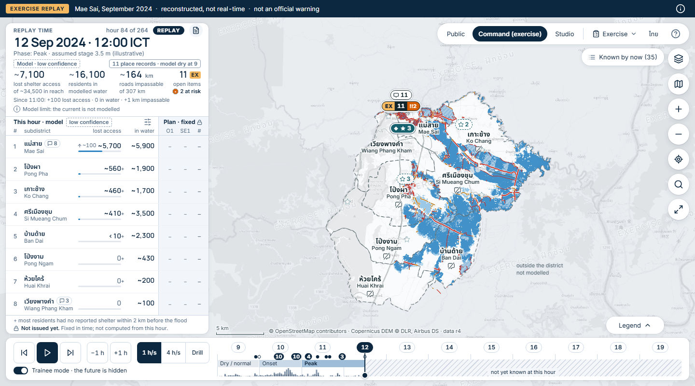
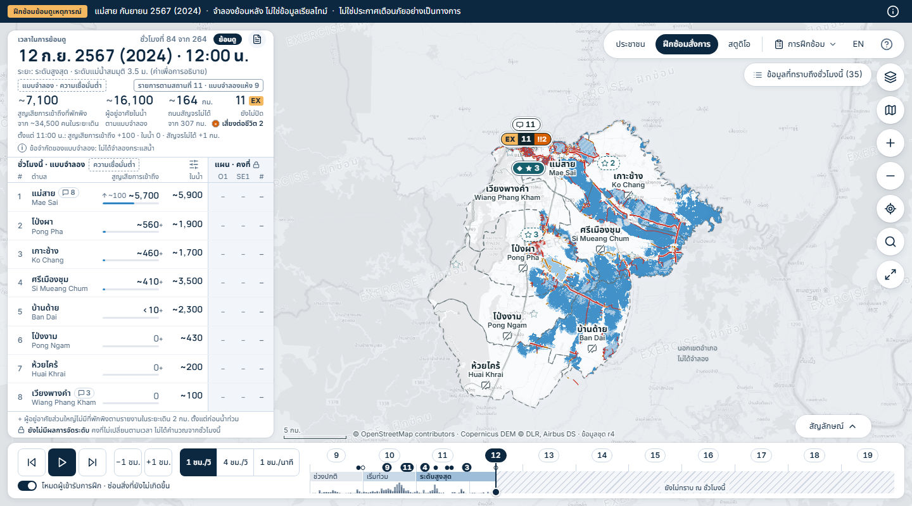
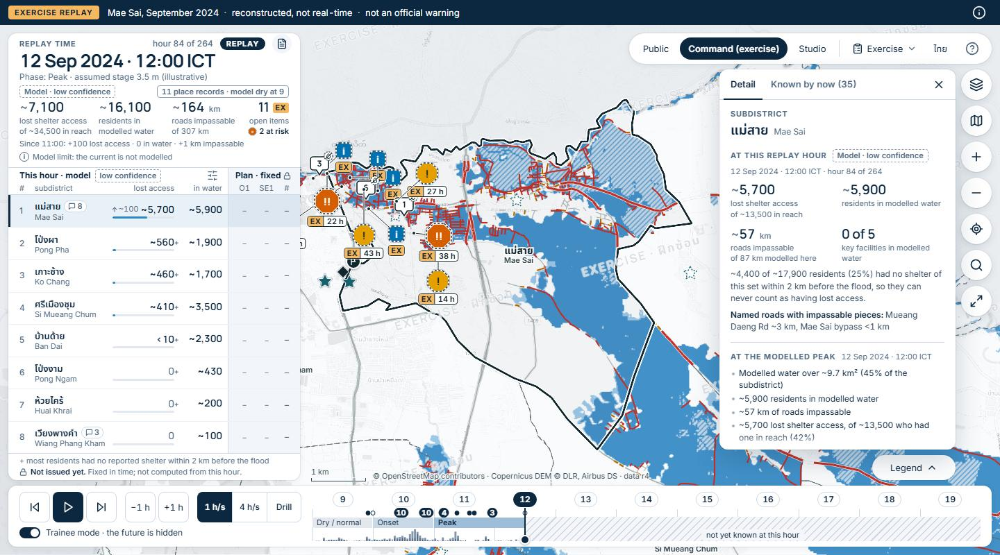
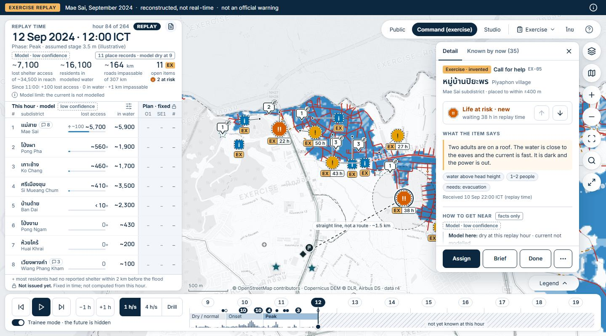
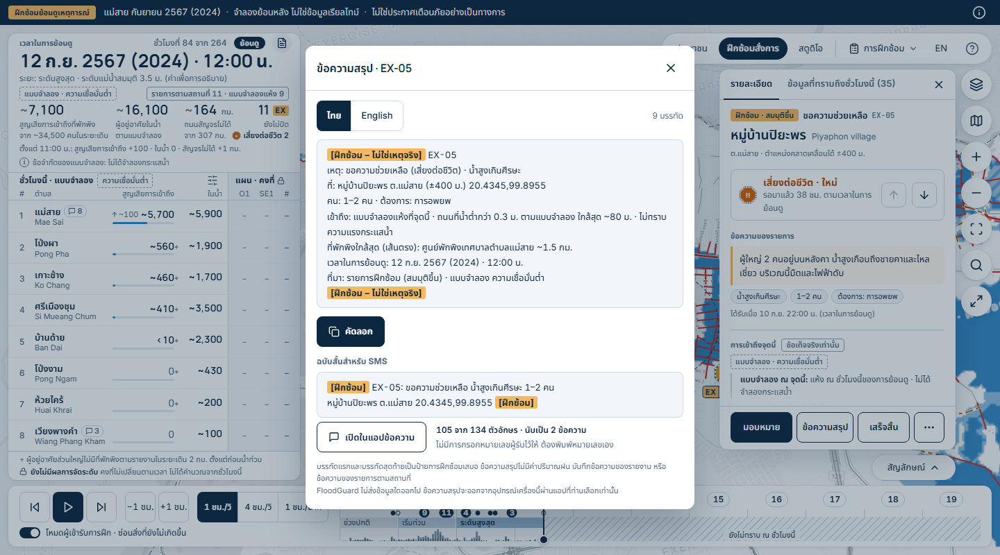
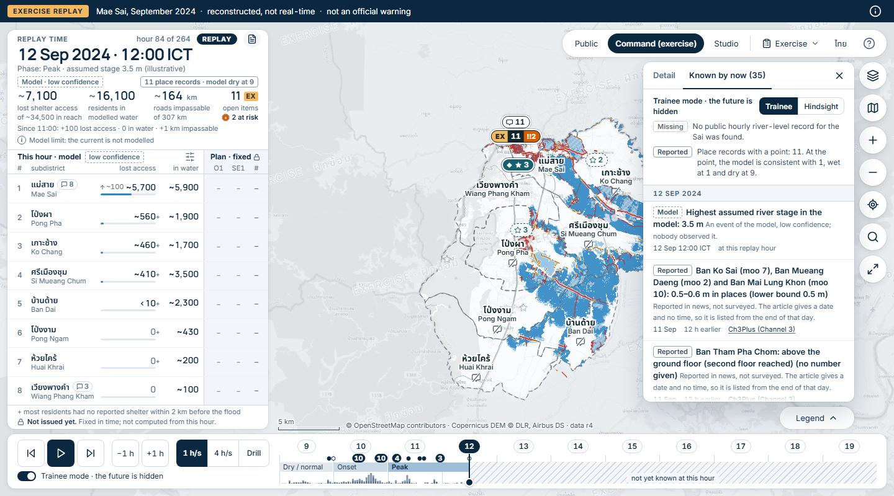
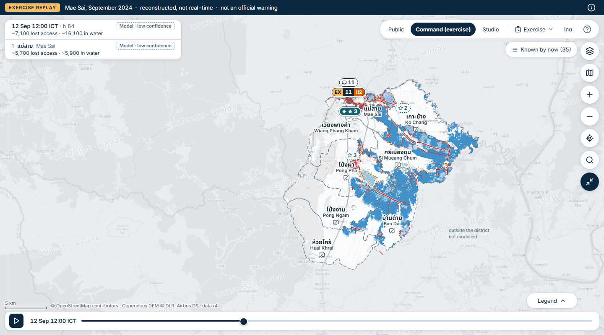
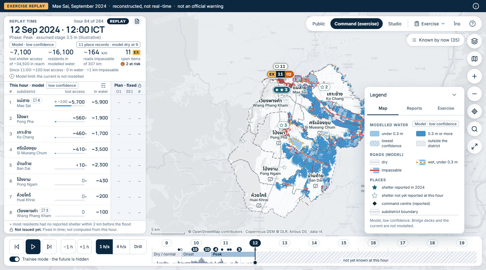
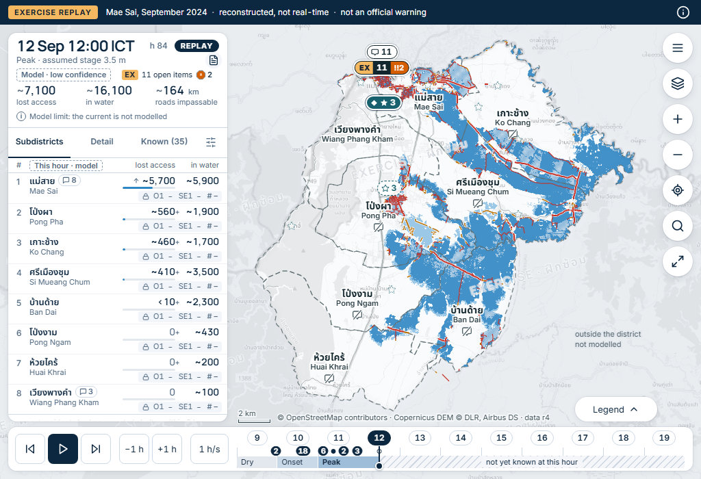
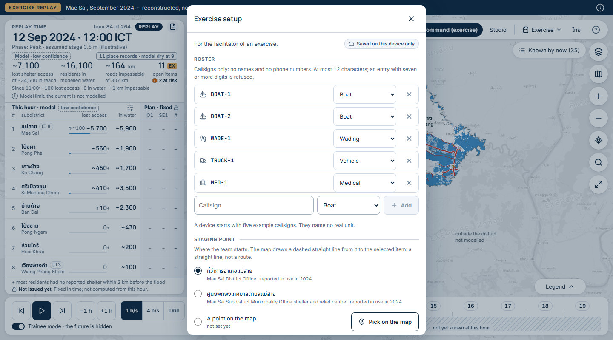

# Command exercise replay: the layout as built (5 Oct 2026)

For the next chat and for the owner. This is what the page looks like today on branch `claude/command-exercise`, at the temporary route `/command/exercise/`. It is not the plan: every size below was measured in headless Chromium on the built site (competition build, replay hour 84, trainee mode, street tiles loaded), on 5 Oct 2026. Where a number comes from a style sheet and not from a measurement, the text says so.

A review on the same day led to corrections in sections 1, 6, 9, 13 and 14. The numbers added then were measured the same way; for the app-status pill the browser was also run with its service worker allowed.

Read with:

- `docs/command_exercise_handoff.md`: what is built, what is not, and the open questions;
- `docs/command_exercise_plan.md`: the specification. Its section 3 holds the planned sizes, which differ from the built ones in several places.

Positions are in window pixels: `x, y` is the top left corner, then width x height. "EN" and "TH" are the English and the Thai page.

## 1. The regions

The page is one full-screen map with opaque white panels floating over it. The code names the regions A to I (`data-region` on each element).

| Region | What it is | What it shows |
|---|---|---|
| A | Banner, full width, dark | The exercise tag and the line "Mae Sai, September 2024 · reconstructed, not real-time · not an official warning". An (i) button opens the information drawer. It never collapses and has no close control. |
| B1 | Clock card, top of the left column | Replay time (the largest text), replay hour, the REPLAY tag, the button of the situation brief, phase and assumed river stage, the tag "Model · low confidence", a chip with the place records known by now, three model figures, the count of open exercise items, one line "since the hour before", one model-limit line. |
| B2 | Subdistrict table, under B1, touching it | Eight rows in two column groups: "This hour · model" on white and "Plan · fixed" on a tint behind a divider. A two-line footer. Three controls (behind a button on a short screen). |
| C | Navigation pill, top right | Public, Command (exercise), Studio, the Exercise menu, the language button, help. |
| D | Right card, under C, left of the tool rail | Closed: a chip "Known by now (35)", or "Detail: ..." when something is selected. Open: two tabs, Detail and Known by now; with an exercise item selected, a fixed action bar at its foot. |
| E | Tool rail, right edge, under C | Seven round tools: view, basemap, zoom in, zoom out, fit, find a place, focus mode. It never moves. |
| F | Time dock, bottom, full width | Transport buttons, three speeds, the trainee switch, eleven day chips, and a track with event marks, the phase band and rain bars. Hatched after the playhead. |
| G | Legend, bottom right above F | A chip; open, a panel with three tabs (Map, Reports, Exercise). |
| H | Watermark and credits | "EXERCISE · ฝึกซ้อม" tiled across the map. A scale bar and one credit line above the dock, right of the left column. |
| I | One-line notice, top, between the left column and C | Appears only when there is something to say: a failure, a tap the page waits for, Undo, a new exercise call, the offline basemap note. |

### Positions and sizes at rest

| Region | 1440 x 800 | 1440 x 900 | 1024 x 700 |
|---|---|---|---|
| A | 0, 0 · 1440 x 36 | 0, 0 · 1440 x 36 | 0, 0 · 1024 x 36 |
| B1 | 12, 48 · 420 x 193 (TH 200) | 12, 48 · 420 x 214 (TH 223) | 12, 48 · 320 x 138 (TH 139) |
| B2 | 12, 241 · 420 x 451 (TH from 248, 444 tall); ends at 692 | 12, 262 · 420 x 530 (TH from 271, 521 tall); ends at 792 | 12, 186 · 320 x 430; ends at 616 |
| B2 rows | 8 in view, 46.5 px each (TH 45.1), with the three controls behind their button. With the controls opened (they take 71 px, TH 74) the rows shrink to 37.8 px (TH 35.9): still 8 in view, no scroll (weak spot 19) | 8 in view, 47.1 px each (TH 45.0); the three controls are open above them | 8 in view, 44 px each, two lines per row. With the controls opened (141 px, TH 148) the rows stay 44 px and the table scrolls inside its card |
| C | 906, 48 · 522 x 44 (TH 953, 475 wide); ends at 1428 | the same | none: one menu button, 968, 48 · 44 x 44 |
| D (chip) | 1205, 100 · 171 x 36 (TH 201 wide); ends at 1376 | the same | none: its content is the tabs "Subdistricts, Detail, Known (35)" in B2 |
| D (open) | 1036, 100 · 340 x 548; ends at 648 | 1036, 100 · 340 x 600; ends at 700 | none |
| E | 1384, 100 · 44 x 356 (7 tools) | the same | 968, 100 · 44 x 304 (6 tools: no basemap tool) |
| F | 12, 700 · 1416 x 88 | 12, 800 · 1416 x 88 | 12, 624 · 1000 x 64 |
| G (chip) | 1256, 656 · 120 x 36 | 1256, 756 · 120 x 36 | 840, 580 · 120 x 36 |
| G (open) | from x 1080 to 1376 (296 wide), bottom at 692; 435 px tall on the Map tab, 540 on Reports, 524 on Exercise (TH 427, 542, 533). The most it may take is 544. | the same heights, bottom at 792 | from x 664 to 960, bottom at 616; 435, 540, 509 px (TH 410, 542, 500). The most it may take is 560. |
| H (credits) | from 448, 672; up to about 520 wide, 22 tall; ends 6 px above the dock | from 448, 772 | from 348, 596; one line at rest (up to about 470 wide), two lines while the legend is open |
| I | 28 px tall, top at 48, centred near x 665 (for example 535 to 795) | the same | 28 px tall, top at 48, centred in the window (382 to 642) |

How much of the window the banner and the panels cover (measured on a 4 px grid, chips counted):

| State | 1440 x 800 | 1440 x 900 | 1024 x 700 |
|---|---|---|---|
| At rest | 43% | 42% | 42% |
| Right card open | 59% | 57% | no right card |
| Legend open | 54% | 51% | 60% |
| Focus mode | 18% | 16% | 18% |

### Things that open over the map

| Thing | Where and how large (1440 x 800) | Notes |
|---|---|---|
| View popover | 1096, 100 · 280 x 366 (TH 380) | Hangs from the navigation, left of the rail. It lies over the "Known by now" chip while open. |
| Find-place box | 1076, 100 · 300 x 162 when empty | The same place; it also lies over the chip. |
| Tablet menu | 740, 48 · 220 x 446 at 1024 x 700 | Opens left of the menu button and the rail. |
| Map popup | An item popup measured 321 x 291; 12 px corners; 44 x 44 close control | An item popup has six lines and two buttons of 140 x 44. The body of any popup is at most 300 px tall; a long place-record popup scrolls inside and fades at its lower edge. |
| Information drawer | 460 px wide, full height, at the right edge (from x 980; from x 564 at 1024 x 700) | A native dialog over a dimmed page. It lies over the right end of the banner. At 1440 wide that is clear of the banner's words; at 1024 wide it covers the end of the line (weak spot 4). |
| Help sheet | 440 px wide (x 500 to 940; x 292 to 732 at 1024 x 700), from y 12 to 12 px above the bottom | It lies over the lower 24 px of the banner (weak spot 4). |
| Setup sheet | 560 px wide (x 440 to 1000; x 232 to 792 at 1024 x 700), from y 12 to 12 px above the bottom; it scrolls inside | It lies over the lower 24 px of the banner (weak spot 4). |
| Log sheet | 560 px wide, centred; 406 px tall (TH 395) in a fresh browser, before any action | Clear of the banner at both sizes. |
| Situation brief | 560 x 492 px (TH 493), centred | Clear of the banner at both sizes (from y 154; from y 104 at 1024 x 700). |
| Brief of an item | 560 px wide, centred; 664 px tall (TH 668) for the item of reference image 5 | At 1440 x 800 it runs from y 68 to y 732 and is clear of the banner. At 1024 x 700 it runs from y 18 (TH 16) to y 682 and lies over the lower half of the banner from x 232 to x 792 (weak spot 4). |

## 2. Focus mode

Key F or the last tool of the rail. The map matters more than the panels.

| What | At rest | In focus mode (1440 x 800) |
|---|---|---|
| B1 | 420 x 193 | 420 x 46 (TH 50): the short replay time, the model tag, two figures |
| B2 | 420 x 451 | 420 x 48 (TH 51): the top row only, with the model tag |
| F | 1416 x 88 | 1416 x 44: play, the replay time, a plain slider |
| G chip | at y 656 | moves down to y 700 |
| Credits | right of the left column | move to the left edge |
| A, C, D chip, E | unchanged | unchanged |

On a tablet the two cards are 320 x 46 and 320 x 48 and the dock is 1000 x 44. Both cards print "Model · low confidence" as text in this mode. The map itself does not move when focus mode is switched.

## 3. Panels that never open together

Five things share one state (`openPanel` in `apps/web/src/components/mae-sai-command-exercise.tsx`), so only one can be open:

- the legend;
- the right card;
- the view popover;
- the find-place box;
- the tablet menu.

Checked in the browser: opening the card while the legend is open closes the legend, and opening the find box closes the view popover.

Dialogs are a second group, also one at a time: the information drawer, the help sheet, the setup sheet, the log sheet, the brief sheet and the situation brief. They are native modal dialogs; while one is open it owns the keys.

Two small things are separate: the Exercise menu in the navigation (three entries) and the tray of the action bar inside the card (the roster for Assign, or the "more" actions).

On a tablet there is no right card, so the legend can be open beside the Detail tab.

## 4. The clear rectangle

The clear rectangle is the part of the map no panel covers. Every fit, every pan to a selection and every popup stays inside it. That is how a selected thing is kept out from under a panel.

- The arithmetic is `clearRect` in `apps/web/src/lib/flood-timeline-layout.ts`, with `clearRectPadding`, `panIntoRect` and `popupFitInRect` beside it.
- The measuring is `getClear` in `apps/web/src/components/mae-sai-command-exercise.tsx`. It reads the boxes of every element marked `data-clear-panel` at the moment a fit or a popup asks.
- The rule: start from the map less a 12 px margin. Each panel that reaches into the rectangle takes away one side of it, 12 px clear of the panel: the side whose loss leaves the most map. Largest panels first. If less than 160 x 120 px is left, the map less its margin is used.
- The one-line notice does not shape the rectangle, but where it lies over it the rectangle starts 8 px below the notice, so a popup never opens under it.
- The legend chip is not marked as a clear panel; the open legend is.

Measured, in window pixels:

| State | 1440 x 800 | 1440 x 900 | 1024 x 700 |
|---|---|---|---|
| At rest | x 444 to 1372, y 148 to 688 (928 x 540) | x 444 to 1372, y 148 to 788 (928 x 640) | x 344 to 956, y 48 to 612 (612 x 564) |
| Right card open | x 444 to 1024, y 104 to 688 (580 x 584) | x 444 to 1024, y 104 to 788 (580 x 684) | no right card |
| Legend open | x 444 to 1068, y 104 to 688 (624 x 584) | x 444 to 1068, y 104 to 788 (624 x 684) | x 344 to 652, y 48 to 612 (308 x 564) |
| Focus mode | x 12 to 1372, y 154 to 732 (1360 x 578) | x 12 to 1372, y 154 to 832 (1360 x 678) | x 12 to 956, y 154 to 632 (944 x 478) |
| A notice shown (tablet) | unchanged | unchanged | top moves from 48 to 84 |

At rest the rectangle starts under the "Known by now" chip (y 148), not under the navigation (y 104).

Checked: with Mae Sai subdistrict selected, its outline lies at x 471 to 996, y 144 to 648 at 1440 x 800, inside the rectangle; at 1024 x 700 it lies at x 387 to 912, y 78 to 582, also inside. A selected exercise item sat at x 960, y 472, inside the rectangle and left of the card.

## 5. Map panes and their order

The map is Leaflet. The page adds its own panes; a higher number is drawn on top (read from the built page).

| Order | Pane | Holds |
|---|---|---|
| 200 | tile pane | Grey street tiles (online only), at 55% opacity, greyscale |
| 250 | `fg-imagery` | Terrain shading, shown when the street tiles are not there or the terrain basemap is chosen; clipped to the eight subdistricts |
| 350 | `fg-water` | Modelled water, repainted per replay hour |
| 352 | `fg-envelope` | The 2024 season envelope, hindsight mode only |
| 370 | `fg-veil` | The pale veil outside the district ("not modelled") |
| 380 | `fg-tambons` | Subdistrict outlines (dashed grey) |
| 390 | `fg-highlight` | Created, not used today |
| 400 | `fg-roads` | Roads, on a canvas |
| 430 | `fg-selection` | Outline of the selected subdistrict, tolerance circles, the staging line, the mark of a found place |
| 436 | `fg-watermark` | The tiled exercise label; held still while the map moves |
| 440 | `fg-labels` | Subdistrict names, the label outside the district, "no reports received" marks, the staging badge |
| 450 | `fg-facilities` | The 42 key facilities, off by default |
| 460 | `fg-shelters` | Shelter stars, the command-centre diamond, shelter count badges |
| 462 | `fg-reported-depths` | Place-record bubbles, exercise markers, count marks, device signs |
| 650 | tooltip pane | Tooltips |
| 700 | popup pane | Popups |

So the watermark lies over the water and the roads and under every name, marker, tooltip and popup.

The panels of the page stack above the map: credits, then left column and dock, then rail and chips, then navigation, open card and open legend, then the notice, then popovers and the menu, and the banner on top of all.

Zoom steps that change the drawing (constants in `apps/web/src/components/mae-sai-command-map.tsx` and `apps/web/src/lib/flood-timeline-command-incidents.ts`):

| From zoom | Change |
|---|---|
| below 12.5 | Shelter stars are small and shelters closer than 36 px share one count badge; "no reports received" is a small glyph |
| below 13 | Report markers within 40 px merge into a count mark; roads take their thin weights |
| 13 and up | Each report marker stands alone; roads take their heavier weights |
| 14 and up | The edge of the modelled water is softened by less than a pixel (display only) |

The map zooms in quarter steps, up to zoom 17; a fit never goes past zoom 16.

## 6. Marker grammar

Every meaning has at least two cues, so colour is never the only one. Every marker a person can press has a 44 px target, whatever the size of its drawing. Shapes, colours and line widths below are read from the code (`apps/web/src/components/mae-sai-command-markers.tsx`, `mae-sai-command-map.tsx`, `apps/web/src/lib/flood-timeline-command-incidents.ts`); the sizes of stars, the diamond, pills and targets were also measured in the browser.

| Kind | Shape | Drawing size | Colour | Outline | Badge or line |
|---|---|---|---|---|---|
| Place record(s) at a point (2024 news) | Speech bubble with a count | about 26 x 26 px | White, ink count | Ink 1.6 px over a white casing | A small dashed round badge at its top right where the model is dry at the point |
| Exercise call for help | Octagon | 36, 30 or 26 px by urgency | By urgency (below) | By handling state (below) | Under it: the amber "EX" tag, then the callsign once assigned, then the hours waited |
| Exercise report (depth or road) | Rounded square | 32, 26 or 22 px by urgency: 4 px smaller than the octagon of the same urgency (an information report measured 22 x 22 px) | the same | the same | the same |
| Reports saved on this device | A text sign above the subdistrict's name | 18 px tall | White | Dashed ink; solid when selected | The count in words |
| Count mark (below zoom 13) | Two pills, one above the other | 20 px tall each | White pill: place records. Dark pill: exercise items. | Ink | The dark pill starts with the amber "EX" tag and ends with "!!" and a count on vermillion when it holds a life-at-risk item. The two counts are never added. |
| Shelter reported in 2024 | Star | 22 px; 14 px below zoom 12.5 | Teal `#17616e` | White 2 px ring | Not yet reported at this hour (trainee mode): dashed teal outline on white. In modelled water: hollow and struck through in dark ink (no case in the data today). |
| Command centre | Diamond | 20 px; 13 px below zoom 12.5, where it stands alone and not inside a count badge | Ink `#12262d` | White ring | Not drawn before its day in trainee mode |
| Shelter count badge | Pill with a star (and the diamond when it holds the command centre) | 22 px tall | Teal, white text | White 2 px | Dashed when none of its sites is reported yet |
| Key facility (off by default) | Circle | radius 4.5 px; 5.5 px when wet | White; blue `#2f86c4` when in modelled water | Ink; white when wet | None |
| "No reports received" | A struck-through speech bubble under the name; the words from zoom 12.5 | 18 px glyph; 17 px text chip | Grey | Dotted | None |
| Staging point | Round badge with a flag, beside its point | 22 px | Ink | White 2 px | A dashed straight line to the selected item, labelled "straight line, not a route" with the distance |
| Selected subdistrict | Its outline | 2.6 px | Ink over a 6.5 px white casing | | A faint ink wash inside |
| Selected item | A ring around its marker | 2.4 px | Navy over a white casing | | A dashed circle of the item's stated tolerance |

Urgency of an exercise item (symbol, size and colour together):

| Urgency | Symbol | Size | Fill | Extra |
|---|---|---|---|---|
| Life at risk | `!!` white | 36 px | Vermillion `#D55E00` | A wider white halo |
| Urgent | `!` dark | 30 px | Orange `#E69F00` | |
| Information | `i` white | 26 px | Blue `#0072B2` | No waiting clock on the map |

The sizes are those of the octagon. The rounded square of a report is drawn 4 px smaller: 32, 26 or 22 px.

Handling state of an exercise item:

| State | Outline | Line under the marker |
|---|---|---|
| New | Dashed ink | "EX", and the hours waited for urgent and life-at-risk items |
| Acknowledged | Solid ink | the same |
| Assigned | Solid ink | "EX", the callsign, the hours waited |
| Done or dropped | No ink outline, only a thin grey line (1.4 px, `#6b787b`) around the shape; the marker is grey `#c3cacb` with a tick | "EX" on grey |

A marker that would cover a place-record bubble, a shelter sign or another item stands beside its point, with a thin line and a dot back to the point. The most urgent items are placed first and keep their own point.

These three urgency colours are used on exercise markers and nowhere else. They are deliberately not the colours of medical triage.

Roads (line styles, so colour is not the only cue):

| State | Line |
|---|---|
| Dry | Thin grey, solid |
| Wet, under 0.3 m | Dashed amber `#b86e00` on a thin white casing |
| Impassable, 0.3 m or more | Solid red `#c62f24`; a through road or a named road is heavier and lies on a white casing |
| Not modelled | Dotted grey (no case in the data today) |

Water: one blue in two tones. Under 0.3 m: `#8dc0e4`. 0.3 m or more: `#2f86c4`. The lowest-confidence cells are hatched.

## 7. Colour and type tokens

The page tokens are custom properties named `--c-*` on the page root. They are defined at the top of `apps/web/src/components/mae-sai-command-exercise.module.css` (class `.page`). Four of them take their value from the site's Command palette in `apps/web/src/app/globals.css` (rule `.command-page, .studio-page`).

| Token | Value | Used for |
|---|---|---|
| `--c-ink` | `#0c2740` (site `--ink`) | Text |
| `--c-muted` | `#526a82` (site `--muted`) | Captions, quiet text; 5.6 to 1 on white |
| `--c-quiet` | `#4e6074` | A zero or a dash that is still data |
| `--c-line` | `#cdd9e6` (site `--line`) | Hairlines, control borders |
| `--c-accent` | `#0c2740` (site `--navy`) | The banner, pressed buttons, the play button, the elapsed part of the focus slider |
| `--c-panel` | `#ffffff` | Panels |
| `--c-tint` | `#f2f5f9` | The plan group of the table, hover |
| `--c-ground` | `#f4f6f9` | The page behind the map; legend samples |
| `--c-water-1`, `--c-water-2` | `#8dc0e4`, `#2f86c4` | The two water tones; the bar in the table |
| `--c-wet` | `#b86e00` | Wet roads |
| `--c-cut` | `#c62f24` | Impassable roads, and nothing else |
| `--c-exercise` | `#f4b860` | The exercise tag: banner tag, "EX" tags, the first line of an item popup |
| `--c-site` | `#17616e` | Reported shelters |
| `--c-focus` | `#1d6fb8` | The keyboard focus ring (3 px) |
| `--c-shadow` | hairline plus a soft shadow | Panels at rest |
| `--c-shadow-over` | hairline plus a deeper shadow | What opens over the map: card, legend, popovers, popups |
| `--c-shadow-tool` | | Round tools, tooltips, the notice |

Type:

| Token | Faces | Used for |
|---|---|---|
| `--c-font` | Inter Variable, Noto Sans Thai Variable | Body, controls, tags |
| `--c-font-head` | Manrope Variable, Noto Sans Thai Variable | The replay time, figures, table numbers, card titles, marker symbols, the watermark |
| `--c-font-mono` | JetBrains Mono Variable | The data line of the drawer and the key caps of the help sheet only |

Sizes found on the page (computed in the browser at 1440 x 800, at rest and with an item selected):

| Size | Where |
|---|---|
| 26 px | The replay time (22 px on a tablet) |
| 19 px | The model figures, the subdistrict's name in the inspector (17 px on a tablet for the figures) |
| 14 px | Table numbers, subdistrict names on the map, titles of popovers |
| 13 px | Body text, navigation, banner line, the first line of a popup |
| 12 px | Controls, popups, the feed, the inspector |
| 11 px | Captions, tags, chips, legend text; the smallest text a reader has to read |
| 16 px | Titles of dialogs (the one size outside the six) |

Marker symbols are SVG text of 12, 14 and 15 px. The unit after a figure ("km") is 11.4 px. Nothing readable was found under 11 px.

Line height is 1.4 in English and 1.5 in Thai; Thai tags use 1.7 so stacked marks do not touch a border. Numbers are tabular.

## 8. Spacing and radius rules

All from the tokens in the same style sheet.

| Rule | Value |
|---|---|
| Margin between a panel and the window edge or the banner | 12 px (`--c-margin`) |
| Gap between neighbouring panels and between tools | 8 px (`--c-gap`) |
| Inner padding of every panel, so stacked text starts on one line | 16 px (`--c-inset`); 12 px on a tablet |
| Panel corners | 12 px (`--c-radius`) |
| Control corners (buttons, segments, popup buttons) | 8 px (`--c-radius-control`) |
| Tags and small chips | 4 px corners |
| Pills (navigation, chips, the notice) | Fully rounded: 44 px tall navigation, 36 px chips, 28 px notice |
| Round tools | 44 px circles |
| Left column width | 420 px (`--c-left`); 320 px on a tablet |
| Time dock height | 88 px (`--c-dock`); 64 px on a tablet; 44 px in focus mode; 104 px below 900 px |
| Right card | 340 px wide, at most 600 px tall |
| Legend | 296 px wide |
| Clear rectangle | 12 px from the map edge, 12 px from a panel |
| The left column is one sheet | B1 and B2 touch, with a hairline between them |
| Watermark tiles | 400 x 210 px, turned 16 degrees, 17 px letters at 15% ink with a light edge |

## 9. Breakpoints

The widths are not defined in one place. Seven style sheets in `apps/web/src/components/` repeat them as plain numbers, and two media queries in `mae-sai-command-exercise.tsx` mirror them (`TABLET_QUERY`, `COMPACT_QUERY`). A change of 1180 or 899 has to be made in every one of them:

| Style sheet | Media queries it holds |
|---|---|
| `mae-sai-command-exercise.module.css` | 1180 px (twice), 899 px, 560 px, the desktop height rule (1181 px and up, 840 px or less), reduced motion |
| `mae-sai-command-queue.module.css` | 1180 px, the desktop height rule, coarse pointer (the only one), reduced motion |
| `mae-sai-command-act.module.css` | 1180 px, 899 px, 520 px (the only one), reduced motion |
| `mae-sai-command-inspector.module.css` | 1180 px, reduced motion (twice) |
| `mae-sai-command-feed.module.css` | 1180 px |
| `mae-sai-command-find.module.css` | 899 px |
| `mae-sai-command-markers.module.css` | 899 px |

The conditions of the table below were each checked one pixel either side, except the 520 px row, which was read from the style sheet and not tried in a browser.

| Condition | What changes |
|---|---|
| Width 1181 px and up | The desktop layout above. |
| Height 840 px or less (desktop) | The three controls of the table start behind the options button. The clock card and the table footer use tighter padding. From 841 px the controls are open. |
| Width 1180 px or less (tablet) | Left column 320 px. No navigation pill: one menu button. No right card: its content becomes the tabs Subdistricts, Detail, Known in B2. Six tools (no basemap tool; it moves into the menu). Dock 64 px: no rain row, no trainee switch, one speed button that cycles, short phase names. The clock card drops its label, the fourth figure and the "since" line; open items stand beside the model tag. Rows are two lines and 44 px. Inset 12 px. The notice is centred in the window. |
| Width 899 px or less | See below. |
| Width 560 px or less | Phase names are hidden in the band. |
| Width 520 px or less | In the setup sheet the rows of the roster change: the select of a row is 104 px wide (112 to 148 px above this width), between the callsign and the 44 px remove button; in the row that adds a callsign the Add button moves to a line of its own (`mae-sai-command-act.module.css`). |
| Coarse pointer (touch) | A table row is never under 44 px; the table scrolls inside its card if needed. |
| Reduced motion | No transitions, no rise of panels, fits are not animated. |

### Under 900 px

This width is outside the first release. The page keeps a short form and says what is missing.

| Kept | Gone |
|---|---|
| The banner (40 px at 768 wide; about 62 to 66 px at 390 wide, where it wraps) | The subdistrict table and its tabs |
| A short situation card across the top (692 x 131 at 768 x 700; 314 x 147 at 390 x 800): replay time, the model tag, open items, three figures | The tool rail, the view popover, the find box |
| The sentence "Narrow window: the subdistrict table and the map tools need a window at least 900 px wide." | The right card and its chip |
| The menu button and the legend chip | The credits and the scale bar |
| The map, with Thai names only | The "no reports received" marks and the label outside the district |
| A time dock of 104 px: play, one hour back, one hour forward, the replay time, the track | Event buttons, speeds, day chips |
| The notice, above the dock | |

The bottom sheet of the plan is not built.

## 10. Keyboard map

From `commandKeyAction` in `apps/web/src/lib/flood-timeline-command-replay.ts`; the help sheet (key `?`) lists the same eight entries.

| Key | Does |
|---|---|
| Space | Play or pause (on a button or a link it presses that control) |
| Left, Right | One replay hour back or forward (on the time slider the slider moves by itself) |
| Shift + Left, Right | One day back or forward |
| `[` and `]` | Previous or next event: every hour that has a mark on the track |
| F | Focus mode on or off |
| `?` | The help sheet |
| U | Undo the last action of the exercise, while its line with "Undo" is on screen (10 seconds) |
| Escape | One thing per press, in this order: a map popup; the staging-point pick; the Exercise menu; the tray of the action bar; an open legend, popover or menu; the selection and the card; a found place; focus mode |
| Enter on a marker | Opens its popup and moves the focus into it; Escape closes it and hands the focus back |
| Enter or Space on a count mark | Zooms in to it |
| Tab | The first stop in the map area is a link "Skip to the replay controls" that passes the markers |

Keys held with Alt, Ctrl or the Command key are left to the browser. In a text field the keys belong to the field, except Escape. While a dialog is open it owns the keys. The map's own arrow-key panning is off; the zoom and fit tools are the keyboard route to the map view.

Focus rules: a panel that opens takes the keyboard focus and hands it back to what opened it when it closes. A marker that takes the focus is panned well inside the clear rectangle. After "Reset exercise" the focus is on Undo.

## 11. Wireframes as built

Desktop, 1440 x 800 (not to scale; sizes in px):

```
+--------------------------------------------------------------------------------------------------+
| A  [EXERCISE REPLAY]  Mae Sai, September 2024 · reconstructed, not real-time · not an ...  (i)   |  36
+--------------------------------------------------------------------------------------------------+
| +-B1  420 x 193----------------------+  ( I: notice )  +-C  522 x 44---------------------------+ |
| | REPLAY TIME     hour 84  [REPLAY]  |                 | Public [Command] Studio Exercise TH ? | |
| | 12 Sep 2024 · 12:00 ICT            |                 +---------------------------------------+ |
| | Phase: Peak · stage 3.5 m          |                             +-D chip 171 x 36----+  +-E-+ |
| | [Model · low conf.] [11 records]   |                             | Known by now (35)  |  |Vw | |
| | ~7,100 ~16,100 ~164 km    11 EX    |                             +--------------------+  |Bm | |
| | Since 11:00: +100 · 0 · +1 km      |                                                     | + | |
| | (i) Model limit: ...               |                                                     | - | |
| +-B2  420 x 451----------------------+   clear rectangle 928 x 540                         |Fit| |
| | This hour · model   | Plan · fixed |   x 444 to 1372, y 148 to 688                       |Fnd| |
| | #  subdistrict  lost  in water |   |                                                     |Foc| |
| | 1  Mae Sai   ~5,700  ~5,900 | - -  |           M   A   P                                 +---+ |
| | 2  Pong Pha    ~560  ~1,900 | - -  |                                                  44 x 356 |
| |    ... 8 rows of 46.5 px ...       |                                                           |
| | + most residents had no ...        |                                                           |
| | Not issued yet. Fixed in time      |  H: scale bar · credits     +-G chip 120 x 36----+        |
| +------------------------------------+                             | Legend          ^  |        |
|                                                                    +--------------------+        |
| +-F  1416 x 88---------------------------------------------------------------------------------+ |
| | [|<] [ > ] [>|] [-1 h] [+1 h] [1 h/s | 4 h/s | Drill] |  9  10  11 [12] 13  14  ...  18  19  | |
| | (o) Trainee mode · the future is hidden               | marks / phases / rain |/// later /// | |
| +----------------------------------------------------------------------------------------------+ |
+--------------------------------------------------------------------------------------------------+
```

With the right card open, D becomes a panel 340 x 548 from x 1036, y 100 (left of the rail), the clear rectangle shrinks to 580 x 584, and the legend stays a chip under the card.

Tablet, 1024 x 700:

```
+------------------------------------------------------------------------------+
| A  [EXERCISE REPLAY]  Mae Sai, September 2024 · ... not real-time · ...(i)   |  36
+------------------------------------------------------------------------------+
| +-B1  320 x 138--------------+     ( I: notice )                     [Menu]  |
| | 12 Sep 12:00 ICT     h 84  |                                        +-E-+  |
| | Peak · stage 3.5 m         |                                        |Vw |  |
| | [Model] EX 11 open, 2 risk |                                        | + |  |
| | ~7,100  ~16,100  ~164 km   |     clear rectangle 612 x 564          | - |  |
| | (i) Model limit: ...       |     x 344 to 956, y 48 to 612          |Fit|  |
| +-B2  320 x 430--------------+                                        |Fnd|  |
| | Subdistricts|Detail|Known  |             M   A   P                  |Foc|  |
| | # [This hour] lost  water  |                                        +---+  |
| | 1  Mae Sai  ~5,700  ~5,900 |                                     44 x 304  |
| |    O1 -   SE1 -   # -      |                                               |
| |    ... 8 rows of 44 px ... |                +-G chip 120 x 36----+         |
| +----------------------------+  H: credits    | Legend          ^  |         |
|                                               +--------------------+         |
| +-F  1000 x 64-------------------------------------------------------------+ |
| | [|<] [>] [>|] [-1 h] [+1 h] [1 h/s] | 9 10 11 [12] 13 .. 19 |// later // | |
| +--------------------------------------------------------------------------+ |
+------------------------------------------------------------------------------+
```

## 12. The ten reference images

Taken after the merge of the unified branch, at replay hour 84 in trainee mode. 1440 x 800 except image 9 (1024 x 700). The PNG originals are outside the repository (see the handoff, section 2).



1. `01-rest-en.jpg`: at rest in English. Banner, clock card, the two-ranking table with empty plan columns, the district view, tool rail, legend chip, time dock.



2. `02-rest-th.jpg`: the same in Thai. The clock card is 7 px taller and the rows 1.4 px lower; nothing is cut.



3. `03-tambon-selected-en.jpg`: the Mae Sai row selected. The map has fitted the subdistrict between the left column and the open card; the card shows its detail.



4. `04-call-selected-en.jpg`: the invented call EX-05 (life at risk) selected. Ring, tolerance circle, the dashed straight line from the staging point, and the card with Assign, Brief, Done.



5. `05-brief-th.jpg`: the brief sheet for EX-05 in Thai. Nine lines between two exercise tags, Copy, and the two-line text-message version.



6. `06-known-by-now-en.jpg`: the "Known by now" tab of the right card, with the Trainee and Hindsight switch and the fixed first line about the missing river record.



7. `07-focus-mode-en.jpg`: focus mode. Two short cards at the top left, a one-line time bar, and the whole map.



8. `08-legend-en.jpg`: the legend open on its Map tab. The Reports and Exercise tabs are not shown in any of the ten images.



9. `09-tablet-en.jpg`: the tablet layout at 1024 x 700. Compact clock card, tabs in the left column, the menu button, six tools, the lower dock.



10. `10-setup-sheet-en.jpg`: the facilitator's setup sheet with the five example callsigns and the staging point choices.

Not among the ten: hindsight mode with the season envelope, the Reports and Exercise tabs of the legend, a map popup, the view popover, the find box, the log sheet, the help sheet, and any width under 900 px. The folders of the earlier build steps hold shots of all of them. Shots of the item brief on a tablet, of the wide app-status pill and of the rows with the controls open are in `handoff/review-fix/results` of the same screenshot folder (see the handoff, section 2).

## 13. Layout rules to keep

The design bar. Where each rule comes from:

- Rule 1: the full-screen map and the HUD panels are the owner's decision (R17, part 1). The look of the GISTDA disaster platform is written in the plan (section 3, "copied from the GISTDA screenshot"), and the build brief names it as the owner's reference; no row of the decision log records it.
- Rules 2 to 7 are the plan's, written by the planner (sections 3 and 8). No row R17 to R19 records them as owner decisions.

1. **A clean full map with floating panels**, in the style of the GISTDA disaster platform: a pale map edge to edge, one card column on the left, a thin column of round tools on the right, a navigation pill top right, a legend chip bottom right, and nothing in the centre. The layout is copied, not the branding.
2. **Restrained colour.** Most of the screen is neutral: white panels, ink text, grey lines, a pale map. Water is one blue in two tones. Amber is for wet roads and the exercise tag. The three urgency colours appear on exercise markers only.
3. **Red only for impassable roads.** No panel, button or tag is red. Wet things are blue or struck through in ink. The life-at-risk marker is vermillion, a different colour chosen on purpose, and it appears on exercise items only.
4. **Nothing overlaps.** Measured today: no two panels overlap at 1440 x 800, 1440 x 900 or 1024 x 700, in English or Thai, at rest, with a subdistrict selected, with the card open, with the legend open, or in focus mode. The one-panel-at-a-time rule of section 3 is what keeps this true. One exception by design: the view popover and the find box open over the "Known by now" chip (weak spot 5).
5. **A selected thing is never under a panel.** Every fit, pan and popup uses the clear rectangle of section 4. New panels must carry `data-clear-panel`.
6. **Thai is never clipped.** Size a component for the longer of the two strings. Thai line height is 1.5 or more. Measured today: no text is cut with an ellipsis at rest, in the town view or with a subdistrict selected, in either language, at 1440 x 800 and 1024 x 700.
7. **44 px touch targets.** A control may look smaller, but its hit area reaches 44 px. Two places fall short today and a third in part (a radio in the setup sheet); see weak spot 9, which also says what was scanned.

Rules that follow from the honesty rules and shape the layout too:

8. The banner is always there and nothing closes it.
9. The model tag ("Model · low confidence") stays in sight wherever a modelled figure is shown, also in focus mode.
10. The two column groups of the table stay visibly apart (a divider and a tint) and are never merged into one ranking.
11. No panel moves while the replay plays: the clock card keeps one height at every hour.
12. The map moves only in answer to a tap, a key or a selection.
13. The exercise watermark and the "EX" tags stay on anything a photo could crop.
14. Missing things are drawn as missing: a dash, a dashed outline, the veil.

## 14. Known weak spots

From the second visual review, the stage reports, the two fix reports, the measurements of this handoff, a look at the ten images, and the review of the handoff itself (which added to 2, 4, 7 and 9 and brought 19). None was fixed here: this handoff changed no behaviour.

| # | Weak spot | Where to see it |
|---|---|---|
| 1 | **Crowded markers at the town zoom.** Near the border crossing the exercise markers, their "EX" lines, the place-record bubbles and the leader lines sit close together. One pair still overlaps at 1440 x 800 and two or three at 1024 x 700 (as the second fix report states). | Images 3 and 4 |
| 2 | **Markers at the edge of a selected subdistrict slip under a panel.** The outline itself stays inside the clear rectangle, with only about 27 px to spare on the left, so 44 px markers on the western border run under the left column. With an item selected, neighbours on the right run under the card. The legend chip is not a clear panel either (section 4), and the stage 3 report says that on a tablet a marker at the edge can sit under it. The checks after the review did not see that: no marker that can be pressed lay under the chip at 1024 x 700 or 1440 x 800 in the district view, in the town view or with an item selected, nor on the tablet with each of the eight subdistricts selected in turn (hour 84, trainee mode). Other hours and a map moved by hand were not tried. | Images 3 and 4 |
| 3 | **Three count marks stack at the town in the district view.** The place-record pill, the exercise pill and the shelter badge stand in one pile, and the shelter badge touches the name "แม่สาย". At phone width it covers the first letters of the name. | Images 1, 2 and 9 |
| 4 | **Tall sheets cover part of the banner.** The setup sheet and the help sheet start 12 px from the top, so they lie over the middle of the banner. Most of "not real-time · not an official warning" is hidden while the setup sheet is open, and part of it under the help sheet. The brief of an item does the same on a tablet: it is 664 px tall (TH 668) in a 700 px window, runs from y 18 (TH 16) and cuts through the words of the banner from x 232 to x 792; at 1440 x 800 it starts at y 68 and is clear. On a tablet the information drawer starts at x 564 and covers the end of the banner line: in English the words "not an official warning" run from x 497 to x 623, and the Thai line ends at x 683. The exercise tag at the left stays visible in every case. The log sheet and the situation brief stay clear at both sizes. | Image 10 (the setup sheet); the item brief on a tablet is not in the ten images |
| 5 | **The view popover and the find box lie over the "Known by now" chip.** They hang from the same corner. Measured: the whole chip (171 x 36) is covered while either is open. | Not in the ten images |
| 6 | **Focus mode does not re-fit the map.** The panels fold away but the district stays where the last fit put it, right of centre, with a wide empty band on the left. | Image 7 |
| 7 | **The app-status pill lies over the time dock for the first seconds.** It stands at the bottom right for about 3.5 to 4 seconds after the page is ready, then hides itself. It has two states. With the service worker blocked, as in the measuring scripts, it reads "Online" and is about 131 x 44 px (TH 138): on a tablet it covers day chips 18 and 19, on a phone the replay time. With the service worker running, as for a visitor, it reads "Online · app pages saved offline" and has a 44 px close button beside it: 274 x 44 px together, from x 732 to x 1006 at 1024 x 700. There it covers the lower part of day chips 16 to 19 and half of chip 15, the phase name "Mostly receded" and most of the label "not yet known at this hour". At 1440 x 800 the wide form stands at x 1148 to 1422 over the right end of the track and covers no day chip. The wide form was measured in English only. | Not in the ten images |
| 8 | **The count chips on the time track differ by width and language.** Marks merge by their distance on screen, so the track reads 10 and 10 in English, 9 and 11 in Thai, and other numbers on a tablet. The totals agree, but it can read as a data mismatch. | Images 1, 2 and 9 |
| 9 | **Targets under 44 px: two, and a third in part.** (a) The place-record chip on the clock card is 190 x 19 px (TH 205 x 21): its larger hit area is cut off by the chip's own `overflow: hidden`. (b) In "Known by now" a source link answers on about 27 px of height and a place link on about 33 px. (c) In the setup sheet the radio of "A point on the map" answers on its own 18 x 18 px only. Its label is 329 x 20 px (TH 353 x 21; 337 and 361 px wide on a tablet) and answers on a band 45 px tall through an invisible extension, and the button "Pick on the map" in the same row is 44 px tall; so the choice has a 44 px target, but the round radio has not. The two site radios above it sit in labels 46 px tall (TH 48). What was scanned: the page at rest, the town view, an item popup, the item inspector, "Known by now" and the open legend for the first measurements; after the review also the six sheets and dialogs, the view popover, the find box, the two menus and the two trays of the action bar, at 1440 x 800 and 1024 x 700 in both languages. Not scanned: the popups of place records and of shelters, and widths under 900 px. | Images 1, 6 and 10 |
| 10 | **A column of dashes.** Until a class is issued, the plan group is 104 px of dashes in every row. | Images 1 and 2 |
| 11 | **A busy clock card.** Tags, a chip, an "EX" tag, a round icon button and a model-limit line share 193 px. | Image 1 |
| 12 | **The legend has no room to grow.** The Reports tab is 540 px (TH 542) of the 544 px it may take at 1440 x 800. One more row and it scrolls. | Not in the ten images |
| 13 | **One label differs in kind between the languages.** The third speed button reads "Drill" in English and "1 ชม./นาที" in Thai. | Images 1 and 2 |
| 14 | **Tablet details.** The Mae Sai row shows an up arrow without its number. The trainee switch is not on the dock (it is in the Known tab and in the setup sheet), and there is one speed button. Never tried with a finger on a real tablet. | Image 9 |
| 15 | **Under 900 px there is no table and no tool.** Only the short form of section 9. | Not in the ten images |
| 16 | **No motion polish.** No cross-fade of the water or the figures, no cue on a row that changes place, no time readout on the playhead. | |
| 17 | **Two "404" lines in the browser console on every load**, for the two overlay files that do not exist yet. | Browser console |
| 18 | **An unused map pane** (`fg-highlight`) is created and holds nothing. | Code |
| 19 | **Rows shrink when the three controls are opened on a short desktop.** At 1440 x 800 the controls start behind their button. Opened, they take 71 px (TH 74) and the eight rows shrink from 46.5 to 37.8 px (TH from 45.1 to 35.9), with no scroll. That is under 44 px for a mouse; the style sheet lets a row go down to 33 px. On a tablet a row keeps 44 px and the table scrolls (measured). The style sheet gives a touch screen of any width the same 44 px (read, not measured). | Not in the ten images |
