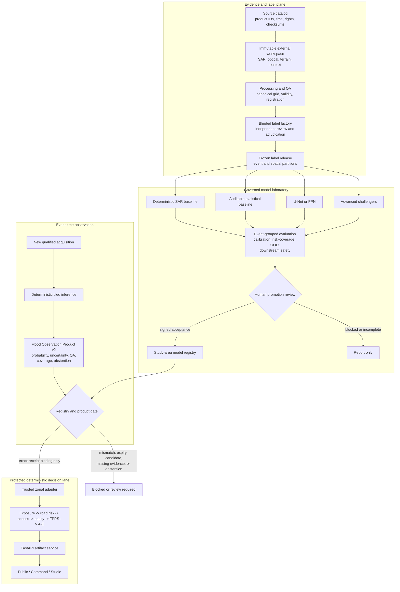
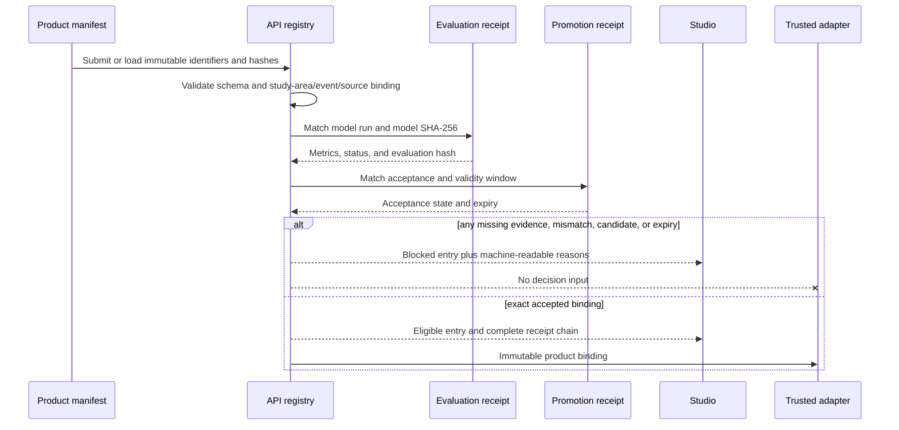

# GeoAI system design v1

## Decision

FloodGuard uses GeoAI as a governed evidence producer, not as an autonomous
decision maker or warning authority.

The primary observed-flood lane is temporal Sentinel-1 segmentation. Optional
optical imagery may corroborate that observation. Rainfall and hydrology belong
to a separately typed forecast lane. Accepted observation or forecast evidence
may reach the existing deterministic exposure, road-risk, access, equity, FPPS,
and A-E modules only through a receipt-validated adapter.

This milestone adds the first implementation boundary for that design:

- an additive Flood Observation Product v2 contract;
- an additive Model Run v2 contract;
- an additive Model Evaluation v2 contract;
- a study-area-aware Model Registry Entry v1 contract;
- fail-closed registry validation in the API and Studio;
- deterministic synthetic examples and rejection tests.

It does **not** train, approve, or deploy a real flood-detection model. The
qualified-reference and calibrated-reviewer gates remain external blockers.

## System boundary



The existing `src/floodguard/trusted_zonal_adapter.py` remains the only model
product to reporting-area bridge. Its signed receipt is now explicitly version
2.0 because the authoritative geometry is bound to the exact model-run study
area. Legacy 1.0 zonal receipts are rejected: they predate that binding and
cannot be replayed into the decision lane. A registry receipt establishes
eligibility; it does not itself calculate zonal evidence or alter FPPS.

## Non-negotiable safety boundaries

The system must preserve all of these rules:

1. A flood model cannot learn or replace FPPS weights.
2. A flood model cannot learn or replace A-E action thresholds.
3. A model probability does not declare a road closed or a route safe.
4. A model result does not assert that a facility is operating.
5. No-data, invalid coverage, and abstention are never converted to dry land.
6. A candidate, shadow, or report-only result cannot feed the decision layer.
7. A frontend switch, query parameter, or environment variable cannot override
   registry eligibility.
8. Active-learning and annotation-assistance scores remain outside the decision
   layer.
9. Model promotion never changes `official_warning` to `true`.
10. FloodGuard remains a preparedness and rapid post-event prioritization tool,
    not an official warning system.

## Evidence lanes

| Evidence kind | Meaning | Typical inputs | Permitted initial use |
|---|---|---|---|
| `satellite_observed_extent` | Inundation observable in a qualified acquisition | Sentinel-1, optional valid Sentinel-2, terrain and static QA | Report-only until a model and product pass all gates |
| `optical_corroboration` | Optical evidence that supports or conflicts with the SAR result | Sentinel-2 L2A plus cloud and shadow validity | Supporting evidence only |
| `susceptibility_forecast` | Flood likelihood at a stated issue time and lead time | Rainfall, gauges, reservoirs, terrain, antecedent state | Separately labeled scenario or forecast evidence |
| `scenario_assumption` | A deliberate planning input, not an observation | Operator-owned scenario parameters | Planning only |
| `external_algorithmic_baseline` | A third-party or weak algorithmic flood product | Product-specific source | Comparison and disagreement detection |
| `human_field_observation` | Human or agency observation with explicit authority | Field report and provenance | Governed according to the observation authority |

The API and UI must not present these kinds as interchangeable. In particular,
rainfall-supported prediction is not satellite-observed inundation.

## Contract package

### Flood Observation Product v2

The product is a manifest-backed package, not a single raster. The contract
binds:

- study area, event, evidence kind, and target semantics;
- source product identifiers, acquisition times, and source-bundle hash;
- model run and model-weight hash;
- grid, CRS, resolution, bounds, and no-data semantics;
- valid coverage;
- probability, uncertainty, sensor-quality, OOD, validity, and abstention
  assets;
- the exact model-run and evaluation manifests, through which threshold,
  calibration, preprocessing, and partition receipts are transitively bound;
- the product-manifest hash in the registry entry;
- limitations, assumptions, review state, and blocked reasons;
- explicit decision and warning flags.

The exact machine roles are:

| Role | Required now? | Intended representation | Semantics |
|---|---:|---|---|
| `flood_probability` | Yes | Float32 COG when materialized | Declared `[0,1]` probability domain, not a hard decision |
| `validity_mask` | Yes | Byte COG when materialized | Common-footprint and no-data truth |
| `sensor_quality_mask` | Yes | Categorical COG when materialized | Registration, layover, shadow, border-noise, or related QA |
| `model_uncertainty` | Yes | Float32 COG when materialized | Ensemble disagreement, entropy, or declared method |
| `abstention_mask` | Yes | Byte COG when materialized | Explicit refusal to classify |
| `hard_extent` | Optional | Byte COG | Thresholded derivative of the probability |
| `ood_score` | Optional | Float32 COG or governed tile table | Distance from the training distribution |
| `permanent_water_context` | Optional | Byte COG or governed context asset | Permanent-water exclusion/context |
| `preview` | Optional | PNG | Human inspection only |
| `stac_item` | Optional | JSON | Discoverability metadata; never decision authority |

Blocked projections may publish a checksum-bound JSON descriptor instead of a
raster. Such an asset uses
`application/vnd.floodguard.blocked-observation-asset-descriptor+json`,
declares `materialization_status=descriptor_only_no_raster`, and cannot be
interpreted as pixel evidence. The Mae Sai competition bundle materializes all
five required descriptors and verifies their exact file hashes. Candidate
examples prove contract and presentation behavior; they are not remotely
sensed flood evidence.

### Model Run v2

Model Run v2 is additive. Model Run v1 remains frozen for completed receipts.
The new contract distinguishes:

- backend family and architecture;
- binary versus multiclass target semantics;
- `uint8_0_255`, normalized float, and physical float preprocessing;
- an ordered feature schema and transform digest;
- observed versus forecast evidence;
- calibration and threshold receipts;
- model-weight identity;
- training, calibration, and locked-event partitions;
- report-only, shadow, decision-input, and operational intent;
- processing and decision eligibility.

The current eight-band, explicitly encoded U-Net/FPN path remains valid for the
first controlled comparison. Future physical-value backends require a new
hashed transform and cannot silently reuse the uint8 loader.

The v1 `/api/v1/model-runs` catalogue is now strictly study-area scoped. The
legacy `mae-sai-weak-label-logistic-v1` record used the older
`mae_sai_2024` identity and is no longer returned by the default fixture route
or silently remapped to `mae_sai_candidate_v1`. Existing consumers must treat
the committed historical output as an audit artifact and migrate to the
study-area-bound v2 registry/evidence endpoint. This is an intentional
cross-study-area safety correction, not deletion of its underlying research
files.

### Model Evaluation v2

A promotion decision cannot be based only on pooled IoU. The evaluation receipt
binds metrics at these layers:

| Layer | Required evidence |
|---|---|
| Pixel discrimination | IoU, Dice/F1, precision, recall, confusion counts |
| Spatial geometry | Boundary F1 or distance, component errors, narrow-feature recall |
| Area | Predicted/reference area, signed error, absolute error, event bias |
| Calibration | Brier score, NLL, ECE, calibration method |
| Selective prediction | Risk-coverage points and declared abstention operating point |
| Event robustness | Per-event results, worst event, lower-tail event performance |
| OOD | Declared score, threshold, and error relationship |
| Sensor and landscape strata | Orbit/acquisition and known failure-mode slices |
| Operations | Processing time, resource use, output size, valid coverage |
| Downstream safety | Population, road, access, equity, FPPS, rank, and A-E changes |

Metrics may be `null` only when the evaluation is explicitly incomplete and
blocked. `completed_report_only` additionally requires the threshold-selection,
calibration-reliability, risk-coverage, OOD-score, and downstream-impact
receipts, plus non-null downstream metrics. The shared JSON Schema, API model,
and core resolver enforce the same rule. A promotion-eligible registry entry
requires a completed, signed evaluation and its exact hash.

### Model Registry Entry v1

The registry is a content-addressed association, not a mutable model selector.
An entry binds at least:

```text
registry_entry_id
study_area_id
event_id
evidence_kind
source_bundle_sha256
model_run_id
model_id
model_sha256
model_run_manifest_sha256
evaluation_id
evaluation_manifest_sha256
controlled_result_receipt_sha256
product_id
product_manifest_sha256
promotion_acceptance_receipt_sha256
field_validation_receipt_sha256
agency_acceptance_receipt_sha256
valid_from
expires_at
registry_status
permitted_use
can_feed_decision_layer
official_warning
reason_blocked
```

The registry must reject or block:

- an unknown or mismatched study area;
- an event or source bundle that differs from the signed binding;
- model-weight substitution;
- an evaluation that evaluated a different model;
- a product manifest that names a different run or model;
- missing, malformed, or unsigned promotion evidence;
- candidate-only, report-only, or shadow-only entries;
- expired calibration or mandatory revalidation;
- missing field-validation evidence where policy requires it;
- a warning claim;
- an attempted UI or deployment override.

The first deterministic examples intentionally include an internally
consistent candidate and a blocked product. Both remain
`can_feed_decision_layer=false`.

## Registry decision sequence



Studio displays the server-owned outcome and reasons. It does not recompute or
upgrade eligibility. Its client-side validation checks shape and cross-record
IDs/hash labels only. The panel explicitly reports
`Browser cryptographic status: not verified`: the browser does not recompute
canonical manifest hashes or authenticate the HMAC. The API/repository resolver
is the cryptographic authority.

The read-only API projection is study-area scoped:

| Route | Purpose |
|---|---|
| `GET /api/v1/model-runs?study_area=...` | Existing v1 model catalogue, now prevented from crossing study areas |
| `GET /api/v1/model-registry?study_area=...` | Signed registry entries |
| `GET /api/v1/model-registry/{id}?study_area=...` | One signed entry inside the requested study area |
| `GET /api/v1/model-evaluations?study_area=...` | Redacted v2 evaluation projections |
| `GET /api/v1/observation-products?study_area=...` | Redacted v2 observation-product projections |
| `GET /api/v1/model-registry/{id}/evidence?study_area=...` | The exact server-validated run, evaluation, product, and registry chain |

The committed API signatures use an explicitly public, non-secret fixture key
only to prove deterministic serialization and tamper detection. They are
labelled non-authoritative and cannot substitute for a promotion, field
validation, or agency-acceptance signature.

The static Mae Sai Studio fallback is generated from the API builder itself,
includes the exact referenced ModelRun v2 manifest, and is regression-tested
for byte-for-byte API/offline equivalence. Regenerate it with:

```powershell
uv run --project services/api --with shapely==2.1.2 python apps/web/scripts/build-mae-sai-offline-bundle.py
```

Some fixture-only SHA fields are deterministic synthetic configuration or
descriptor identities rather than hashes of trained weights. They are labelled
as synthetic/non-authoritative, cannot pass the operational resolver, and must
not be described as model-weight integrity. Real runs must supply hashes of
materialized weights and signed receipts.

## Abstention and coverage

A usable model product separates probability from the right to make a
prediction. At minimum, a cell or reporting unit becomes review-required when:

- it is no-data or outside common coverage;
- registration or geometry checks fail;
- SAR shadow, layover, or border noise is material;
- model disagreement exceeds the declared threshold;
- OOD score exceeds the declared threshold;
- probability lies inside the declared ambiguous band;
- valid coverage is below the reporting threshold;
- required source provenance or processing permission fails;
- SAR and optical evidence conflict without a reviewed explanation.

Abstention is preserved as an explicit asset and a coverage statistic.
Aggregation must use valid, non-abstained support and disclose its coverage; it
must not replace abstained cells with zero probability.

## Threat and failure model

| Failure or attack | Required response |
|---|---|
| Replace weights while keeping the same run ID | Reject model SHA-256 mismatch |
| Reuse an evaluation for another study area or event | Reject receipt binding mismatch |
| Swap a source raster after evaluation | Reject source-bundle hash mismatch |
| Present an expired calibration as current | Block and require revalidation |
| Delete or hide an abstention mask | Reject incomplete product assets |
| Set a browser flag to "approved" | Ignore; eligibility is server-owned and receipt-derived |
| Supply `official_warning=true` | Reject every model/product/registry contract |
| Treat a candidate fixture as real evidence | Preserve candidate/non-operational metadata and block decision use |
| Replace no-data with dry pixels | Reject validity/abstention inconsistency |
| Aggregate active-learning disagreement as flood probability | Reject evidence kind/source mismatch |

## First model programme

The controlled experiments remain ordered:

1. Complete the existing deterministic SAR, logistic, and U-Net/FPN comparison
   without changing its signed protocol.
2. Only after that pathway works, predeclare a temporal U-Net, SegFormer, and
   Earth-observation foundation-model comparison on the same immutable event
   folds and locked holdout.

Random chip splitting is not acceptable. All overlapping chips, dates, and
children of a parent review tile remain in one event/spatial group. Calibration
and threshold selection use complete held-out events, never the final test.

## Current evidence status

| Capability | Status after this milestone | Decision meaning |
|---|---|---|
| V2 schemas and deterministic fixtures | Implemented | Contract engineering only |
| Study-area registry API and Studio display | Implemented | Fail-closed inspection only |
| Synthetic fixture registry projection | Implemented | Internally consistent, report-only; evaluation remains blocked where selective/OOD/downstream suites are absent |
| Synthetic blocked/mismatch/substitution tests | Implemented | Proves rejection behavior |
| Qualified in-area reference | Blocked externally | No real model training or promotion |
| Calibrated independent reviewers and adjudicator | Blocked externally | No qualified label release |
| Controlled three-model experiment | Not executed | No comparative model claim |
| Multi-event Thai corpus and locked geographic holdout | Absent | No geographic generalization claim |
| Field validation and agency acceptance | Absent | No operational or warning claim |

`candidate` means only that a package is internally inspectable in the
report-only research registry. It does not mean that its evaluation is
complete, or that it is accepted for decisions, field use, agency operations,
or public warnings.

## Release criteria for a future decision-input entry

A future registry entry may set `can_feed_decision_layer=true` only when all
repository and external gates pass:

- rights, provenance, product identity, timestamps, and checksums;
- qualified in-area reference and reference-purpose acceptance;
- calibrated independent review and adjudicated label release;
- immutable event and geographic partitions;
- completed model, calibration, threshold, and evaluation receipts;
- predeclared primary-metric improvement over the deterministic baseline;
- no unacceptable worst-event, critical-road, or vulnerable-population harm;
- useful risk-coverage behavior and an explicit abstention region;
- downstream access, equity, FPPS, rank, and A-E stability;
- exact study-area, event, source, model, evaluation, promotion, and product
  hashes;
- human promotion acceptance, validity window, monitoring, and rollback;
- field-validation evidence where policy requires it.

The current v1 runtime resolver deliberately refuses `decision_input`, even if
all of those receipt hash fields are populated. Hash-shaped strings are not
evidence that the corresponding signed documents exist or validate. A later
authority-integration milestone must supply the actual promotion,
field-validation, and agency-acceptance documents, verify their signatures and
cross-bindings, and add a separately reviewed trusted v2 zonal adapter before
the resolver may return decision eligibility.

Even then, `official_warning` remains `false`.

## Engineering ownership

| Component | Responsibility |
|---|---|
| `packages/contracts/schemas/` | Versioned machine-readable contracts |
| `packages/contracts/examples/` | Small deterministic, non-operational examples |
| `src/floodguard/` | Dependency-light validation and protected decision logic |
| `services/geoai-runner/` | Isolated heavy ML preparation, training, inference, and product writing |
| `services/api/` | Server-owned registry validation and artifact delivery |
| `apps/web/` | Role-filtered explanation and fail-closed offline presentation |
| External workspace | Large imagery, labels, weights, and controlled experiment artifacts |

Large imagery and model weights remain outside Git. Git contains schemas,
configurations, redacted manifests, hashes, small fixtures, tests, receipts, and
documentation.
