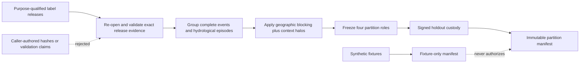
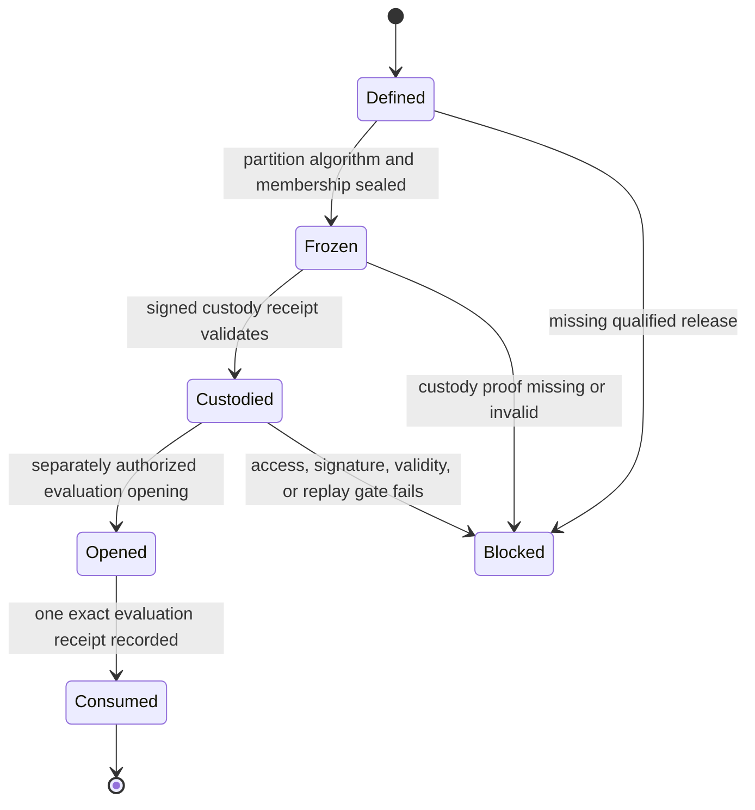

# Immutable Multi-Event Partitions v1

## Purpose

This contract prepares the event-level and geographic split needed before any
FloodGuard flood-extent model can be trained or compared honestly. It keeps
training, model-probability calibration, development, and final holdout
evidence separate.

Version 1 is an engineering and synthetic-fixture foundation. It does not seal
a real Mae Sai partition and cannot create candidate or production authority
from caller-supplied hashes. Candidate and production sealing remains blocked
until the repository has file-backed qualified label releases plus a signed,
independently verifiable holdout-custody receipt.

## Four roles

| Role | May fit model weights? | May fit probability calibration? | May select thresholds or models? | May report the final result? |
|---|---:|---:|---:|---:|
| `training` | Yes | No | No | No |
| `model_probability_calibration` | No | Yes | No | No |
| `development` | No | No | Yes | No |
| `final_holdout` | No | No | No | Yes, once under a separately authorized opening receipt |

Reviewer calibration is not model-probability calibration. The former
qualifies people before formal annotation; the latter calibrates a trained
model's probability output without changing its learned weights.

## Evidence flow



## Unit identity

Every partition unit binds:

- event and hydrological-episode ID;
- study area;
- qualified label-release identity and exact content hashes;
- spatial group and overlap group;
- core and buffered bounds in a projected metre-based CRS;
- context-halo distance;
- exact predictor dependencies;
- exact target dependencies;
- grid-schema and feature-schema hashes; and
- all required strata.

The same event, episode, spatial group, overlap group, label content, query
identity, qualified-reference content, or final-cell content must never cross
roles.

## Required strata

Candidate and production programmes eventually need at least five qualified
heterogeneous Thai flood events. The manifest records:

| Dimension | Example values |
|---|---|
| Settlement | urban, rural, mixed |
| Terrain | flat, steep, rolling, mixed |
| Flood mechanism | riverine, flash, urban pluvial, coastal, mixed |
| Permanent-water context | present, absent, mixed |
| Vegetation | dense, sparse, mixed |
| Radar quality | high, medium, low, mixed |

Five wrappers around the same event do not satisfy the five-event target.
Different product IDs do not establish independent hydrological episodes.

## Leakage controls

The manifest fails closed when:

1. an event or hydrological episode appears in multiple roles;
2. spatial or overlap groups cross roles;
3. buffered footprints overlap or touch across roles;
4. units use incompatible CRSs that cannot be compared under the v1 rule;
5. a protected label, reference, review, consensus, adjudication, FPPS, or
   action-class artifact appears among model features;
6. preprocessing is fitted outside the training role;
7. a seed is declared after qualified labels are available;
8. the manifest is sealed after fitting may begin;
9. a final-holdout release is usable for training;
10. the same protected target content is rewrapped under different release
    IDs or purposes; or
11. a fixture/test marker appears in a candidate or production input.

Static context may cross roles only through an explicit exemption proving that
it is target-independent, temporally static, and not fitted from any partition.

## Final-holdout state machine



An arbitrary SHA-256-shaped string is not custody. A self-hash proves content
integrity only when its expected value is independently anchored; it does not
prove who authorized access, whether the holdout stayed closed, or whether it
was already consumed.

## Current implementation boundary

`src/floodguard/multi_event_partitions.py` provides a deterministic,
adversarially tested synthetic-fixture contract for the four roles. It can
exercise role isolation, geographic blocking, target contamination checks,
stratification, chronology, hashes, and fail-closed safety flags.

It must not emit a real candidate or production manifest until two additional
authority surfaces exist:

1. a canonical file-backed loader that revalidates every qualified label
   release and its complete source chain; and
2. a signed holdout-custody/opening/consumption workflow with trusted keys,
   replay protection, and immutable storage.

Accordingly, current real-event status is:

```text
partition_engineering_fixture = ready
candidate_partition_sealing = blocked
production_partition_sealing = blocked
final_holdout_custody = absent
model_training_authorized = false
model_evaluation_authorized = false
decision_layer_authorized = false
official_warning = false
```

## Exit gate for a real programme

The programme may advance to the controlled three-model experiment only when:

- at least five qualified event releases validate from exact files;
- every event and episode belongs to one role only;
- every protected content identity is disjoint across roles;
- geographic buffers have been compared in one trusted spatial frame;
- all six stratification dimensions meet the predeclared coverage target;
- preprocessing and selection chronology validate;
- the final holdout is protected by signed custody rather than self-asserted
  booleans;
- the immutable partition manifest and every per-role hash validate; and
- every metric and run receipt names the exact partition-manifest hash.

Passing this gate authorizes a controlled experiment only. It does not
authorize access, equity, FPPS, A-E action classes, an operational product, or
an official warning.
