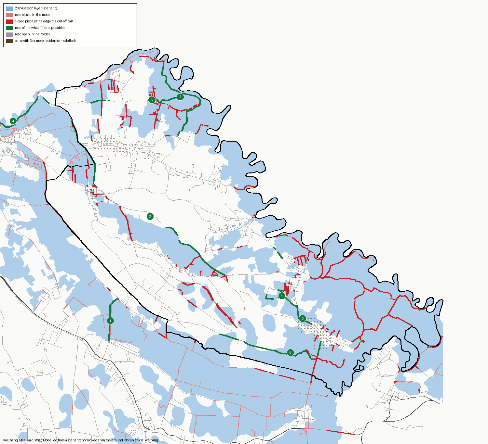

# The roads that cut Ko Chang off in the scenario: a desk sheet

**What this is.** Case SE1 says that in the 2024 season-layer scenario every
resident of Ko Chang who had a road out loses it. This sheet opens that count
up: which closed road pieces do the cutting, and which roads would have to
stay passable for residents to get a route back. It is plan task V1 and the
caveat of the case card ("the roads have not been looked at").

**How to read it.** Everything here is a model result on a scenario. The flood
input is the accumulated season layer of UNOSAT and GISTDA, treated as flooded
at once; it is not a day. A closure is modelled from where that layer crosses
a road. Nothing was looked at on the ground or on an image. The sheet says
**where to look**. It does not say that a road was closed or would stay open,
and it is not an official warning.

- Result and map: `outputs/ko_chang_road_check/ko_chang_roads_se1_v1.json`, `…_v1_map.png`
- Code: `scripts/build_ko_chang_road_sheet.py`
- Source time: season layer of 1 August to 12 October 2024. Confidence: low.
- Closure rule v1, central level. Vehicle routes. Roads and residents of the case of record.

## It reproduces the case first

The sheet rebuilds the road graph of case SE1 and counts again before it
writes anything. It refuses to write if the counts differ.

| Ko Chang | This sheet | Case SE1 |
|---|---:|---:|
| Residents with a route before the flood | 5,972 | 5,972 |
| Residents who lose every route in the scenario | 5,972 | 5,972 |

## What cuts Ko Chang off

| | |
|---|---:|
| Road pieces in the tambon | 3,855 |
| Closed in the model | 1,364 (35%) |
| Pieces tagged as a bridge | 5, of which 1 is closed |
| Cut-off parts of the road graph that hold residents | 801 |
| Residents in the largest cut-off part | 3,369 (56%) |
| Residents in the next five parts | 243, 110, 70, 67, 58 |
| Closed pieces at the edge of a cut-off part | 1,155, on 186 roads |

Two things follow.

1. **Ko Chang is not one island. It is one large one and very many small
   ones.** More than half the residents sit in a single part of the road
   graph that stays connected inside but has no way out. The rest are spread
   over hundreds of small parts, often one lane behind one closed piece.
2. **Almost no bridge is mapped.** Five pieces in the whole tambon carry a
   bridge tag. A raised road or a bridge that OpenStreetMap does not tag
   would be read as closed here. This is the first thing a local reader can
   correct.

## Which roads would have to stay passable

**One road alone.** Each of the 186 roads was tried on its own, kept passable
along its whole closed length. Only three give any resident a route back, and
one of them matters:

| Road | Class | Closed pieces | Length inside the layer | Residents who get a route back |
|---|---|---:|---:|---:|
| [OSM way 206803562](https://www.openstreetmap.org/way/206803562), no name, near 20.3969 N, 99.9482 E | unclassified | 13 | 1.24 km | **3,369 (56%)** |
| OSM way 93419443, outside Mae Sai district | unclassified | 21 | 1.80 km | 17 |
| OSM way 93181802, outside Mae Sai district | tertiary | 6 | 0.12 km | 17 |

The first road lies **outside Ko Chang, in the tambon next to it, Si Mueang
Chum**, south-west of the boundary. It is the link between the largest cut-off
part and the main road. In the model, 1.24 km of one unnamed road decides
whether 3,369 people have a way out. A plan for Ko Chang's routes is therefore
partly a plan for a road that another tambon looks after.

**Roads one after another.** At each step the road is added that gives the
most residents a route back (numbers 1 to 8 on the map):

| Step | Road | Class | Length inside the layer | Residents who get a route back | With a route after this step |
|---:|---|---|---:|---:|---:|
| 1 | [way 206803562](https://www.openstreetmap.org/way/206803562), no name | unclassified | 1.24 km | 3,369 | 3,369 (56.4%) |
| 2 | [way 1112593664](https://www.openstreetmap.org/way/1112593664), ถนนเหมืองแดง, ชร.3059 | tertiary | 1.24 km | 323 | 3,692 (61.8%) |
| 3 | [way 206803573](https://www.openstreetmap.org/way/206803573), ชร.5055 | tertiary | 3.02 km | 260 | 3,953 (66.2%) |
| 4 | [way 345929304](https://www.openstreetmap.org/way/345929304), no name | unclassified | 4.04 km | 104 | 4,057 (67.9%) |
| 5 | [way 546447060](https://www.openstreetmap.org/way/546447060), no name | unclassified | 1.34 km | 157 | 4,214 (70.6%) |
| 6 | [way 206803548](https://www.openstreetmap.org/way/206803548), ชร.5054 | tertiary | 2.09 km | 94 | 4,308 (72.1%) |
| 7 | [way 546447123](https://www.openstreetmap.org/way/546447123), no name | unclassified | 3.02 km | 79 | 4,387 (73.5%) |
| 8 | [way 546688135](https://www.openstreetmap.org/way/546688135), no name | track | 1.17 km | 67 | 4,453 (74.6%) |

Three roads, 5.5 km inside the layer, give two residents in three a route
back. Eight roads, 17.2 km, give three in four. The last quarter, about 1,520
residents, sit in small parts that each need their own lane; no short list of
roads reaches them.

Roads 2, 3, 5, 6, 7 and 8 lie in Ko Chang. Road 1 lies in Si Mueang Chum. The
middle of road 4 falls outside the eight tambons of Mae Sai district, to the
north-west; it may run on the far side of the border river, and a route that
depends on it should not be counted on before someone has looked.

Step 5 gives more than step 4 because a road can open a part that only became
reachable through an earlier step. The order is that of the largest gain at
each step and is not proven to be the best order overall.



## The other closure levels, and what the terrain model shows

Added on 9 October 2026 (`outputs/ko_chang_road_check/ko_chang_roads_se1_levels_v1.json`,
`scripts/build_ko_chang_road_levels.py`). The count of case SE1 is reproduced
at each level before anything is written.

| Closure level | Ko Chang residents who lose every route | Road 1 alone gives a route back to | First three roads, one after another |
|---|---:|---:|---|
| Strict | all 5,972 | 3,670 (61%) | road 1, then ชร.5055, then way 345929304 |
| Central (the sheet above) | all 5,972 | 3,369 (56%) | road 1, then ชร.3059, then ชร.5055 |
| Permissive | all 5,972 | 2,876 (48%) | road 1, then ชร.3059, then ชร.5055 |

**The finding does not depend on the closure level.** At all three, every
resident loses every route, and the same unnamed road in Si Mueang Chum is
the first road to keep passable. It carries between a half and three-fifths
of the result.

**The terrain model does not settle whether road 1 is raised.** On the open
elevation model (Copernicus DEM, 30 m) the road lies between 379 m and 384 m.
At 26 points along it, the road is a median 0.8 m above the ground 60 to 150 m
to either side, and more than 2 m above at 4 of them (at most 3.7 m). The
model's stated accuracy is about 4 m and its cells are wider than a road, so
this neither shows an embankment nor rules one out. It is no substitute for
someone looking.

## What a person who knows the place is asked

For each of the eight roads, and first of all for road 1:

1. Is it there, and is it the way people drive out?
2. Is it raised, or does it cross the low ground on a bridge or an embankment?
3. Did it stay passable in September 2024, and for which vehicles?
4. Is there a way out that the map does not have?

An answer to question 2 or 3 for road 1 alone changes the reading for more
than half of Ko Chang. An image of September 2024 at a few metres would answer
question 3 without a visit; the THEOS-2 scene and the UNOSAT data asked for on
7 October would serve.

## What follows for the project

- **"Keep routes open" can now name the routes.** The case card for Ko Chang
  said class B without saying which roads. It can now say: begin with one
  road, then seven more, and here is where they are.
- **The caveat stays, and is sharper.** The class rests on modelled closures
  and on a road map with almost no bridge tags. If road 1 is raised, Ko Chang
  is not cut off as a whole in this scenario, and its class would have to be
  read again.
- **The result is fragile in a way worth saying aloud.** One 1.24 km link
  carrying 56% of the result is a finding about Ko Chang's road network and
  also a warning about the model: a single wrong piece of road map would move
  the headline.
- **Nothing here feeds a score.** No component, no planning score and no
  action class is computed or changed.

## Limits

- The season layer has no water depth. A road counts as closed whatever the
  depth was.
- The layer is an accumulation over a season. Roads closed on different days
  are closed together here.
- A road is an OpenStreetMap way as mapped in the extract of record. Names are
  missing for most of the eight.
- The road graph of the case reaches past the district, and one road of the
  what-if (road 4) appears to lie outside it. The model does not know a
  border crossing from any other road.
- Residents are modelled counts (WorldPop 2020) placed at the road node within
  250 m of their cell.
- "Stays passable" is a what-if on the model graph. It keeps the whole closed
  length of the way open, which for a long way is a lot of road.
- One closure level (central) and one mode (vehicle) are read. The strict and
  permissive levels were not run for this sheet.

## Credits

UNOSAT and GISTDA, FL20240912THA, UNOSAT product 4009 (CC BY-SA 4.0). Changed
by FloodGuard: repaired, projected, clipped and set against roads and
residents; the figures derived from it are shared under CC BY-SA 4.0. Roads
and road names © OpenStreetMap contributors (ODbL 1.0). Residents: WorldPop
2020 (CC BY 4.0). Boundaries: HDX Thailand COD-AB.

## To run it again

```bash
python scripts/build_ko_chang_road_sheet.py --external-root <external-data-root>
```
