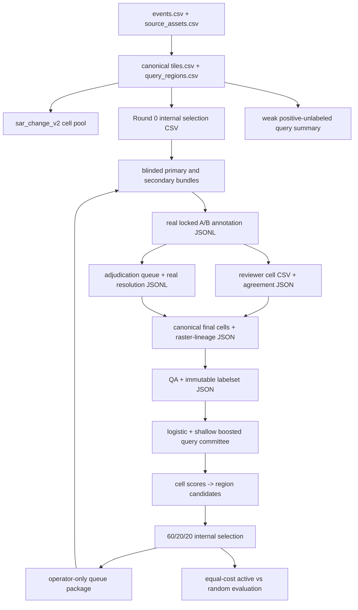

# Flood-label factory runbook

Status: executable engineering runbook. Steps that require real aligned imagery, human decisions, adjudication, or release QA remain explicitly external and must fail closed when evidence is missing.

## 1. Safety before execution

The label factory creates review-priority evidence and, after real review, a research label corpus. It does not create an operational flood layer. Every query-model artifact must remain:

```text
query_model_only=true
eligible_for_decision_layer=false
eligible_for_fpps=false
eligible_for_warning=false
```

Never copy an internal acquisition CSV into a reviewer package. Never reinterpret code 255 as dry. Never make up reviewer ids, timestamps, polygons, agreement values, adjudications, QA findings, reviewer time, or active-learning gains to move the workflow forward.

## 2. Install and inspect

From the repository root:

```powershell
cd "C:\Users\iputu\Documents\Flood Guard"
uv sync --extra dev --extra geo --extra ml
uv run pytest
```

The `geo` extra is required for human-geometry containment/rasterization. The `ml` extra supplies scikit-learn for the shallow boosted query challenger. Run every command with `--help` before using real evidence.

Recommended external layout (illustrative only):

```text
<external_data_workspace>/label_factory/
  registry/
  source_assets/
  grids/
  review_rounds/
  annotations/
  agreement/
  adjudication/
  releases/
  query_models/
```

Raw Sentinel imagery, reviewer geometries, complete cell rasters, and real model workspaces should remain outside Git. Repo outputs should contain only deliberately reviewed small manifests, hashes, aggregate metrics, and non-sensitive fixtures.

## 3. End-to-end artifact chain



The practical boundary is between implemented validators/writers and evidence that only humans or the controlled geospatial workspace can produce. Section 17 lists those gaps exactly.

## 4. Phase 0: registry and canonical grid

Prepare these controlled inputs:

- `events.csv` using the event contract;
- `source_assets.csv` with pre/event assets, product ids, UTC times, checksums, rights, CRS, spacing, and registration evidence; and
- `processing_evidence.csv` with one row per non-static source asset plus the
  local processed raster, coverage-evidence, valid-data-evidence, and
  registration-evidence files whose expected SHA-256 values it records; and
- `tile_assignments.csv` with explicit grid indices, dataset role, overlap group, valid fraction, `sar_change_v2`, timestamp, confidence, and assumptions.

Generate the byte-bound coverage, valid-support, and residual-registration
evidence after all four canonical dB rasters exist. The four asset ids below
refer to separate pre/event VV/VH rows in `source_assets.csv`; the two rows for
one acquisition may bind the same original SAFE checksum, but each processed
row binds its own polarization raster checksum.

```powershell
uv run python scripts/build_label_factory_registration_evidence.py `
  --pre-vv <processing_workspace>/pre_vv_db.tif `
  --pre-vh <processing_workspace>/pre_vh_db.tif `
  --event-vv <processing_workspace>/event_vv_db.tif `
  --event-vh <processing_workspace>/event_vh_db.tif `
  --pre-vv-asset-id <pre_vv_asset_id> `
  --pre-vh-asset-id <pre_vh_asset_id> `
  --event-vv-asset-id <event_vv_asset_id> `
  --event-vh-asset-id <event_vh_asset_id> `
  --pre-layover-shadow-mask <processing_workspace>/pre_layover_shadow_mask.tif `
  --event-layover-shadow-mask <processing_workspace>/event_layover_shadow_mask.tif `
  --source-timestamp-utc <evidence_timestamp_utc> `
  --processing-software-version 13.0.0 `
  --rtc-terrain-correction-method "<exact pinned SNAP graph/operator description>" `
  --output-directory <external_data_workspace>/label_factory/processing/evidence_v1
```

The diagnostic uses deterministic 256-pixel windows in both polarizations. It
reports the shift required to align event imagery to pre-event imagery and
defines `registration_error_pixels` as the magnitude of the combined median
shift plus the p90 radial dispersion across accepted windows. This is a
scene-correlation diagnostic, not independent control-point or geodetic truth.
It blocks on inadequate valid support, texture, peak quality, or VV/VH
agreement. Exit code 3 means evidence was written but the measured envelope
exceeds the receipt's 0.5-pixel gate. The generated `processing_evidence.csv`
remains report/query-model only and cannot enter FPPS or warning logic.

Build the processing/alignment receipt first. The command opens and hashes all
four evidence files per source row; metadata declarations alone do not pass:

```powershell
uv run python scripts/build_label_factory_processing_receipt.py `
  --events <external_data_workspace>/label_factory/registry/events.csv `
  --source-assets <external_data_workspace>/label_factory/registry/source_assets.csv `
  --governance-package <external_data_workspace>/label_factory/governance_cleared_vN `
  --processing-evidence <external_data_workspace>/label_factory/processing/processing_evidence.csv `
  --output <external_data_workspace>/label_factory/processing/processing_alignment_v1.json
```

The receipt must exactly cover every non-static pre/event source asset. It
requires a common north-up six-term affine, dimensions, CRS, resolution, nodata
convention, full declared coverage, valid-data evidence, and registration error
at or below 0.5 pixel. Version 1 has no per-asset tiling exception. Its
`query_model_only=true` and decision/FPPS/warning fields are fail-closed. A
synthetic test receipt proves only that the validator works; it is not evidence
that real Sentinel-1 processing occurred.

The governance package is mandatory in production. Its validator requires the
complete sealed artifact set, source-specific rights decisions, explicit MBRSC
exclusion, role ledger, safety flags, and parent-package binding. The supplied
`events.csv` and `source_assets.csv` must be byte-identical to the sealed copies.
Synthetic low-level tests may omit this package only through the explicit
`allow_ungoverned_fixture=True` API flag; no production CLI exposes that bypass.

Then build immutable tile/query manifests:

```powershell
uv run python scripts/build_label_factory_grid.py `
  --events <external_data_workspace>/label_factory/registry/events.csv `
  --source-assets <external_data_workspace>/label_factory/registry/source_assets.csv `
  --governance-package <external_data_workspace>/label_factory/governance_cleared_vN `
  --processing-alignment-receipt <external_data_workspace>/label_factory/processing/processing_alignment_v1.json `
  --tile-assignments <external_data_workspace>/label_factory/registry/tile_assignments.csv `
  --tile-output <external_data_workspace>/label_factory/grids/tiles_v1.csv `
  --query-output <external_data_workspace>/label_factory/grids/query_regions_v1.csv
```

Revalidate before every downstream run:

```powershell
uv run python scripts/validate_label_factory_manifests.py `
  --events <external_data_workspace>/label_factory/registry/events.csv `
  --source-assets <external_data_workspace>/label_factory/registry/source_assets.csv `
  --governance-package <external_data_workspace>/label_factory/governance_cleared_vN `
  --processing-alignment-receipt <external_data_workspace>/label_factory/processing/processing_alignment_v1.json `
  --tiles <external_data_workspace>/label_factory/grids/tiles_v1.csv `
  --queries <external_data_workspace>/label_factory/grids/query_regions_v1.csv
```

Expected validation output is `VALID` plus counts. Grid construction also checks
that every declared tile falls inside every non-static processed source raster.
Existing receipt and grid outputs are never overwritten. Any changed source
byte, processing method, affine, CRS, resolution, origin, dimension, tile size,
or query size requires new content-addressed artifacts.

## 5. Phase 0: build the aligned pool features and weak evidence

Materialize the query-only feature pool directly from the four aligned dB
rasters. This is allowed before labels because it creates covariates, not
training examples:

```powershell
uv run python scripts/build_sar_change_v2_features.py `
  --pre-vv <external_data_workspace>/label_factory/processing/pre_vv_db.tif `
  --event-vv <external_data_workspace>/label_factory/processing/event_vv_db.tif `
  --pre-vh <external_data_workspace>/label_factory/processing/pre_vh_db.tif `
  --event-vh <external_data_workspace>/label_factory/processing/event_vh_db.tif `
  --query-manifest <external_data_workspace>/label_factory/grids/query_regions_v1.csv `
  --output-directory <external_data_workspace>/label_factory/features/sar_change_v2_pool_v1
```

For a single already-projected GeoJSON/query, the original weak-seed command is
still available:

Choose exactly one canonical query and write a new seed cell CSV plus JSON manifest:

```powershell
uv run python scripts/build_label_factory_seed.py `
  --source-geojson <external_data_workspace>/label_factory/source_assets/mae_sai_weak_polygon.geojson `
  --query-manifest <external_data_workspace>/label_factory/grids/query_regions_v1.csv `
  --query-region-id <canonical-query-region-id> `
  --seed-id mae_sai_weak_seed_v1 `
  --boundary-buffer-cells 1 `
  --source-timestamp 2024-09-12T00:00:00Z `
  --assumptions "Legacy polygon is a conservative weak positive; exterior is unreviewed." `
  --raster-output <external_data_workspace>/label_factory/grids/mae_sai_weak_seed_v1.csv `
  --manifest-output <external_data_workspace>/label_factory/grids/mae_sai_weak_seed_v1.json
```

Verify in the cell CSV that the only semantics are weak positive, optional weak-uncertain boundary, and 255 exterior. This output is seed/sampling evidence, not a human labelset.

For the real multi-query GeoPackage bridge, use the batch summary command:

```powershell
uv run python scripts/build_weak_query_summary.py `
  --weak-vector <external_data_workspace>/manual_reference/mae_sai_manual_flood_reference.gpkg `
  --vector-layer manual_flood_extent `
  --weak-source-manifest outputs/manual_reference_mask_manifest.csv `
  --query-manifest <external_data_workspace>/label_factory/grids/query_regions_v1.csv `
  --output-directory <external_data_workspace>/label_factory/weak_seed/manual_weak_query_summary_v2
```

The default fails on invalid geometry. Use `--repair-invalid-geometry` only
after inspecting the validity reason; the output manifest records
`shapely.make_valid`, and the result remains low-confidence positive-unlabeled
context. In all cases, a zero fraction is `unreviewed`, not dry land.

## 6. Phase 1: model-independent Round 0

Round 0 does not use committee scores. Prepare a candidate CSV from the `training_and_query_pool` queries with a declared `round0_stratum` for every row and the required query geometry, role, review-status, CRS, and safety fields. Strata should cover the pilot's flood-like, dry, permanent-water, urban, steep-terrain, and ambiguous conditions without showing a proposed answer to reviewers.

```powershell
uv run python scripts/select_active_learning_round.py `
  --candidates <external_data_workspace>/label_factory/review_rounds/round0_candidates.csv `
  --round-zero `
  --batch-size 40 `
  --round-id mae_sai_round_0 `
  --random-seed 202409 `
  --minimum-center-distance-m 0 `
  --manifest-output <external_data_workspace>/label_factory/review_rounds/round0_internal_selection.csv `
  --summary-output <external_data_workspace>/label_factory/review_rounds/round0_internal_summary.md
```

The selected rows record lane `round0_stratified`, stratum population/quota, inclusion probability, stable order, and model-independent selection basis. If the aligned Mae Sai formal pool is small enough, review the entire feasible pool; do not present the pilot as an active-learning efficiency test.

## 7. Build independent blinded review bundles

Prepare a required approved `context_layers.csv` with exact source-registry/product/acquisition/checksum lineage, processed-layer hashes, one projected CRS, and checksum-tracked redacted path hints. Each event must include pre/event VV and VH, permanent-water context, land cover, and at least one terrain view (`dem_hillshade` or `slope`). Generate different write-once directories for primary and secondary review:

### Optional governed VV/VH change displays

Do not add a change layer to `context_layers.csv` merely because its filename
looks plausible. First generate a write-once, authority-pending VV change, VH
change, and RGB candidate from the exact four governed single-polarization
rasters. The fixed `-10..+10 dB` range below is symmetric and declared before
statistics; it is a candidate for authority review, not an approved display:

```powershell
uv run python scripts/build_review_derivative_candidates.py `
  --event-id TH-MAESAI-2024-09 `
  --derivative-set-id MAE-SAI-2024-CHANGE-DISPLAY-CANDIDATE-V1 `
  --pre-vv-asset-id <governed-pre-vv-asset-id> `
  --pre-vv <external_data_workspace>/label_factory/processing/<pre-vv>.tif `
  --event-vv-asset-id <governed-event-vv-asset-id> `
  --event-vv <external_data_workspace>/label_factory/processing/<event-vv>.tif `
  --pre-vh-asset-id <governed-pre-vh-asset-id> `
  --pre-vh <external_data_workspace>/label_factory/processing/<pre-vh>.tif `
  --event-vh-asset-id <governed-event-vh-asset-id> `
  --event-vh <external_data_workspace>/label_factory/processing/<event-vh>.tif `
  --processing-alignment-receipt <external_data_workspace>/label_factory/receipts/processing_alignment_v2.json `
  --governance-package <external_data_workspace>/label_factory/governance_cleared_v2 `
  --fixed-stretch-min-db -10 `
  --fixed-stretch-max-db 10 `
  --output-directory <external_data_workspace>/label_factory/review_context/mae_sai_change_display_candidate_v1
```

The generator writes the exact build spec and a self-hashed manifest with
`authority_approval_status=authority_approval_pending`. Its validator
independently recomputes both change rasters, all RGB channels, and the validity
mask from the governed sources. It reports clipping/coverage statistics only
after generation and records `statistics_influence_display=false`.

Build the production lineage receipt from that exact spec:

```powershell
uv run python scripts/build_review_derivative_lineage_receipt.py `
  --build-spec <external_data_workspace>/label_factory/review_context/mae_sai_change_display_candidate_v1/review_derivative_build_spec_v1.json `
  --processing-alignment-receipt <external_data_workspace>/label_factory/receipts/processing_alignment_v2.json `
  --governance-package <external_data_workspace>/label_factory/governance_cleared_v2 `
  --output <external_data_workspace>/label_factory/review_context/mae_sai_change_display_candidate_v1/review_derivative_lineage_v1.json
```

The receipt builder re-hashes all four processed polarization rasters and all three outputs,
requires the processing-receipt common grid, enforces canonical
`pre_db - event_db` VV/VH change, rejects dynamic/percentile display stretches,
and writes a self-hashed receipt without local paths. It does not generate the
rasters or prove that their scientific interpretation is correct.
`production_review_eligible=true` in this receipt means governance/lineage
eligibility only. It does not override `authority_approval_pending` and does
not authorize reviewer delivery.

Stop here until the named Reference Authority issues an attributable,
timestamped decision on this exact candidate version. Do not create a context
manifest or reviewer bundle from a pending candidate.

After the evidence-complete pre-calibration human-role package and provisional
reserve design exist, freeze the authority's combined design decision with
`scripts/build_reference_authority_approval.py`. The request must bind one
reserve candidate, the fixed reference-procedure document hash/version, and an
explicit `approved`, `rejected`, or `not_submitted` derivative decision. Follow
`docs/reference_authority_design_approval.md`; do not create a real request or
package until the appointed authority's exported decision exists.

Even `approved_next_construction_only` is not a bundle or review release. It
only permits a later, separately validated canonical reserve/reference
construction step and keeps query selection, calibration execution, formal
review, training, decision, FPPS, and warning flags false.

An authority design decision is still not a reviewer-delivery release. The
production bundle writer currently has no canonical derivative-context release
artifact to consume, so it deliberately fails closed whenever
`--derivative-lineage-receipt` is supplied. Do not append the three derivative
rows to production `context_layers.csv` and do not add the following option to
a production command until that later release artifact and validator exist:

```text
--derivative-lineage-receipt <external_data_workspace>/label_factory/review_context/review_derivative_lineage_v1.json
```

If the receipt is omitted, no `vv_change`, `vh_change`, or
`fixed_stretch_change_composite` context role is permitted. Synthetic contract
tests may still supply the receipt with all three exactly matching rows through
the internal fixture-only API; the CLI exposes no fixture escape.

### Bind every bundle to the appointed human lane

Do not create a reviewer bundle from nomination sheets, outreach messages, or
an unfrozen working JSON file. First validate the immutable package described in
`docs/human_role_package.md`.

- Calibration uses the evidence-complete pre-calibration package. It must have
  no calibration receipt and `formal_review_authorized=false`.
- The first 20, later acquisition rounds, and fixed evaluation use the later
  post-calibration package with `formal_review_authorized=true` and the exact
  passing receipt.
- `primary` binds only to the appointed `reviewer_a` role id; `secondary` binds
  only to the appointed `reviewer_b` role id.
- `--planned-review-start-utc` is an enforceable earliest start, not a note. For
  calibration it cannot predate the frozen package. For formal work it cannot
  predate either the package or `formal_review_authorized_from_utc`.
- Event, protocol, and taxonomy must match. Build separate write-once bundles
  for A and B; never hand one reviewer's bundle to the other.

For calibration, use the pre-calibration package path and the same three role
arguments shown below, but set `--review-purpose reviewer_calibration` and use
the fixed calibration query manifest. For the first 20, use the
post-calibration package. The following commands illustrate that later formal
state; they are not authorization to build it now.

```powershell
uv run python scripts/build_label_factory_review_bundle.py `
  --queries <external_data_workspace>/label_factory/review_rounds/round0_internal_selection.csv `
  --context-layers <external_data_workspace>/label_factory/review_rounds/context_layers.csv `
  --processing-alignment-receipt <external_data_workspace>/label_factory/processing/processing_alignment_v1.json `
  --governance-package <external_data_workspace>/label_factory/governance_cleared_vN `
  --grid-validation-receipt <external_data_workspace>/label_factory/grids/grid_validation_receipt_v3.json `
  --canonical-tile-manifest <external_data_workspace>/label_factory/grids/canonical_tiles.csv `
  --canonical-query-manifest <external_data_workspace>/label_factory/grids/canonical_query_regions.csv `
  --supported-query-derivation <external_data_workspace>/label_factory/query_support/supported_query_derivation.json `
  --human-role-package <external_data_workspace>/label_factory/human_roles/human_roles_postcalibration_vN `
  --target-reviewer-id FG-RV-A-NNN `
  --planned-review-start-utc <UTC-at-or-after-package-and-formal-gate> `
  --review-purpose acquisition_primary `
  --review-stage primary `
  --protocol-version label_factory_protocol_v1 `
  --taxonomy-version flood_label_v1 `
  --tool-version qgis_manual_review_v1 `
  --output-directory <external_data_workspace>/label_factory/review_rounds/round0_primary_bundle

uv run python scripts/build_label_factory_review_bundle.py `
  --queries <external_data_workspace>/label_factory/review_rounds/round0_internal_selection.csv `
  --context-layers <external_data_workspace>/label_factory/review_rounds/context_layers.csv `
  --processing-alignment-receipt <external_data_workspace>/label_factory/processing/processing_alignment_v1.json `
  --governance-package <external_data_workspace>/label_factory/governance_cleared_vN `
  --grid-validation-receipt <external_data_workspace>/label_factory/grids/grid_validation_receipt_v3.json `
  --canonical-tile-manifest <external_data_workspace>/label_factory/grids/canonical_tiles.csv `
  --canonical-query-manifest <external_data_workspace>/label_factory/grids/canonical_query_regions.csv `
  --supported-query-derivation <external_data_workspace>/label_factory/query_support/supported_query_derivation.json `
  --human-role-package <external_data_workspace>/label_factory/human_roles/human_roles_postcalibration_vN `
  --target-reviewer-id FG-RV-B-NNN `
  --planned-review-start-utc <UTC-at-or-after-package-and-formal-gate> `
  --review-purpose acquisition_primary `
  --review-stage secondary `
  --protocol-version label_factory_protocol_v1 `
  --taxonomy-version flood_label_v1 `
  --tool-version qgis_manual_review_v1 `
  --output-directory <external_data_workspace>/label_factory/review_rounds/round0_secondary_bundle
```

Each directory contains:

```text
review_regions.csv
annotation_template.csv
README.md
bundle_manifest.csv
context_layers.csv
processing_alignment_receipt.json
review_derivative_lineage_receipt.json  # only when governed change displays are included
```

The formal writer verifies that the governance package, exact event/source
registries, query receipt hash, event/grid/source lineage, query coverage, raw
SAR context checksums, and processed-file checksums all agree. Permanent-water,
land-cover, and terrain context must also match the sealed
`aligned_context_inventory.csv`; ungoverned roads, settlements, or optical
context are rejected. The verified receipt is copied into the bundle and
checksum-bound by `bundle_manifest.csv`. Every manifest row records the package
ID, package-manifest hash, seal self-hash, aligned-context inventory hash,
processing-receipt self-hash, governance status, and formal-review eligibility.
When change displays are present, it also revalidates and copies the
derivative-lineage receipt and records both its self-hash and copied-file hash.
Formal annotation import repeats that semantic validation; a coherent
hand-authored bundle manifest is not sufficient.
Synthetic API fixtures are explicitly marked `synthetic_fixture_only` and the
production CLI cannot create or import them. The receipt contains file
names and hashes, not absolute workspace paths.

Use `reviewer_calibration` only for `reviewer_calibration` rows and `fixed_evaluation` only for fixed-development or untouched-test rows. Those two purposes reject active-selection flags and score/rank evidence; they are annotation paths, not acquisition paths.

Before delivery, inspect `bundle_manifest.csv` and confirm that no weak-label, score, entropy, disagreement, rank, or selection-reason file is present. Do not deliver both reviewers' writable results in a shared folder.

### Mandatory reviewer calibration before formal review

Pre-assign at least eight unique queries to `dataset_role=reviewer_calibration`.
They must remain inactive for selection and ineligible for query-model training.
An expert panel or real adjudicator first completes and locks one annotation per
calibration query using the same canonical multipart geometry contract as a
reviewer. Bind an attributable role/qualification evidence file, rasterize the
locked geometry, and inspect the confidential lineage manifest:

```powershell
uv run python scripts/rasterize_calibration_reference.py `
  --authority-annotation-log <external_data_workspace>/label_factory/calibration/authority_annotations.jsonl `
  --authority-id <expert-panel-or-adjudicator-id> `
  --authority-role-evidence <restricted_coordination_workspace>/authority_acceptance.pdf `
  --calibration-query-manifest <external_data_workspace>/label_factory/grids/calibration_queries.csv `
  --geometry-parts <external_data_workspace>/label_factory/calibration/authority_geometry_parts.csv `
  --assumptions "Locked authority geometry; confidential calibration evidence only." `
  --reference-cells-input-output <external_data_workspace>/label_factory/calibration/reference_cells_input.csv `
  --lineage-manifest-output <external_data_workspace>/label_factory/calibration/reference_cells_input.manifest.json
```

The rasterizer requires exact authority/query coverage, locked complete and
blinded records, exact grid/source/timestamp hashes, valid contained polygons,
non-overlapping class cells, and explicit fill/review-extent semantics. It
emits the complete canonical grid with codes 0/1/2/3/4 and preserves code 255
only outside a partial reviewed extent. Its self-hashed manifest binds the
authority-evidence checksum, annotation-content hashes, geometry/query hashes,
cell checksum, label counts, query/grid/source lineage, confidentiality, and
all negative safety flags. It does not claim that the authority is qualified;
the named human and their attributable evidence remain a governance decision.

The resulting CSV has `event_id`, `tile_id`, `query_region_id`, canonical
`cell_id`, `row_index`, `column_index`, and `label_code`. After the Reference
Authority checks the raster and lineage manifest, freeze that reference exactly
once:

```powershell
uv run python scripts/freeze_label_factory_calibration_reference.py `
  --reference-cells-input <external_data_workspace>/label_factory/calibration/reference_cells_input.csv `
  --calibration-query-manifest <external_data_workspace>/label_factory/grids/calibration_queries.csv `
  --reference-id calibration_reference_v1 `
  --authority-type expert_consensus `
  --authority-id <expert-panel-or-adjudicator-id> `
  --protocol-version label_factory_protocol_v1 `
  --taxonomy-version flood_label_v1 `
  --created-at-utc <timezone-aware-UTC-timestamp> `
  --assumptions "Fixed calibration truth; not a training labelset." `
  --cells-output <external_data_workspace>/label_factory/calibration/reference_cells_v1.csv `
  --manifest-output <external_data_workspace>/label_factory/calibration/reference_cells_v1.json
```

Each named formal reviewer then completes the same blinded calibration bundle.
Import and rasterize those locked reviews independently using the normal review
commands below. Prepare `calibration_query_strata.csv` with exact query coverage,
then build the passing evidence receipt:

```powershell
uv run python scripts/build_reviewer_calibration_receipt.py `
  --annotation-log <external_data_workspace>/label_factory/annotations/annotations.jsonl `
  --calibration-query-manifest <external_data_workspace>/label_factory/grids/calibration_queries.csv `
  --reviewer-cells <reviewer-a-id>=<external_data_workspace>/label_factory/calibration/reviewer_a_cells.csv `
  --reviewer-cells <reviewer-b-id>=<external_data_workspace>/label_factory/calibration/reviewer_b_cells.csv `
  --reviewer-cell-manifest <reviewer-a-id>=<external_data_workspace>/label_factory/calibration/reviewer_a_cells.json `
  --reviewer-cell-manifest <reviewer-b-id>=<external_data_workspace>/label_factory/calibration/reviewer_b_cells.json `
  --reference-cells <external_data_workspace>/label_factory/calibration/reference_cells_v1.csv `
  --reference-manifest <external_data_workspace>/label_factory/calibration/reference_cells_v1.json `
  --query-strata <external_data_workspace>/label_factory/calibration/calibration_query_strata.csv `
  --protocol-version label_factory_protocol_v1 `
  --taxonomy-version flood_label_v1 `
  --formal-review-not-before-utc <UTC-after-calibration-completion> `
  --assumptions "Reviewer calibration only; no model-training eligibility." `
  --output <external_data_workspace>/label_factory/calibration/reviewer_calibration_v1.json
```

The command fails closed unless every reviewer has one locked, blinded review
for every calibration query; every query contains at least one non-255 decision;
annotation, cell, grid, source, protocol, taxonomy, timestamp, and safety lineage
match exactly; and each reviewer reaches temporary-flood Dice >= 0.75, Cohen's
kappa >= 0.75, mean boundary F1 >= 0.70, and every critical-stratum Dice >=
0.65. Formal review must use the same reviewer identities, protocol, and
taxonomy and cannot start before the receipt's `formal_review_not_before_utc`.
Calibration artifacts and the receipt remain ineligible for query-model
training, the decision layer, FPPS, and warnings.

If one or more reviewers miss a threshold, do not write or fabricate a passing
receipt. Preserve the valid scored attempt as a separate confidential failure
diagnostic:

```powershell
uv run python scripts/build_reviewer_calibration_failure_diagnostic.py `
  --annotation-log <external_data_workspace>/label_factory/annotations/annotations.jsonl `
  --calibration-query-manifest <external_data_workspace>/label_factory/grids/calibration_queries.csv `
  --reviewer-cells <reviewer-a-id>=<external_data_workspace>/label_factory/calibration/reviewer_a_cells.csv `
  --reviewer-cells <reviewer-b-id>=<external_data_workspace>/label_factory/calibration/reviewer_b_cells.csv `
  --reviewer-cell-manifest <reviewer-a-id>=<external_data_workspace>/label_factory/calibration/reviewer_a_cells.json `
  --reviewer-cell-manifest <reviewer-b-id>=<external_data_workspace>/label_factory/calibration/reviewer_b_cells.json `
  --reference-cells <external_data_workspace>/label_factory/calibration/reference_cells_v1.csv `
  --reference-manifest <external_data_workspace>/label_factory/calibration/reference_cells_v1.json `
  --query-strata <external_data_workspace>/label_factory/calibration/calibration_query_strata.csv `
  --protocol-version label_factory_protocol_v1 `
  --taxonomy-version flood_label_v1 `
  --diagnostic-created-at-utc <UTC-after-calibration-completion> `
  --assumptions "Confidential remediation evidence; no formal-review authorization." `
  --output <restricted_coordination_workspace>/calibration_failure_v1.json
```

This command succeeds only when the full evidence chain is valid and at least
one reviewer actually fails. The self-hashed artifact records per-reviewer and
per-query scores plus exact failure reasons, declares `calibration_passed=false`
and `formal_review_authorized=false`, and is ineligible for training, the
decision layer, FPPS, and warnings. If everyone passes, the failure-diagnostic
command fails closed; use the passing-receipt command instead. Keep diagnostics
restricted because they expose individual reviewer performance.

## 8. Human review and immutable import

This is a real human gate. Each reviewer completes their own template with explicit reviewer identity, class/code, confidence, evidence layers, reviewed extent, start/finish/create/lock times, and both blinding fields false. They also export canonical `geometry_parts.csv` rows for every annotation/class geometry. Review revisions append new ids and name the superseded record.

Import reviewer A, then reviewer B, into the same canonical hash-chained annotation log. Always pass the exact original bundle's `review_regions.csv`:

```powershell
uv run python scripts/import_reviewer_annotations.py `
  --completed-annotations <external_data_workspace>/label_factory/annotations/reviewer_a_completed.csv `
  --review-regions <external_data_workspace>/label_factory/review_rounds/round0_primary_bundle/review_regions.csv `
  --geometry-parts <external_data_workspace>/label_factory/annotations/reviewer_a_geometry_parts.csv `
  --bundle-manifest <external_data_workspace>/label_factory/review_rounds/round0_primary_bundle/bundle_manifest.csv `
  --context-layers <external_data_workspace>/label_factory/review_rounds/round0_primary_bundle/context_layers.csv `
  --governance-package <external_data_workspace>/label_factory/governance_cleared_vN `
  --grid-validation-receipt <external_data_workspace>/label_factory/grids/grid_validation_receipt_v3.json `
  --canonical-tile-manifest <external_data_workspace>/label_factory/grids/canonical_tiles.csv `
  --canonical-query-manifest <external_data_workspace>/label_factory/grids/canonical_query_regions.csv `
  --supported-query-derivation <external_data_workspace>/label_factory/query_support/supported_query_derivation.json `
  --annotation-log <external_data_workspace>/label_factory/annotations/annotations.jsonl `
  --receipt-json <external_data_workspace>/label_factory/annotations/reviewer_a_import_receipt.json

uv run python scripts/import_reviewer_annotations.py `
  --completed-annotations <external_data_workspace>/label_factory/annotations/reviewer_b_completed.csv `
  --review-regions <external_data_workspace>/label_factory/review_rounds/round0_secondary_bundle/review_regions.csv `
  --geometry-parts <external_data_workspace>/label_factory/annotations/reviewer_b_geometry_parts.csv `
  --bundle-manifest <external_data_workspace>/label_factory/review_rounds/round0_secondary_bundle/bundle_manifest.csv `
  --context-layers <external_data_workspace>/label_factory/review_rounds/round0_secondary_bundle/context_layers.csv `
  --governance-package <external_data_workspace>/label_factory/governance_cleared_vN `
  --grid-validation-receipt <external_data_workspace>/label_factory/grids/grid_validation_receipt_v3.json `
  --canonical-tile-manifest <external_data_workspace>/label_factory/grids/canonical_tiles.csv `
  --canonical-query-manifest <external_data_workspace>/label_factory/grids/canonical_query_regions.csv `
  --supported-query-derivation <external_data_workspace>/label_factory/query_support/supported_query_derivation.json `
  --annotation-log <external_data_workspace>/label_factory/annotations/annotations.jsonl `
  --receipt-json <external_data_workspace>/label_factory/annotations/reviewer_b_import_receipt.json
```

Missing/extra formal queries, changed geometry parts, unapproved evidence layers, bundle/context checksum mismatch, malformed WKT, geometry outside the reviewed/query extent, visible model/other-reviewer evidence, incomplete review, blank reviewer identity, inconsistent class/code, or invalid revision lineage blocks import. The locked annotation stores the deterministic multipart payload and all bundle/grid/source hashes.

## 9. Rasterize reviewer evidence and compute agreement

Reuse the exact imported `geometry_parts.csv` rows; rasterization recomputes the canonical payload and rejects any change, extra part, or missing part. A blank geometry row is legal only when `fill_unpainted_with_primary_class=true` explicitly fills the reviewed extent with the annotation's primary class.

The rasterization query manifest must include the canonical query grid and the agreement/training/decision safety columns required by the rasterizer.

```powershell
uv run python scripts/rasterize_reviewer_annotations.py `
  --annotation-log <external_data_workspace>/label_factory/annotations/annotations.jsonl `
  --reviewer-id <reviewer-a-id> `
  --query-manifest <external_data_workspace>/label_factory/grids/query_regions_for_agreement.csv `
  --geometry-parts <external_data_workspace>/label_factory/annotations/reviewer_a_geometry_parts.csv `
  --cell-output <external_data_workspace>/label_factory/agreement/reviewer_a_cells_v1.csv `
  --manifest-output <external_data_workspace>/label_factory/agreement/reviewer_a_cells_v1.json

uv run python scripts/rasterize_reviewer_annotations.py `
  --annotation-log <external_data_workspace>/label_factory/annotations/annotations.jsonl `
  --reviewer-id <reviewer-b-id> `
  --query-manifest <external_data_workspace>/label_factory/grids/query_regions_for_agreement.csv `
  --geometry-parts <external_data_workspace>/label_factory/annotations/reviewer_b_geometry_parts.csv `
  --cell-output <external_data_workspace>/label_factory/agreement/reviewer_b_cells_v1.csv `
  --manifest-output <external_data_workspace>/label_factory/agreement/reviewer_b_cells_v1.json
```

For agreement, concatenate the two verified cell CSVs without altering rows; retain both reviewer raster manifests and their SHA-256 values. The reviewer filter is mandatory so the consensus builder can independently verify A and B evidence.

Prepare `query_strata.csv` mapping every formal query to one or more critical strata. Then compute paired cell agreement:

```powershell
uv run python scripts/compute_label_factory_agreement.py `
  --annotation-log <external_data_workspace>/label_factory/annotations/annotations.jsonl `
  --reviewer-a-id <reviewer-a-id> `
  --reviewer-b-id <reviewer-b-id> `
  --cell-labels <external_data_workspace>/label_factory/agreement/reviewer_a_b_cells_v1.csv `
  --pixel-size-m 10 `
  --boundary-tolerance-m 20 `
  --query-strata <external_data_workspace>/label_factory/agreement/query_strata.csv `
  --output-json <external_data_workspace>/label_factory/agreement/agreement_v1.json `
  --per-query-output-csv <external_data_workspace>/label_factory/agreement/agreement_per_query_v1.csv
```

Inspect temporary-flood Dice/IoU, kappa, boundary coverage/F1, per-query results, and every critical-stratum slice. Individual reviewer cells remain agreement-only.

## 10. Build and resolve the adjudication queue

```powershell
uv run python scripts/build_label_factory_adjudication_queue.py `
  --annotation-log <external_data_workspace>/label_factory/annotations/annotations.jsonl `
  --reviewer-a-id <reviewer-a-id> `
  --reviewer-b-id <reviewer-b-id> `
  --created-at-utc <timezone-aware-UTC-timestamp> `
  --queue-prefix MAESAI_ADJ `
  --output-csv <external_data_workspace>/label_factory/adjudication/adjudication_queue_v1.csv
```

The queue only includes explicit disagreement/ambiguity reasons and hashes both source reviews. A real human adjudicator completes the strict `floodguard.completed_adjudications.v1` CSV; the importer requires exact coverage of every still-open queue item and invents no resolution:

```powershell
uv run python scripts/import_label_factory_adjudications.py `
  --completed-adjudications <external_data_workspace>/label_factory/adjudication/completed_adjudications_v1.csv `
  --adjudication-queue <external_data_workspace>/label_factory/adjudication/adjudication_queue_v1.csv `
  --annotation-log <external_data_workspace>/label_factory/annotations/annotations.jsonl `
  --reviewer-a-id <reviewer-a-id> `
  --reviewer-b-id <reviewer-b-id> `
  --adjudication-log <external_data_workspace>/label_factory/adjudication/adjudications.jsonl `
  --receipt-json <external_data_workspace>/label_factory/adjudication/adjudication_import_v1.json `
  --imported-at-utc <timezone-aware-UTC-timestamp>
```

The atomic batch append validates source annotation hashes, outcome-specific fields, reason codes, adjudicator independence, timestamp order, duplicate IDs, and duplicate queue resolution before writing any bytes.

If the locked adjudication log contains one or more `redraw` outcomes, rasterize
those adjudicator geometries before consensus construction:

```powershell
uv run python scripts/rasterize_adjudicator_redraw.py `
  --adjudication-log <external_data_workspace>/label_factory/adjudication/adjudications.jsonl `
  --query-manifest <external_data_workspace>/label_factory/grids/query_regions_for_agreement.csv `
  --cell-output <external_data_workspace>/label_factory/adjudication/redraw_cells_v1.csv `
  --manifest-output <external_data_workspace>/label_factory/adjudication/redraw_cells_v1.json
```

The producer verifies the hash-chained adjudication log, exact query/grid/source
lineage, geometry containment, class overlap, and deterministic cell-centre
rasterization. It writes the cell CSV and self-contained raster manifest as one
immutable pair and rolls back a partial pair on failure. Omit this command and
the two consensus redraw arguments when no locked outcome is `redraw`.

## 11. Build consensus cells, assemble QA, and freeze a release

Build the release candidates from the exact locked reviewer rasters and completed adjudication evidence. Omit the two redraw arguments when the adjudication log has no `redraw` outcome; when it does, both inputs must be supplied and must be bound to the locked adjudicator geometry. If the validated queue is empty, the named adjudication-log path may be absent and is cryptographically bound as canonical empty bytes; a missing log is rejected for every nonempty queue.

```powershell
uv run python scripts/build_label_factory_consensus_cells.py `
  --annotation-log <external_data_workspace>/label_factory/annotations/annotations.jsonl `
  --reviewer-a-id <reviewer-a-id> `
  --reviewer-b-id <reviewer-b-id> `
  --reviewer-a-cells <external_data_workspace>/label_factory/agreement/reviewer_a_cells_v1.csv `
  --reviewer-a-raster-manifest <external_data_workspace>/label_factory/agreement/reviewer_a_cells_v1.json `
  --reviewer-b-cells <external_data_workspace>/label_factory/agreement/reviewer_b_cells_v1.csv `
  --reviewer-b-raster-manifest <external_data_workspace>/label_factory/agreement/reviewer_b_cells_v1.json `
  --query-manifest <external_data_workspace>/label_factory/grids/query_regions_for_agreement.csv `
  --adjudication-queue <external_data_workspace>/label_factory/adjudication/adjudication_queue_v1.csv `
  --adjudication-log <external_data_workspace>/label_factory/adjudication/adjudications.jsonl `
  --redraw-cells <external_data_workspace>/label_factory/adjudication/redraw_cells_v1.csv `
  --redraw-raster-manifest <external_data_workspace>/label_factory/adjudication/redraw_cells_v1.json `
  --output-cells <external_data_workspace>/label_factory/releases/final_cells_v1.csv `
  --output-raster-lineage <external_data_workspace>/label_factory/releases/raster_lineage_v1.json `
  --output-label-content <external_data_workspace>/label_factory/releases/label_content_v1.json `
  --output-consensus-receipt <external_data_workspace>/label_factory/releases/consensus_receipt_v1.json
```

The command writes four immutable outputs in one preflighted operation: canonical final cells, raster lineage, ordered label content, and a self-hashed consensus receipt. It independently verifies both reviewer raster manifests against locked geometry, requires exact queue/resolution coverage, copies direct A/B agreement without invention, applies the six adjudication outcomes deterministically, and refuses to overwrite any target. `reject` omits a query; `uncertain` and `unobservable` preserve their explicit class plus 255 outside reviewed support; `accept_a`, `accept_b`, and `redraw` remain bound to the selected locked geometry. All four outputs remain `eligible_for_query_model_training=false` until freeze and revalidation succeed.

The following additional inputs are required and are not inferred:

- latest locked A/B annotation ids;
- adjudication queue and real adjudication JSONL with zero open items;
- agreement JSON passing all release gates;
- code-generated QA CSV and self-hashed receipt reproduced from the exact raw
  source, split, usage, annotation, and binary-candidate files;
- the four unmodified consensus-builder outputs;
- nonempty release metadata and semantics JSON; and
- SHA-256 for every named final-cell raster.

Build release QA only through the code-owned assembler. The five raw roles are
mandatory. Add `--query-models` and/or `--query-records` whenever those artifacts
are in release scope; the assembler applies the permanent query-only and
non-decision safety checks to them.

```powershell
uv run python scripts/build_label_factory_release_qa.py `
  --source-assets <external_data_workspace>/label_factory/registry/source_assets.csv `
  --dataset-assignments <external_data_workspace>/label_factory/grids/query_dataset_assignments.csv `
  --usage-records <external_data_workspace>/label_factory/releases/release_usage_records_v1.csv `
  --annotation-log <external_data_workspace>/label_factory/annotations/annotations.jsonl `
  --binary-training-rows <external_data_workspace>/label_factory/releases/binary_training_candidates_v1.csv `
  --reviewer-a-id <reviewer-a-id> `
  --reviewer-b-id <reviewer-b-id> `
  --reviewer-calibration-receipt <external_data_workspace>/label_factory/calibration/reviewer_calibration_v1.json `
  --agreement-json <external_data_workspace>/label_factory/agreement/agreement_v1.json `
  --raster-lineage-json <external_data_workspace>/label_factory/releases/raster_lineage_v1.json `
  --raster final_cells=<external_data_workspace>/label_factory/releases/final_cells_v1.csv `
  --qa-protocol-version release_qa_v1 `
  --qa-report-output <external_data_workspace>/label_factory/releases/release_qa_v1.csv `
  --qa-receipt-output <external_data_workspace>/label_factory/releases/release_qa_evidence_v1.json
```

The assembler reads and hashes every raw input, reruns `run_label_factory_qa`,
writes deterministic finding bytes, records validator and input-schema versions,
binds the reviewer-calibration, agreement, reviewer-cell, raster-lineage, and
final-raster hashes, fixes all decision/FPPS/warning eligibility fields to false,
and self-hashes the receipt. Both outputs are write-once. A coherent hand-authored
passing CSV or receipt is not release evidence.

Every successful consensus build also embeds its self-hashed receipt in the
generated raster-lineage artifact. Freeze verifies that receipt across direct
consensus, `uncertain`, `unobservable`, `accept_a`, `accept_b`, `redraw`, and
`reject` branches against the final-cell bytes, grid, reviewer annotations,
adjudications, derivation rules, and named raster hash. Do not hand-edit or
substitute any consensus or QA output.

Freeze an initial authoritative JSON manifest:

```powershell
uv run python scripts/freeze_label_factory_labelset.py `
  --annotation-log <external_data_workspace>/label_factory/annotations/annotations.jsonl `
  --reviewer-a-id <reviewer-a-id> `
  --reviewer-b-id <reviewer-b-id> `
  --adjudication-queue <external_data_workspace>/label_factory/adjudication/adjudication_queue_v1.csv `
  --adjudication-log <external_data_workspace>/label_factory/adjudication/adjudications.jsonl `
  --qa-report <external_data_workspace>/label_factory/releases/release_qa_v1.csv `
  --qa-evidence-manifest <external_data_workspace>/label_factory/releases/release_qa_evidence_v1.json `
  --qa-source-assets <external_data_workspace>/label_factory/registry/source_assets.csv `
  --qa-dataset-assignments <external_data_workspace>/label_factory/grids/query_dataset_assignments.csv `
  --qa-usage-records <external_data_workspace>/label_factory/releases/release_usage_records_v1.csv `
  --qa-binary-training-rows <external_data_workspace>/label_factory/releases/binary_training_candidates_v1.csv `
  --reviewer-calibration-receipt <external_data_workspace>/label_factory/calibration/reviewer_calibration_v1.json `
  --agreement-json <external_data_workspace>/label_factory/agreement/agreement_v1.json `
  --raster-lineage-json <external_data_workspace>/label_factory/releases/raster_lineage_v1.json `
  --reviewer-a-cells <external_data_workspace>/label_factory/agreement/reviewer_a_cells_v1.csv `
  --reviewer-a-raster-manifest <external_data_workspace>/label_factory/agreement/reviewer_a_cells_v1.json `
  --reviewer-b-cells <external_data_workspace>/label_factory/agreement/reviewer_b_cells_v1.csv `
  --reviewer-b-raster-manifest <external_data_workspace>/label_factory/agreement/reviewer_b_cells_v1.json `
  --query-manifest <external_data_workspace>/label_factory/grids/query_regions_for_agreement.csv `
  --labelset-name mae_sai_2024_labels `
  --version 0.1.0 `
  --change-kind initial `
  --label-content-json <external_data_workspace>/label_factory/releases/label_content_v1.json `
  --metadata-json <external_data_workspace>/label_factory/releases/metadata_v1.json `
  --semantics-json <external_data_workspace>/label_factory/releases/semantics_v1.json `
  --source-annotation-id <latest-a-annotation-id> `
  --source-annotation-id <latest-b-annotation-id> `
  --raster final_cells=<external_data_workspace>/label_factory/releases/final_cells_v1.csv `
  --expected-raster-sha256 final_cells=<sha256> `
  --created-at-utc <timezone-aware-UTC-timestamp> `
  --output-manifest <external_data_workspace>/label_factory/releases/mae_sai_2024_labels_v0.1.0.json
```

Repeat `--source-annotation-id`, `--raster`, and
`--expected-raster-sha256` as needed. If query-model or selected-query artifacts
were included by the QA assembler, pass those same exact files as
`--qa-query-models` and/or `--qa-query-records` to both freeze and revalidation.
The raw QA annotation role is always the same `--annotation-log` used by
consensus; a copied or substitute log is rejected. A child version also requires
`--parent-manifest` and the exact semantic bump declared by `--change-kind`.

Immediately revalidate the frozen manifest against every external artifact:

```powershell
uv run python scripts/validate_label_factory_labelset.py `
  --manifest <external_data_workspace>/label_factory/releases/mae_sai_2024_labels_v0.1.0.json `
  --annotation-log <external_data_workspace>/label_factory/annotations/annotations.jsonl `
  --reviewer-a-id <reviewer-a-id> `
  --reviewer-b-id <reviewer-b-id> `
  --label-content-json <external_data_workspace>/label_factory/releases/label_content_v1.json `
  --metadata-json <external_data_workspace>/label_factory/releases/metadata_v1.json `
  --semantics-json <external_data_workspace>/label_factory/releases/semantics_v1.json `
  --adjudication-queue <external_data_workspace>/label_factory/adjudication/adjudication_queue_v1.csv `
  --adjudication-log <external_data_workspace>/label_factory/adjudication/adjudications.jsonl `
  --qa-report <external_data_workspace>/label_factory/releases/release_qa_v1.csv `
  --qa-evidence-manifest <external_data_workspace>/label_factory/releases/release_qa_evidence_v1.json `
  --qa-source-assets <external_data_workspace>/label_factory/registry/source_assets.csv `
  --qa-dataset-assignments <external_data_workspace>/label_factory/grids/query_dataset_assignments.csv `
  --qa-usage-records <external_data_workspace>/label_factory/releases/release_usage_records_v1.csv `
  --qa-binary-training-rows <external_data_workspace>/label_factory/releases/binary_training_candidates_v1.csv `
  --reviewer-calibration-receipt <external_data_workspace>/label_factory/calibration/reviewer_calibration_v1.json `
  --agreement-json <external_data_workspace>/label_factory/agreement/agreement_v1.json `
  --raster-lineage-json <external_data_workspace>/label_factory/releases/raster_lineage_v1.json `
  --reviewer-a-cells <external_data_workspace>/label_factory/agreement/reviewer_a_cells_v1.csv `
  --reviewer-a-raster-manifest <external_data_workspace>/label_factory/agreement/reviewer_a_cells_v1.json `
  --reviewer-b-cells <external_data_workspace>/label_factory/agreement/reviewer_b_cells_v1.csv `
  --reviewer-b-raster-manifest <external_data_workspace>/label_factory/agreement/reviewer_b_cells_v1.json `
  --query-manifest <external_data_workspace>/label_factory/grids/query_regions_for_agreement.csv `
  --raster final_cells=<external_data_workspace>/label_factory/releases/final_cells_v1.csv `
  --expected-raster-sha256 final_cells=<sha256> `
  --receipt-output <external_data_workspace>/label_factory/releases/mae_sai_2024_labels_v0.1.0.validation.json
```

Do not edit a frozen manifest or canonical cell file. A changed release is a new version with parent lineage.

## 12. Phase 2: train the query committee

Build the controlled training table from the frozen release, its code-generated validation receipt, canonical final cells, and aligned `sar_change_v2` features:

- the builder derives `sample_id`, `label_source_type`, binary target, eligibility, labelset lineage, and fixed safety fields rather than trusting caller columns;
- codes 3, 4, and 255 are excluded and counted; and
- calibration, development, untouched-test, grid-mismatched, or non-`sar_change_v2` rows are rejected.

```powershell
uv run python scripts/build_label_factory_training_table.py `
  --labelset-manifest <external_data_workspace>/label_factory/releases/mae_sai_2024_labels_v0.1.0.json `
  --release-validation-receipt <external_data_workspace>/label_factory/releases/mae_sai_2024_labels_v0.1.0.validation.json `
  --final-cell-csv <external_data_workspace>/label_factory/releases/final_cells_v1.csv `
  --feature-csv <external_data_workspace>/label_factory/features/sar_change_v2_cells.csv `
  --output-directory <external_data_workspace>/label_factory/query_models/training_join_v0.1.0
```

Prepare a separate unreviewed `training_and_query_pool` feature CSV for scoring. It must retain canonical query/source/grid metadata and the same feature schema.

```powershell
uv run python scripts/train_query_committee.py `
  --training-csv <external_data_workspace>/label_factory/query_models/training_join_v0.1.0/query_model_training_cells.csv `
  --pool-csv <external_data_workspace>/label_factory/query_models/unreviewed_pool_v0.1.0.csv `
  --labelset-manifest <external_data_workspace>/label_factory/releases/mae_sai_2024_labels_v0.1.0.json `
  --release-validation-receipt <external_data_workspace>/label_factory/releases/mae_sai_2024_labels_v0.1.0.validation.json `
  --training-derivation-manifest <external_data_workspace>/label_factory/query_models/training_join_v0.1.0/query_model_training_derivation.json `
  --feature-schema-version sar_change_v2 `
  --target-column binary_target `
  --group-column spatial_group_id `
  --splits 5 `
  --repeats 3 `
  --random-seed 202409 `
  --output-directory <external_data_workspace>/label_factory/query_models/committee_round_0
```

The new output directory contains logistic JSON, logistic/boosted manifests, grouped out-of-fold scores, pool scores, and a committee-run manifest. The boosted estimator is intentionally not pickled. Training a committee is not a flood-model promotion.

## 13. Aggregate candidates and select later rounds

Before candidate aggregation, attach versioned per-query region summaries to every row of `query_pool_scores.csv`: boundary impurity, hard-stratum flag, major land-cover stratum, and the explicit diversity features named on the command line. Each region-level value must be constant within a query.

```powershell
uv run python scripts/build_active_learning_candidates.py `
  --cell-scores <external_data_workspace>/label_factory/query_models/pool_scores_with_region_context.csv `
  --diversity-columns vv_change_local_p50_db,vh_change_local_p50_db,slope_degrees,permanent_water_fraction,urban_fraction `
  --top-tail-fraction 0.20 `
  --output <external_data_workspace>/label_factory/review_rounds/round1_candidates.csv
```

Select the default 60/20/20 batch (24 active, 8 hard-stratum, 8 random for batch size 40):

```powershell
uv run python scripts/select_active_learning_round.py `
  --candidates <external_data_workspace>/label_factory/review_rounds/round1_candidates.csv `
  --diversity-columns vv_change_local_p50_db,vh_change_local_p50_db,slope_degrees,permanent_water_fraction,urban_fraction `
  --batch-size 40 `
  --round-id mae_sai_round_1 `
  --random-seed 202410 `
  --disagreement-metric absolute `
  --minimum-center-distance-m 320 `
  --near-duplicate-feature-distance 0.000001 `
  --maximum-per-event 40 `
  --maximum-per-land-cover-stratum 12 `
  --manifest-output <external_data_workspace>/label_factory/review_rounds/round1_internal_selection.csv `
  --summary-output <external_data_workspace>/label_factory/review_rounds/round1_internal_summary.md
```

Inspect requested versus achieved lane quotas, random inclusion probabilities, event/stratum concentration, near duplicates, and spatial separation. Then generate new primary/secondary blinded bundles using Section 7. Never expose the internal selection CSV directly to reviewers.

Build the consolidated internal operator package before creating either blinded
bundle. The preview manifest is optional; if supplied as a file, every selected
preview path and SHA-256 is revalidated:

```powershell
uv run python scripts/build_active_learning_operator_queue.py `
  --acquisition-manifest <external_data_workspace>/label_factory/review_rounds/round1_internal_selection.csv `
  --context-evidence <external_data_workspace>/label_factory/query_support/supported_query_evidence.csv `
  --weak-summary <external_data_workspace>/label_factory/weak_seed/manual_weak_query_summary_v2/weak_query_summary.csv `
  --preview-manifest <external_data_workspace>/label_factory/review_context/operator_previews/preview_manifest.csv `
  --output-dir <external_data_workspace>/label_factory/review_rounds/round1_operator_queue
```

This package contains model/weak/priority evidence and is therefore
`operator_internal_only=true` and `reviewer_delivery_allowed=false`. Give
reviewers only the separately generated blinded bundle.

## 14. Phase 3: equal-cost evaluation and stop rules

After real active and stratified-random lanes have been reviewed at measured cost, prepare `round_evidence.csv` with exactly two rows per round and these fields:

```text
round_id, event_id, round_order, acquisition_policy
review_minutes, iou, dice, reviewer_dice, reviewer_kappa
area_bias_ratio, uncovered_critical_strata_count
source_timestamp, assumptions
```

`acquisition_policy` must be exactly `active` or `stratified_random`. The default cost-comparability tolerance is 10%.

```powershell
uv run python scripts/evaluate_active_learning_rounds.py `
  --round-evidence <external_data_workspace>/label_factory/review_rounds/round_evidence.csv `
  --equal-cost-relative-tolerance 0.10 `
  --minimum-iou-gain 0 `
  --comparison-output <external_data_workspace>/label_factory/review_rounds/active_vs_random.csv `
  --summary-output <external_data_workspace>/label_factory/review_rounds/active_vs_random.md
```

The evaluator pauses for incomparable latest cost, reviewer Dice/kappa below 0.80, uncovered critical strata, persistent absolute area bias above 0.25, or three comparable active non-wins. Its output remains query-selection evidence only.

## 15. Generate the honest readiness report

The current default command uses committed weak-reference evidence and includes optional real artifacts only if they exist:

```powershell
uv run python scripts/generate_label_factory_readiness.py
```

This writes `outputs/label_factory_readiness.csv` and `outputs/label_factory_readiness.md`. Until real grid, paired review, and release-receipt evidence is supplied, the report must remain blocked.

For real evidence, pass the code-generated artifacts explicitly:

```powershell
uv run python scripts/generate_label_factory_readiness.py `
  --grid-validation-receipt <external_data_workspace>/label_factory/grids/grid.validation.json `
  --governance-package <external_data_workspace>/label_factory/governance_cleared_vN `
  --annotation-log <external_data_workspace>/label_factory/annotations/annotations.jsonl `
  --agreement-evidence <external_data_workspace>/label_factory/agreement/agreement_v1.json `
  --labelset-validation-receipt <external_data_workspace>/label_factory/releases/mae_sai_2024_labels_v0.1.0.validation.json
```

Alternatively, generate the immutable grid receipt by supplying the complete
governance package, events, source-assets, processing-alignment receipt, tile,
and query manifests together with `--grid-validation-receipt-output`. Required
raw-input options include `--governance-package` and
`--processing-alignment-receipt`; without them, declared event/source grid
metadata cannot become ready. Readiness rejects partial grid evidence, ordinary
reviewer CSVs, compact release CSVs, malformed receipts, and hash/provenance
mismatches with an explicit `validation_failed=...` observation.

If the canonical tile/query manifests were built from a supported-query
allowlist, also pass the same self-hashed derivation with
`--supported-query-derivation`. The v3 grid receipt records its manifest hash;
omitting it causes validation to fail rather than silently treating allowlisted
queries as whole-tile support.

The grid receipt schema is `floodguard.grid_validation_receipt.v3`. It embeds
the package ID, package-manifest hash, package-seal self-hash, governance-binding
status, and `production_readiness_eligible`. A receipt made through the explicit
unit-test fixture API records `synthetic_fixture_only` and cannot satisfy
standalone production readiness, even if its own self-hash is valid.

## 16. CLI inventory

| Command | Implemented purpose |
| --- | --- |
| `build_label_factory_registration_evidence.py` | Measure deterministic dual-polarization residual registration and write byte-bound coverage, valid-support, and receipt-input evidence |
| `build_label_factory_processing_receipt.py` | Bind a sealed governance package to exact registries, hash processing evidence, and write the immutable common-grid receipt |
| `build_label_factory_grid.py` | Revalidate governance/registry/receipt lineage and write immutable canonical tile/query CSVs |
| `validate_label_factory_manifests.py` | Recheck governance, event/source, grid, and role contracts |
| `build_label_factory_seed.py` | Convert legacy polygon to weak positive-unlabeled cells |
| `build_weak_query_summary.py` | Reproject and checksum-bind a weak GeoPackage into per-query positive-unlabeled summaries without inventing dry labels |
| `build_sar_change_v2_features.py` | Materialize immutable aligned pre/event VV/VH and direct-change cells for the query pool |
| `select_active_learning_round.py --round-zero` | Model-independent stratified cold start |
| `build_label_factory_review_bundle.py` | Revalidate governance, receipt, raw SAR/static context lineage, frozen human-role package, appointed reviewer lane, and not-before gate; write model-blinded artifacts while production derivative context remains fail-closed |
| `build_review_derivative_candidates.py` | Generate write-once pre-minus-event VV/VH and fixed RGB candidates with independent cell/mask recomputation and authority-pending status |
| `build_review_derivative_lineage_receipt.py` | Re-hash exact dual-date SAR inputs and fixed VV/VH/composite outputs; bind transformation/display/governance/grid lineage in an immutable receipt |
| `build_reference_authority_approval.py` | Freeze/revalidate attributable pre-calibration authority decisions binding one reserve candidate, optional derivative receipt decision, fixed reference procedure, and a next-construction-only safety scope |
| `import_reviewer_annotations.py` | Revalidate the governance-bearing bundle and append locked records to annotation JSONL |
| `rasterize_reviewer_annotations.py` | Produce agreement-only canonical reviewer cells |
| `freeze_label_factory_calibration_reference.py` | Freeze expert/adjudicated calibration-reference cells and a self-hashed manifest |
| `build_reviewer_calibration_receipt.py` | Score exact locked calibration reviews and write a threshold-gated self-hashed receipt |
| `compute_label_factory_agreement.py` | Compute A/B cell, boundary, and stratum metrics |
| `build_label_factory_adjudication_queue.py` | Write source-hashed conflict queue |
| `import_label_factory_adjudications.py` | Atomically append exact completed-queue resolutions and write a self-hashed receipt |
| `rasterize_adjudicator_redraw.py` | Deterministically rasterize locked redraw outcomes into an immutable consensus input pair |
| `build_label_factory_consensus_cells.py` | Resolve A/B/adjudication evidence into four immutable freeze inputs |
| `build_label_factory_release_qa.py` | Recompute QA from exact raw files and write an immutable self-hashed receipt |
| `freeze_label_factory_labelset.py` | Write authoritative content-addressed release JSON once |
| `validate_label_factory_labelset.py` | Recompute release, raster, QA, agreement, and lineage gates |
| `build_label_factory_training_table.py` | Join a verified frozen release to aligned `sar_change_v2` features |
| `train_query_committee.py` | Train repeated-grouped logistic/HGB query committee |
| `build_active_learning_candidates.py` | Aggregate committee cell scores to query cores |
| `select_active_learning_round.py` | Apply active/hard/random quotas and diversity controls |
| `build_active_learning_operator_queue.py` | Join selected scores, location, context, weak evidence, optional checked previews, and priority into an internal-only write-once package |
| `evaluate_active_learning_rounds.py` | Compare active/random at equal cost and apply stop rules |
| `generate_label_factory_readiness.py` | Preserve current real-data/human blockers in CSV/Markdown |

## 17. Exact current blockers

The Mae Sai source, processing, canonical-grid, aligned feature-pool, static
context, and positive-unlabeled query-summary steps now exist. A real
active-learning run remains blocked until all of these exist:

1. attributable accepted human roles and Reference-Authority approval of the reserve/reference procedure and any reviewer display;
2. a real fixed calibration reference, genuine independently blinded A/B calibration work, and a passing code-generated receipt;
3. real formal annotations from two independent blinded reviewers;
4. real adjudication records and zero unresolved queue items;
5. real code-generated final cells, raster lineage, label content, and consensus receipt from that evidence;
6. complete raw QA inputs plus the code-generated finding CSV and self-hashed receipt;
7. a frozen and revalidated authoritative labelset JSON;
8. a real release-bound training join, committee run, active selection, and operator queue using the already aligned features;
9. measured reviewer time and matched random-control evidence; and
10. additional Thailand development events plus one untouched geographic test.

None of these blockers is evidence that the design failed. They are the evidence-producing work that the code intentionally refuses to fabricate.
