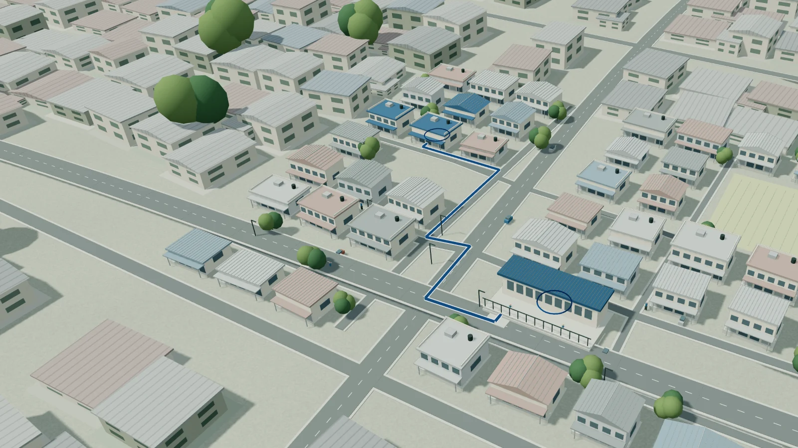
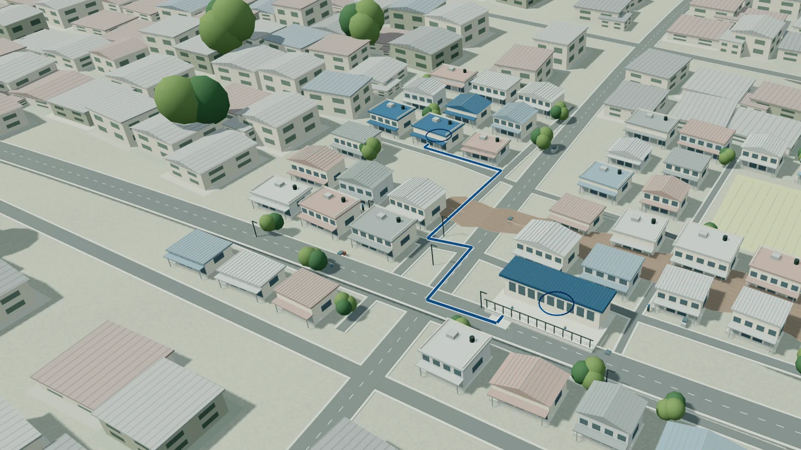
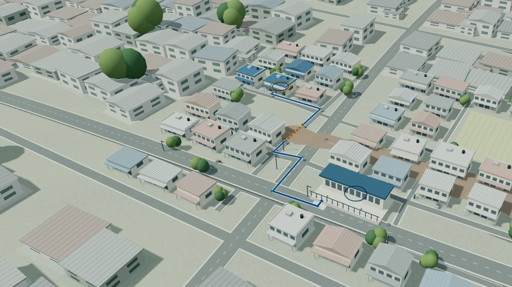
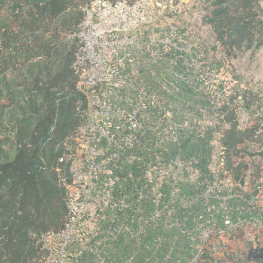

# Landing Storyboard

Stage 2, September 12, 2026. Local implementation storyboard, not a record of
external art approval. Claims and destinations are bounded by
`positioning-and-claims.md`.

## The Through-Line

Flood exposure and access loss are different questions. A visibly dry home
cluster depends on a road connection to a visibly dry essential-service
building. Flood overlap raises a question about one link. Assuming that link
is disrupted changes reachability in this deliberately small synthetic
network. The useful output is a finding, its reason, its uncertainty, and a
reviewable next step. The water does not disappear when FloodGuard appears.

## Six Frames

| Frame | New understanding | Composition | Content and boundary |
| --- | --- | --- | --- |
| 1. Connected neighborhood | Homes depend on a connection, not just their own footprint | A wide oblique Mae Sai-inspired town moves toward the same home cluster and service building; blue baseline connection stays registered | Hero positions FloodGuard as a planning prototype. Both endpoints remain identifiable. No verified geography or real household claim. |
| 2. Flood evidence | The footprint is a starting observation, not a conclusion about access | Hold the close camera; irregular water enters lower ground, with endpoints outside it | Flood overlap is illustrative. No depth, timestamp, forecast, or observed closure is fabricated. |
| 3. Network consequence | One assumed interruption can disconnect a dry home | Quiet context, retain the same streets, accent the crossing with amber dashes and an explicit label | Baseline reachability is computed from the synthetic graph. Removing the identified link changes that result. Unknown additional roads are not treated as absent in reality. |
| 4. Explainable finding | A result is useful when its reason and limits are visible | Keep the water and connection in place; stable text shows finding, reason, uncertainty, next review | Synthetic example, not a result for a named Mae Sai household. Next step: verify the connection and review contingency access, not take a route. |
| 5. Product responsibilities | Public, Planning, and Studio have genuinely different jobs | Three unpinned editorial rows, each with an actual product capture, specific benefit, limitation, and working destination | Empty Public household-plan builder; Planning ranks/map with confidence and limitations; Studio evidence decision matrix. They are parallel responsibilities, not a live dispatch chain. |
| 6. Historical evidence | The real case has available sources, derived outputs, and unresolved gates | February optical context beside a source-backed evidence inventory and explicit dates | Optical context is not a September flood mask. Candidate, non-operational, no qualified evaluation. Direct evidence record links. |

## Motion Contract

- One persistent Three.js world and a pure sampled story clock.
- Four animated chapter IDs: `place`, `flood`, `access`, `finding`.
- Opening: a bounded pointer response; broad context becomes one neighborhood.
- Flight finishes before the flood transition. The camera then holds through the analytical changes.
- Full stage keeps a 24px inset on all sides and a clear header zone.
- Text uses discrete, stable chapter panels; meaning does not depend on intermediate animation frames.
- Named chapter anchors work with forward, reverse, fast, and direct navigation.
- Product and historical sections use ordinary native document scrolling.
- Reduced motion, compact viewports, data saving, offline policy, and rendering failure retain semantic text, matching stills, and direct workspace links.

## What Was Removed

The repeated resident-report, task-assignment, research-desk, and shared-context
scene sequence is not the new product argument. No oversized phone, fake
receipt, dispatch event, numerical priority, invented result screenshot, or
claimed verified closure is needed to explain the access problem.

## Static Frame Review

The following figures are exports from the implemented master, not separate
generated neighborhoods. Their exact source and image hashes are in the
scene manifest. The integrated typography/key-frame captures are recorded
with the final browser acceptance evidence.

### 1. Connected Neighborhood

### 2. Flood Evidence

### 3. Network Consequence

### 4. Explainable Finding

### 5. Actual Product Views

- [Public: empty household-plan builder](../apps/web/public/landing/product/public-preparedness.webp).
- [Planning: historical priorities and context, with confidence and scenario limits](../apps/web/public/landing/product/planning-priorities.webp).
- [Studio: evidence identity and unresolved evaluation/authorization gates](../apps/web/public/landing/product/studio-evidence.webp).

These are separate actual captures, not one fabricated interface. The live
landing pairs each with its role, qualification, and real destination.

### 6. Historical Evidence

The displayed Available / Derived / Needs verification inventory describes
the separately identified historical package. It is never implied to be
the source of the synthetic neighborhood's household finding.

## Review Check

The implementation must be inspected at the hero, all four chapter end
states, all three product previews, and historical evidence on desktop.
Compact/static views are regression and semantic-fallback checks, not a new
mobile animation design. Human comprehension interviews and owner art
acceptance are separate checks and must not be inferred from passing tests.
