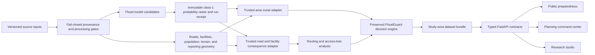

# Mae Sai capability milestones

## Purpose

This is the durable development plan for FloodGuard's Mae Sai product. It is
organized around geospatial and decision-support capabilities, not proposal
ownership, team biographies, portal fields, or a competition submission. A
submission may reference the evidence produced here, but none of these runtime
contracts depend on submission metadata.

FloodGuard remains a preparedness and rapid post-event prioritization tool. It
is not an official warning system, a guaranteed real-time detector, or a live
evacuation navigator.

## Evidence levels

The product must keep these levels visibly distinct:

| Level | Meaning | Mae Sai status |
|---|---|---|
| Real open context | Real coordinates and public-source geometries | Available |
| Provenance-tracked candidate analysis | Reproducible analysis derived from real open context, but not formally accepted | Available |
| Authoritative operational truth | Current agency-confirmed inputs, qualified references, accepted models, and formal operating authority | Blocked |

The current Mae Sai bundle is therefore always `dataset_mode=candidate`,
`operational_status=non_operational`, and `official_warning=false`. A missing or
invalid candidate bundle must return an explicit blocked/unavailable state. It
must never silently fall back to the fixture profile.

## System boundary

GeoAI owns a governed flood-probability candidate. It does not define
administrative truth, verify facilities, calculate routing or equity, select
FPPS weights, assign A-E classes, or authorize an operational warning.

## Spatial roles

- The eight committed Mae Sai ADM3 polygons are stable reporting units for
  area FPPS, A-E class, exposure, access loss, equity, evidence, and briefs.
- Raster cells, road segments, bridges, facilities, and routing nodes are
  analysis units. They may explain a reporting-area result but do not create a
  new administrative decision jurisdiction.
- A future village/community layer can provide localized context only after
  its identity and authority contract is defined.

## Milestone 1 - Real Mae Sai Command map

### Capability

- Register `mae_sai_candidate_v1` as a first-class, checksum-bound study area.
- Expose exactly eight reporting areas plus candidate roads, facilities, and
  access hotspots through typed API layers.
- Render Polygon and MultiPolygon reporting geometry.
- Use stable Leaflet layer groups with regional/detail semantic zoom.
- Preserve selection and zoom when language, filters, or evidence panels
  change.
- Show a persistent selected-area evidence drawer.
- Keep the real-context vectors usable when an optional basemap fails.
- Ship the same bounded, checksummed context in offline mode.

### Safety contract

- The 42 OSM-derived facilities remain open-context candidates. The public and
  Command interfaces must not call them official shelters, available shelters,
  or safe destinations.
- Road styling means modeled disruption candidate, never observed closure.
- Source timestamp, confidence, assumptions, candidate mode, and
  non-operational status remain visible.
- Any absent scenario capability is disabled with an exact server-owned reason.

### Acceptance evidence

- Exactly eight expected area IDs and no missing area joins.
- Layer checksums, feature counts, geometry types, bounds, and required
  attribution validate before serving.
- No external request is required in offline mode.
- Basemap failure leaves FloodGuard vectors and text equivalents functional.
- Component, interaction, static-build, and offline browser tests pass.

## Milestone 2 - Real backend scenario foundation

### Capability

- Persist a compact, immutable copy of the routing graph edges and modeled
  population nodes needed for scenario recomputation.
- Bind those inputs to row counts, column contracts, SHA-256 hashes, study-area
  identity, and a self-hashed manifest.
- Keep scenario IDs and parameter bounds in a closed server registry.
- Recompute nearest-facility shortest-path access from accepted server inputs.
- Return a paired baseline/scenario result and deterministic run ID.
- Return server-produced map effects and evidence deltas; the browser performs
  no access, equity, road-risk, or FPPS formula.

### Safety contract

- Existing nearest-facility access and equity functions remain the source of
  truth. This milestone does not implement or claim 2SFCA.
- Scenario facilities are planning assumptions, not verified emergency
  shelters.
- Candidate road disruptions are modeled assumptions, not observed closures.
- A corrupt, substituted, cross-study-area, or partial graph is rejected.

### Acceptance evidence

- Invalid IDs and out-of-range parameters are rejected.
- Identical accepted inputs return an identical run ID and artifact payload.
- Access/equity deltas trace to the input-manifest and scenario hashes.
- Existing scoring, access, equity, and road-risk contract suites remain green.

## Milestone 3 - Segment-level flood consequences

### Capability

- Consume an immutable class-1 probability raster and separate road/facility
  geometry receipts.
- Validate raster checksum, run identity, CRS, transform, dimensions, bounds,
  nodata, class mapping, range, and decision eligibility.
- Validate geometry checksum, CRS, feature count, unique IDs, join IDs,
  study-area identity, authority status, and raster intersection.
- Compute explicit metric-buffer, pixel-center statistics for roads and
  facilities, including bridge evidence.
- Produce a canonical HMAC-SHA256 signed receipt without serializing private
  paths or the signing secret.

### Safety contract

- Candidate geometry or candidate model output requires an explicit
  report-only invocation and always returns
  `can_feed_decision_layer=false`.
- Nodata never becomes a closure or exposed facility by inference.
- Probability cannot establish road closure, safe-route status, facility
  operation, or facility suitability.
- Tampering or substituting a raster, grid, cross-study-area geometry, lineage
  receipt, result, eligibility field, or signature fails closed.

The detailed contract is in `docs/probability_consequence_contract.md`.

## Milestone 4 - Qualified label foundation

Implementation status (2026-07-20): the repository now contains a fail-closed
external-authority request, acquisition-authority receipt issuer, a validated
Reference Authority approval boundary, a deterministic whole-parent-tile
calibration release (12 blind calibration queries plus 12 disjoint fresh-retest
queries), the existing blinded review/adjudication pipeline, a signed three-way
spatial partition freezer, and a qualified-reference-cell signer. These tools
prepare and verify evidence; they have not created the missing human or external
evidence.

### Software capability

- Immutable acquisition and product-identity manifests.
- Reference-mask authority and processing-permission receipts.
- Blinded reviewer calibration, locked submissions, agreement, adjudication,
  and handbook-version records.
- Representative label selection before model-directed active learning.
- Explicit identification of model-assisted labels.
- Immutable train, calibration, and final spatial-holdout polygons with
  no-overlap validation.
- A fail-closed dataset release and readiness receipt.

### External evidence required

This milestone cannot be completed by code alone. It remains evidence-blocked
until named people or authorities provide all of the following:

1. licensed, product-identified pre/post Sentinel-1 authority;
2. a qualified reference mask with purpose and redistribution status;
3. blind reviewer-calibration submissions and adjudication evidence;
4. immutable spatial holdout polygons approved before final evaluation;
5. signed reference cells and release-manifest evidence.

No placeholder, self-generated approval, weak cross-border mask, or synthetic
mask may clear these gates.

## Milestone 5 - Controlled model comparison

Implementation status (2026-07-20): the controlled runner verifies the full
signed lineage for all three lanes, evaluates only untouched `final_holdout`
membership, publishes the required metrics, reliability bins and SVG, error
strata, runtime/resource table, summary, and a signed expiry-bound report-only
receipt. A separate signed promotion-policy evaluator can recommend either one
qualified candidate or no candidate, but always leaves
`can_feed_decision_layer=false`. Publication is atomic: a failed write, render,
signature, or checksum validation cannot expose a partial final result bundle.
Promotion re-derives physical-area metrics, binds each decision threshold to its
signed model run, and requires one identical calibration-bin grid across all
three candidates. The real-data gate is currently blocked, so no qualified
metrics or promotion recommendation have been generated.

### Required candidates

1. Deterministic SAR baseline.
2. Existing weak-label/calibrated logistic model.
3. Isolated GeoAI U-Net or FPN, initially with `encoder_weights=None` for SAR.

An optional tree challenger may be added only after those three share one
stable comparison contract.

### Experiment contract

- Use identical immutable event inputs and the same final spatial holdout.
- Keep calibration data separate from the final holdout.
- Freeze decision thresholds before final-holdout inspection.
- Report overall and per-area IoU, Dice/F1, precision, recall, area error,
  Brier score, calibration error/reliability evidence, runtime, and resources.
- Categorize permanent-water, wet-soil/agriculture, urban shadow, layover,
  terrain, speckle, narrow-channel, boundary, temporal-change, input-quality,
  reference-uncertainty, and geometry-mismatch errors.
- Select a champion only through predefined acceptance criteria.
- Retain the deterministic baseline as fallback and audit evidence.

### Current evidence boundary

The experiment runner and fail-closed gate audit may be tested while evidence
is blocked, but no qualified metrics or champion may be published until every
Milestone 4 external gate passes. Synthetic GeoAI execution proves integration,
not real flood-detection accuracy.

## Beyond Milestone 5

After a qualified champion exists, Milestone 6 can publish a checksummed
probability COG/tile artifact, bind it to the trusted adapters, expose the
probability and uncertainty layers, and derive
`can_feed_decision_layer` from signed evidence. Agency identity, field reports,
retention, monitoring, and formal operational acceptance remain separate later
capabilities; software configuration alone can never promote
`official_warning` or agency-operational status.
