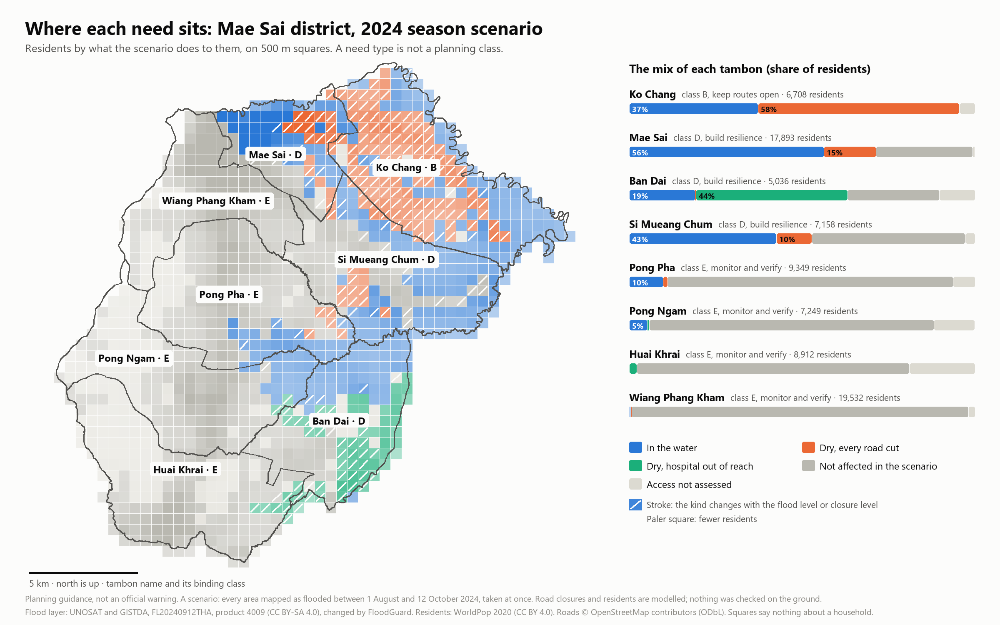

# FloodGuard Thailand: one page for an outside reader

*For a planner, a disaster officer, a GISTDA facilitator or a mentor. Reading
time: ten minutes. Four questions at the end; three lines of answer each are
enough. Prepared on 11 October 2026.*

## What this is

A planning tool. It takes a flood map that already exists and asks what the
flood does to access: who is in the water, who stays dry and loses every road,
who loses the hospital, and which roads matter. **It is not a warning system
and not an official source.** Everything below is one scenario for Mae Sai
district: every area that UNOSAT and GISTDA mapped as flooded between 1 August
and 12 October 2024, taken as flooded at once. Roads are closed by a rule, not
observed. Residents are modelled counts. Nothing was checked on the ground.

## What it found

1. **A flood map shows the blue. The orange and the green are 10,000 more
   people.** In the scenario about 18,000 residents are in the water. About
   7,500 more stay dry and lose every road; about 2,400 stay dry and on the
   road network with the hospital out of reach.
2. **Tambons with the same class need different things.** Mae Sai, Ban Dai
   and Si Mueang Chum are all class D ("build resilience"). In Mae Sai most
   residents are in the water; in Ban Dai the largest group is dry with the
   hospital out of reach.
3. **Ko Chang is the tambon to plan routes for.** A third of its residents are
   in the water and nearly all the rest are dry with every road cut.
4. **Two short roads matter most.** Kept passable, a road of 1.3 km and one of
   0.8 km would give about a quarter of the 21,800 cut-off residents a route
   back. Most of the rest are in the water themselves.
5. **Seven of the eight classes hold when the assumptions change; one does
   not.** Over 180 runs (a smaller and a larger flood, stricter and looser
   road closures, two population datasets, two vulnerability scales, five sets
   of weights) Mae Sai town keeps its class in half. It depends on which
   population data are used.

## What it could not do

- Its own radar flood detection sees about a quarter of the water in a
  flooded town. For decisions it uses the agency map.
- It has no dated picture of the September 2024 flood. THEOS-2 scenes have
  been requested from GISTDA.
- Whether older residents are cut off more than others depends on the age
  data: the open modelled data show no gap, registration counts show older
  residents losing hospital access about 1.1 times as often.

## Four questions

1. **Would this change anything you plan or decide?** Which of the five
   findings, if any, would you use, and for what?
2. **What is wrong or missing?** A road you know is raised, a village the map
   misses, a figure that cannot be right.
3. **Which words would you not accept?** For example "cut off", "need",
   "class", "unstable: verify".
4. **What would you need before you trusted it?** A field check, another data
   source, a named owner.

## How your answer is used

It is recorded with your name and role only if you agree, in the project's
decision log, as the view of one reader. It is not an approval of the tool and
will not be described as one.

---

*Credits. Flood layer: UNOSAT and GISTDA, FL20240912THA, UNOSAT product 4009
(CC BY-SA 4.0), changed by FloodGuard. Residents: WorldPop (CC BY 4.0). Roads
© OpenStreetMap contributors (ODbL). Registration counts: Department of
Provincial Administration. Details and every limit:
`docs/need_mix.md`, `docs/road_reconnection.md`,
`docs/uncertainty_ensemble_rescaled_demand.md`, `docs/equity_by_age.md`.*
