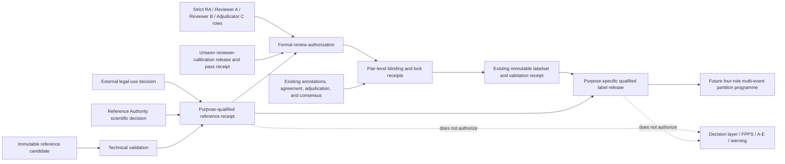

# Qualified Thai Reference and Frozen Label Release v1

## Purpose

This milestone is the evidence foundation for every learned flood-extent model
in FloodGuard Thailand. It determines whether a specific reference product and
a specific human-reviewed label release may be used for one declared scientific
purpose.

The milestone does not train a model, authorize an operational product, issue a
warning, or permit model output to enter access, equity, FPPS, or A-E action
classification. Repository code can validate supplied evidence and block unsafe
escalation. It cannot create legal permission, human expertise, independent
review, scientific truth, or institutional authority.

## Current Mae Sai decision

As of the evidence snapshot represented by this repository:

- the Sentinel-1 source pair is checksum-bound and permitted for the existing
  research processing scope;
- no legally and scientifically qualified, in-area, temporally aligned Thai
  flood-reference raster has been supplied;
- no strict four-person review campaign has been authorized;
- no real reviewer-calibration pass, blind A/B review, adjudication, or frozen
  flood-model label release exists;
- experiment processing, model training, model evaluation, decision-layer use,
  FPPS use, A-E action assignment, and official-warning use remain blocked.

This is an expected fail-closed state, not a software failure.

## Evidence flow



## Two independent evidence lanes

The system keeps two evidence lanes distinct:

| Lane | Primary purpose | May be used as independent final-holdout truth? |
|---|---|---:|
| Human-reviewed label release | Declared flood-model training labels, when an exact purpose envelope permits it | No, not merely because it is frozen or high quality |
| Qualified evaluation reference | Model probability calibration or final evaluation, under its own legal and scientific receipt | Yes, but only for the exact purpose named by that receipt |

An existing `floodguard.labelset_validation_receipt.v1` proves the integrity of
the label-factory release and its query-model-only safety boundary. It is not,
by itself, flood-model training authority. A new qualified-use envelope must
bind it to exact legal, scientific, reviewer, blinding, and purpose evidence.

## Purpose-specific qualification

Every qualified-reference receipt authorizes exactly one purpose:

- `human_reviewer_calibration`
- `human_annotation_reference`
- `flood_model_training_labels`
- `model_probability_calibration`
- `model_final_evaluation`
- `derived_metrics_only`

Permission for one purpose is never inherited by another. In particular:

- local analysis does not imply ML-label use;
- ML-label use does not imply final evaluation;
- validation does not imply training;
- source processing does not imply experiment execution;
- model evaluation does not imply decision-layer or operational use.

The canonical qualified-reference receipt therefore contains one top-level
`purpose` and exactly one matching `purpose_authorizations` row. The selected
purpose is included in both the canonical evidence-bundle hash and the release
self-hash. Blocked projections default only to `derived_metrics_only` when no
purpose is supplied; synthetic and qualified releases require an explicit
purpose.

## Reference evidence classes

| Evidence class | Meaning | Reviewer calibration | Model training | Model calibration | Final evaluation |
|---|---|---:|---:|---:|---:|
| `observed_measurement` | Direct observed measurement with documented uncertainty | Conditional | Conditional | Conditional | Conditional |
| `expert_interpretation` | Attributable expert interpretation of appropriate evidence | Conditional | Conditional | Conditional | Conditional |
| `weak_reference` | Incomplete, geographically weak, indirectly derived, or otherwise unqualified reference | No | No | No | No |
| `context_only` | Context that helps interpretation but is not flood truth | No | No | No | No |

“Conditional” still requires exact product identity, bytes, permissions,
scientific acceptance, study-area coverage, timing, CRS/grid, nodata, class,
independence, and validity-window gates.

The authority basis is recorded separately from the evidence class:

- `provider_issued`
- `independent_expert`
- `adjudicated_consensus`
- `project_weak_candidate`

This prevents a production method or provider name from being mistaken for an
evidence-strength claim.

## Reference technical contract

A candidate reference records facts without carrying a caller-set
`qualified=true` or `processing_allowed=true` claim. Qualification is derived
only after all required evidence validates.

The immutable candidate identity binds:

- reference ID and version;
- event ID and canonical study-area ID;
- authoritative study-area geometry SHA-256;
- provider, dataset ID, exact product ID, catalog URL, and terms URL;
- observation/validity interval, source timestamp, and access timestamp;
- the predeclared allowable event-time difference;
- every asset or archive member, byte size, media type, and SHA-256;
- native CRS, axis order, bounds, transform, resolution, and dimensions;
- geometry type for vector sources;
- class mapping, nodata, unknown, and validity-mask semantics;
- study-area intersection and complete-coverage facts;
- parent products, processing method, uncertainty, and assumptions.

For a shapefile, the verified asset is a checksum-bound archive or the complete
component set. Hashing only the `.shp` member is insufficient.

A purpose-qualified receipt additionally binds:

- the candidate manifest canonical hash and file hash;
- all reference-asset hashes;
- external legal-decision and detached-signature hashes;
- signer identity, key identity, validity period, revocation state, and exact
  permitted purpose;
- licence/terms evidence hashes and exact provider product ID;
- a separate Reference Authority scientific-purpose decision;
- technical-validation software version, Git commit, and run timestamp;
- any geometry-repair, reprojection, or resampling receipt and output hash.

### Independent Reference Authority decision

The acquisition/legal authority is not the scientific Reference Authority.
The acquisition receipt's `reference_qualification` fields remain necessary
input checks, but they cannot by themselves qualify a reference for any
scientific purpose.

For `qualified_for_controlled_model_development`, the builder additionally
requires a file-backed
`floodguard.reference_authority_scientific_decision.v1` decision, its detached
Ed25519 signature, and a public key supplied by runtime trust configuration.
The decision binds the exact:

- event, study area, experiment, source, product, and artifact SHA-256;
- source timestamp and observation interval;
- reference-authority class and one canonical purpose;
- scientific method, known uncertainty/error categories, and independence
  attestation;
- issuing identity, role, authority basis, signing-key ID, key fingerprint,
  issue time, and expiry time.

The Reference Authority identity, key ID, and key fingerprint must be distinct
from both the acquisition-integrity signer and the external legal/permission
authority. A public key embedded in a decision is not trusted merely because
the same payload names it. The release records checksum-bound decision,
signature, credential, validity, purpose, class, and canonical scientific
receipt hashes. Blocked and synthetic releases carry every such field as
`null`.

Qualification passes only when:

```text
reference_processing_allowed =
    candidate_bytes_verified
    AND legal_decision_valid_for_exact_purpose
    AND scientific_purpose_decision_approved
    AND technical_validation_passed
    AND event_study_area_product_version_hashes_match
    AND decision_not_expired_or_revoked
```

## Label and unknown-data contract

The canonical human-review taxonomy remains multiclass:

| Code | Meaning | Default binary projection |
|---:|---|---|
| `0` | confirmed non-flood | `0` |
| `1` | temporary flood | `1` |
| `2` | permanent water | `0`, while retaining the permanent-water stratum |
| `3` | uncertain change | excluded |
| `4` | unobservable or artifact | excluded |
| `255` | nodata or unreviewed | excluded |

The stored qualified reference never erases codes `2`, `3`, `4`, or `255`.
Binary targets are a later, checksum-bound projection. Unknown, invalid,
abstained, unobservable, or unreviewed cells are never converted to dry.

## Strict human-review profile

The existing label factory remains authoritative for role packages,
calibration membership, reviewer bundles, annotations, agreement, adjudication,
consensus, QA, and immutable labelset freezing. This milestone adds strict
composition and independence checks; it does not create a parallel annotation
system.

The strict campaign requires four distinct people:

```text
Reference Authority != Reviewer A != Reviewer B != Adjudicator C
Reference Authority != Adjudicator C
```

Both reviewers must:

- be assigned to `independent_blinded` lanes;
- not be project operators;
- declare no prohibited prior evidence exposure;
- qualify against the exact protocol, taxonomy, event, evidence-set version,
  and validity window;
- pass the predeclared overall and critical-stratum thresholds on an unseen
  calibration set;
- complete any retest on a fresh set that does not overlap practice or the
  original calibration set.

A failed calibration diagnostic is not a passing receipt. Remediation requires
fresh practice and a different unseen calibration set.

## Pair-level proof

One pair receipt is required for every released query. It binds:

- event, study area, tile, query, and pair IDs;
- the exact formal-review authorization;
- distinct Reviewer A and Reviewer B assignments;
- both sealed bundle hashes;
- a shared reviewer-visible evidence-set hash;
- exact locked annotation IDs, revisions, content hashes, and lineage;
- review start, finish, lock, reveal, and adjudication times;
- an explicit `other_reviewer_annotations_visible=false` field in both
  serialized annotations;
- agreement evidence;
- the conflict-queue item, adjudication record, redraw lineage, and consensus
  evidence when disagreement exists;
- a final state of `paired_agreement_locked`, `adjudicated_locked`,
  `excluded_rejected`, or `contaminated_excluded`.

A bundle leak, early reveal, post-reveal revision, hidden visibility default, or
identity collision makes the query `contaminated_excluded`. It is not repaired
in place.

## Qualified label release

The qualified label release is a purpose-specific envelope around an existing
immutable labelset. It binds:

- the labelset manifest file hash, manifest self-hash, and label-content hash;
- the labelset validation receipt file hash and self-hash;
- QA, agreement, raster lineage, consensus, and adjudication-import evidence;
- the qualified reference used for reviewer calibration;
- any separate qualified evaluation reference;
- the formal-review authorization;
- a sorted manifest of every pair receipt and its aggregate hash;
- exact grid, source registry, processing, protocol, taxonomy, and
  target-definition hashes;
- counts for codes `0`, `1`, `2`, `3`, `4`, and `255`;
- excluded-cell counts and the exact declared purpose;
- release time, semantic version, parent release, and canonical self-hash.

Changing the purpose from training to evaluation requires a new envelope.
Changing label content requires a new immutable labelset release. Withdrawal,
expiry, or revocation belongs in an append-only status registry and never
rewrites released bytes.

Even a valid qualified label release keeps these claims false:

```text
eligible_for_decision_layer = false
eligible_for_access_analysis = false
eligible_for_equity_analysis = false
eligible_for_fpps = false
eligible_for_action_class = false
official_warning = false
```

## Gate states

| Stage | Engineering exit condition | Current Mae Sai state |
|---|---|---|
| Engineering foundation | Candidate inspection, qualified-reference schema/writer/CLI, fixture-only review/partition validators, blocked projection, and adversarial tests pass | Ready for blocked and fixture evidence only |
| Qualified Thai reference | Exact legal, technical, scientific, temporal, spatial, and purpose evidence validates | Blocked on external evidence |
| Reviewer calibration | Strict four-person role package and real unseen calibration passes | Blocked on external human work |
| Blind review and adjudication | Every released query has a valid pair receipt and no open conflict | Absent |
| Frozen label release | Existing immutable labelset revalidates and a purpose envelope passes | Absent |

The aggregate milestone can expose `source_processing_allowed=true` for the
exact Sentinel-1 research-input scope while keeping
`experiment_processing_allowed=false`. These booleans have different meanings
and must never be collapsed into one generic readiness flag.

## Required adversarial verification

The release-blocking test suite covers at least:

1. permission granted for validation but not training;
2. permission granted for training but not final evaluation;
3. blank, expired, future, revoked, or invalidly signed decisions;
4. product, asset, event, study-area, version, or purpose substitution;
5. changed bytes after authority signatures;
6. incomplete multi-file vector checksums;
7. out-of-area or temporally misaligned reference evidence;
8. matching CRS names with mismatched axis, transform, origin, resolution, or
   dimensions;
9. unreceipted geometry repair or reprojection;
10. nodata, uncertain, artifact, or unreviewed cells converted to dry;
11. weak/context evidence claimed as final truth;
12. fixture keys or synthetic authority presented to a candidate validator;
13. human identity collisions or relaxed reviewer lanes;
14. insufficient, overlapping, expired, or stratum-incomplete calibration;
15. different A/B evidence sets or reviewer-visible model/weak-label leakage;
16. omitted visibility fields, early reveal, or post-reveal revision;
17. omitted, changed, duplicate, or unresolved adjudication;
18. edited consensus/label bytes with recomputed caller-supplied hashes;
19. a query-model receipt presented directly as flood-model authority;
20. any attempt to set decision, access, equity, FPPS, A-E, operational, or
    official-warning authority.

`synthetic_fixture_only` receipts are explicitly synthetic and confer no
authority. Positive candidate-path integration tests use ephemeral test trust
roots to prove the complete signature and purpose machinery, but those trust
roots are neither serialized into receipts nor shipped as production
configuration. A candidate can qualify only when its separately supplied
runtime trust store contains the exact legal and scientific authority keys;
production trust configuration must never contain fixture keys.

## Engineering complete versus evidence complete

Engineering completion in this milestone means the candidate inspector,
qualified-reference contract and immutable writer, strict fail-closed
composers, fixture-only human-review and partition validators, documentation,
blocked Mae Sai projection, and adversarial tests pass. It does not claim that
a candidate/official frozen-label writer, signed release authority, or signed
holdout-custody workflow exists.

Evidence completion additionally requires genuine external facts:

- product-specific permission for each declared purpose;
- a real Reference Authority decision;
- four genuinely distinct accepted human roles;
- a real unseen calibration reference and passing reviewer submissions;
- independent A/B formal annotations;
- real adjudication with zero open conflicts;
- a reproduced and independently revalidated frozen label release.

Until those facts exist, the required terminal state is:

```text
engineering_status = ready
qualified_reference_status = blocked_external_evidence
formal_review_status = blocked_external_human_work
label_release_status = absent
experiment_processing_allowed = false
eligible_for_decision_layer = false
eligible_for_fpps = false
eligible_for_action_class = false
official_warning = false
```

## Handoff to the partition programme

The first purpose-qualified release unlocks the next engineering lane: a
standalone multi-event partition manifest with four explicit model roles:

- training;
- model probability calibration;
- development;
- final holdout.

That contract must not overload Model Run v2's current three-way partition
fields and must not reuse the term `reviewer_calibration` for model probability
calibration. Model Run v3 should be introduced only when the controlled
three-model programme consumes the new four-role partition manifest.

No real partition may be sealed until qualified event releases exist. A
synthetic partition fixture may test the validator, but it must be marked as
non-authoritative and must not appear as Mae Sai progress.
