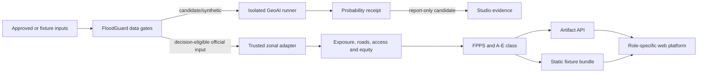

# FloodGuard proposal-stage architecture and API inventory

## Runtime boundaries

```text
apps/web                Next.js + TypeScript static/offline PWA
services/api            FastAPI artifact, scenario and bounded pilot API
services/geoai-runner   isolated Python 3.12 GeoAI candidate environment
packages/contracts      JSON Schema and generated/maintained TypeScript types
src/floodguard          tested domain and geospatial decision package
```



The current proposal demo follows the static fixture/report-only branches. It
does not claim that candidate GeoAI output passed the official-input branch.

## Data flow and ownership

1. Flood detection/probability is separate from road disruption, access,
   equity and scoring.
2. GeoAI may create a probability candidate but cannot recalculate FPPS,
   access or equity.
3. The trusted zonal adapter accepts only schema-complete, decision-eligible
   official-input evidence and authoritative geometry. Candidate and fixture
   evidence fail closed.
4. FastAPI reuses committed artifacts and server-owned scenario definitions.
5. The browser uses typed API data when configured, a clearly stale cached
   snapshot if that API later fails, or a separately labeled fixture bundle.
6. The static web export and legacy dashboard remain usable without an API.

## Public API inventory

| Method | Path | Purpose | Proposal-stage boundary |
|---|---|---|---|
| GET | `/api/v1/health` | Process health only | Does not imply fresh or usable data. |
| GET | `/api/v1/status` | Dataset, source, confidence and operational state | Fixture/candidate status remains non-operational. |
| GET | `/api/v1/study-areas` | Available study-area catalog | Proposal default is fixture-backed. |
| GET | `/api/v1/areas` | Filtered area decision list | FPPS is server/artifact-owned; no browser formula. |
| GET | `/api/v1/areas/{area_id}` | One area decision | Path-safe typed response. |
| GET | `/api/v1/layers` | Layer catalog | Advertises readiness/state explicitly. |
| GET | `/api/v1/layer-data/{layer_id}` | Path-sanitized GeoJSON layer | Does not expose source rasters or local paths. |
| GET | `/api/v1/briefs/{area_id}` | Bilingual Markdown brief/download | Includes source and non-warning headers. |
| GET | `/api/v1/scenarios` | Server-owned scenario definitions | No arbitrary client scenario formula. |
| POST | `/api/v1/scenario-runs` | Deterministic bounded scenario execution | Validated IDs and parameter ranges only. |
| GET | `/api/v1/scenario-runs/{run_id}` | Deterministic scenario result | Unknown run IDs are rejected. |
| GET | `/api/v1/model-runs` | Model-run catalog | Candidate eligibility remains visible. |
| GET | `/api/v1/model-runs/{run_id}` | One model-run record | No source weights or private workspace. |
| GET | `/api/v1/data-readiness` | Gates and blocked reasons | Blocked is not converted into unavailable or passed. |

## Bounded pilot endpoints

The codebase also contains protected pilot controls. They are not required by
the public static proposal demo and do not establish an accepted agency pilot.

| Method | Path | Control |
|---|---|---|
| GET | `/api/v1/pilot/readiness` | Sanitized readiness and exact blockers |
| GET | `/api/v1/pilot/session` | Signed session identity and capabilities |
| GET | `/api/v1/pilot/monitoring` | Deployment/data/acceptance monitoring |
| POST | `/api/v1/pilot/acceptance-receipts` | Signed bilingual acceptance receipt |
| POST | `/api/v1/pilot/acceptance-receipts/verify` | Receipt verification |
| POST | `/api/v1/pilot/operational-assessments` | Fail-closed promotion assessment |
| GET | `/api/v1/pilot/audit-log` | Redacted tamper-evident audit read |
| POST | `/api/v1/pilot/retention` | Signed-catalog retention operation |

The default installation lacks the external keys, audit anchor, governed
retention workspace and signed acceptance evidence required for operational
status. It remains non-operational. The current JSONL audit design is
single-process; multi-worker deployment requires a transactional append store.

## Shared contract fields

Decision-facing public objects include, where applicable:

- `schema_version`;
- `dataset_mode`;
- `operational_status`;
- `source_timestamp`;
- `generated_at`;
- `confidence_class`;
- `source_name`;
- `assumptions`;
- `official_warning`;
- `data_version`; and
- `git_commit`.

Fixture and candidate states set `official_warning=false`. A healthy API may
return stale, blocked or unavailable data; service health is not a freshness
shortcut.

## Proposal-stage deployment

- Primary judging link: static Next.js export on Vercel after the owner records
  the real URL.
- Backup: downloadable offline ZIP served through a local static HTTP server.
- API: demonstrated through source, OpenAPI, tests and receipts; it is not a
  dependency of the public judging link.
- GeoAI: demonstrated through small public proof artifacts; PyTorch, GeoAI,
  source rasters and weights are not deployed to the browser.
- Fonts, map layers and fixture assets: local to the built application.
- Analytics and third-party network calls: not required.
